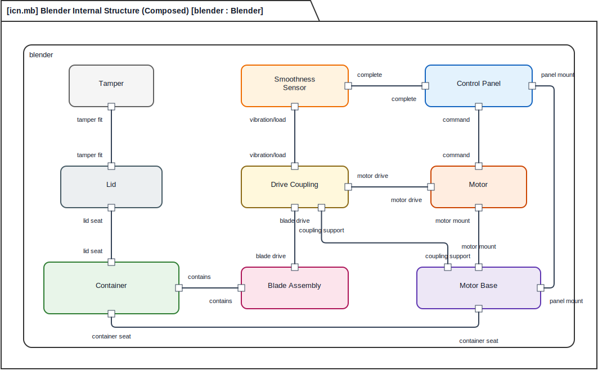
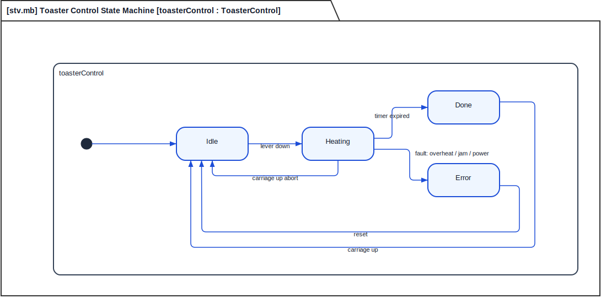

# SysMLD

SysMLD is a lightweight diagram/view format and deterministic rendering toolkit for SysML v2 models.

**Why SysMLD?** Most MBSE tools bundle model semantics and diagram layout together, making it hard to keep diagrams in sync with models or to generate diagrams automatically. SysMLD separates the two: a `.sysml` file holds the model, and a `.sysmld` file holds the diagram layout. Composers generate the layout deterministically from a compact JSON intent file — the same inputs always produce the same diagram.

- `.sysml` files hold SysML v2 model content.
- `.json` intent files describe compact view requests for the composers.
- `.sysmld` files hold explicit diagram layout and rendering instructions.
- `.svg` files are generated renderings.

## Examples

**Blender internal block diagram** — generated by `sysmld interconnection`:



**Toaster control state machine** — generated by `sysmld state`:



See the full [toaster](examples/toaster) and [blender](examples/blender) example sets for all 15 supported view types.

## Quick Start

```bash
git clone https://github.com/meaningfulsystems/sysml2d.git
cd sysml2d
python -m pip install -e .
```

Then see [QUICKSTART.md](QUICKSTART.md) for a step-by-step guide to creating your first model and diagram.

## Supported Views

SysMLD supports these SysML v2 view kinds:

| View kind | Code | Composer command | Notation |
| --- | --- | --- | --- |
| `DefinitionView` | `def` | `sysmld definition` | ✅ Close to SysML v2 standard |
| `InterconnectionView` | `icn` | `sysmld interconnection` | ✅ Close to SysML v2 standard |
| `StateView` | `stv` | `sysmld state` | ✅ Close to SysML v2 standard |
| `ActionView` | `act` | `sysmld action` | ✅ Close to SysML v2 standard |
| `InteractionView` | `int` | `sysmld interaction` | ✅ Close to SysML v2 standard |
| `UseCaseView` | `uc` | `sysmld usecase` | ✅ Close to SysML v2 standard |
| `PackageView` | `pkg` | `sysmld package` | ⚠️ Pragmatic overview diagram |
| `RequirementView` | `req` | `sysmld requirement` | ⚠️ Pragmatic overview diagram |
| `ConstraintView` | `cst` | `sysmld constraint` | ⚠️ Pragmatic overview diagram |
| `AllocationView` | `alloc` | `sysmld allocation` | ⚠️ Pragmatic overview diagram |
| `FlowView` | `flow` | `sysmld flow` | ⚠️ Pragmatic overview diagram |
| `AnalysisCaseView` | `acase` | `sysmld analysis` | ⚠️ Pragmatic overview diagram |
| `VerificationCaseView` | `vcase` | `sysmld verification` | ⚠️ Pragmatic overview diagram |
| `InterfaceView` | `intf` | `sysmld interface` | ⚠️ Pragmatic overview diagram |
| `GeneralView` | `gen` | `sysmld general` | ⚠️ User-defined |

**Notation note:** Views marked ✅ produce diagrams that closely follow the SysML v2 OMG graphical notation specification. Views marked ⚠️ produce pragmatic overview diagrams that correctly reference SysML v2 model elements but use simplified relationship notation.

The composers are deterministic. Given the same model and intent file, they always produce the same `.sysmld` output.

**Backward-compatible aliases:** `sysmld compose` (→ `interconnection`), `sysmld bdd` / `sysmld tree` (→ `definition`), `sysmld stm` (→ `state`), `sysmld req` (→ `requirement`) are all still accepted.

## Install

Requires Python 3.11 or newer.

```bash
pip install -e .
```

## Command Line

```bash
sysmld interconnection examples/toaster/toaster-mech-composed.json
sysmld definition      examples/toaster/toaster-bdd.json
sysmld state           examples/toaster/toaster-stm.json
sysmld requirement     examples/toaster/toaster-req.json
sysmld action          examples/toaster/toaster-act.json
sysmld render          examples/toaster/toaster-mech-composed.sysmld
sysmld validate        examples/toaster/toaster-mech-composed.sysmld --strict
```

Add `--graph` to see the crossing-minimized topology before full layout:

```bash
sysmld interconnection examples/toaster/toaster-mech-composed.json --graph
```

**Note:** SVG is the primary output format in v0.1. PNG rendering is not yet implemented.

## Repository Layout

```text
src/sysmld/              Python package — view composers, layout engine, renderer, validator
schemas/                 SysMLD JSON Schema (authoritative for .sysmld document shape)
examples/toaster/        Toaster appliance model and all diagram examples
examples/blender/        Blender appliance model and all diagram examples
skills/                  Prompt templates for AI-assisted modeling
tests/                   Unit and regression tests (66 tests)
sysmld-specification.md  Human-readable SysMLD specification
QUICKSTART.md            Step-by-step guide for new users
```

## Development

```bash
pytest
```

See [CONTRIBUTING.md](CONTRIBUTING.md) for development setup, code conventions, and pull request guidelines.

## License

SysMLD is released under the MIT License. See [LICENSE](LICENSE).
