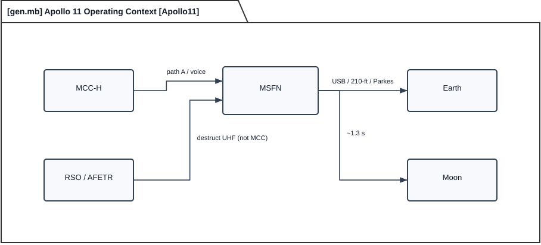
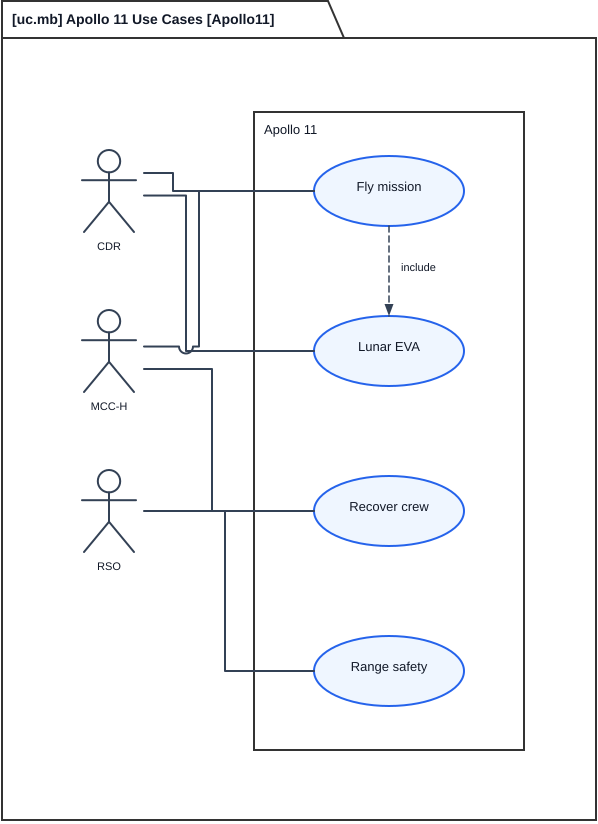
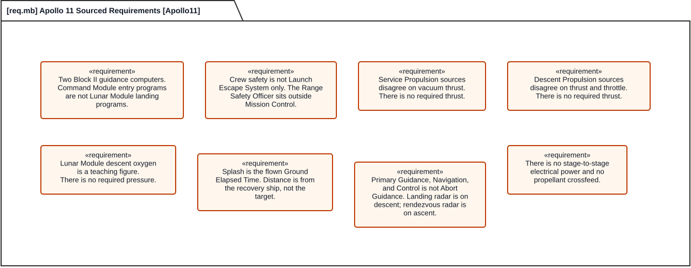
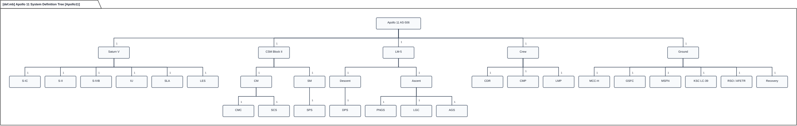
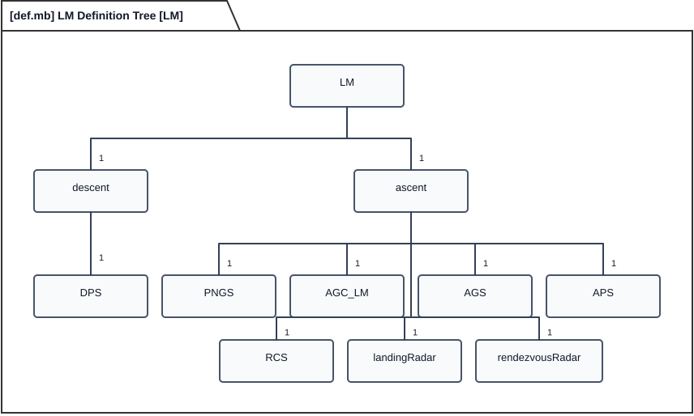
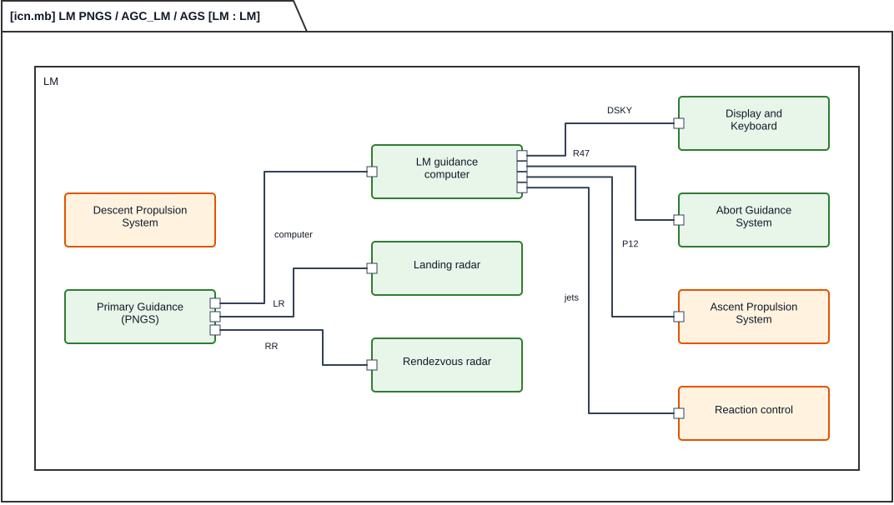
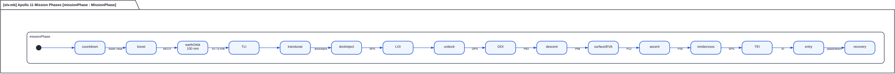
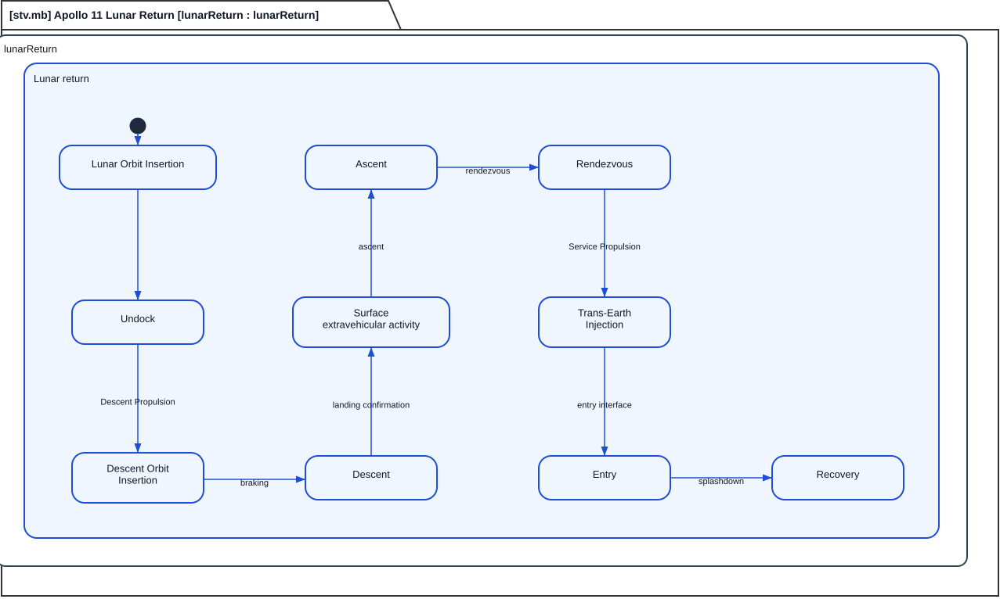
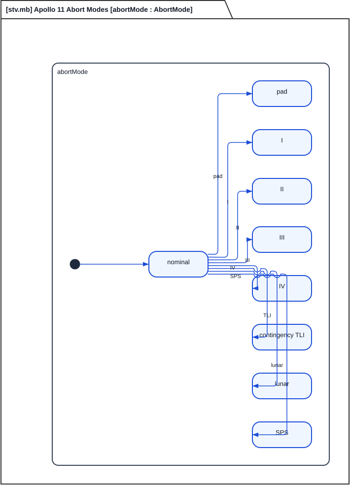
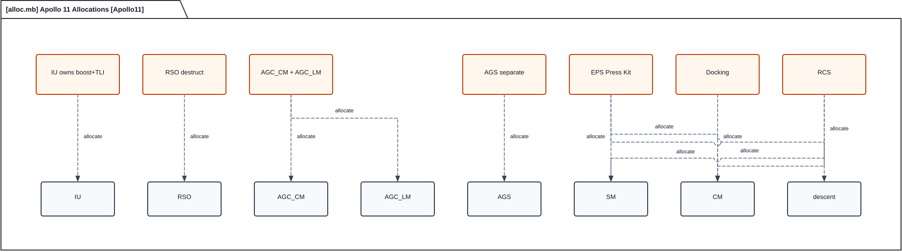

# Apollo Architecture

Houston does not own the destruct button. Apollo 11 is still one mission, but the as-flown stack is several vehicles, two guidance computers, and a control room that cannot blow the rocket if the range says no.

Look at the photograph first. NASA 69-HC-620 is Saturn-Apollo 506 (SA-506) rolling to Pad 39-A on 20 May 1969 (National Aeronautics and Space Administration [NASA], 1969a). That is the vehicle. The diagrams come later.

This is a Systems Modeling Language version 2 (SysML v2) example rendered in SysML2d. The source is `apollo.sysml`. When a generated view disagrees with the model, the model wins. Numbers appear only when the model already has them. This is an **example model, not a certifiable** vehicle.

Three crew fly. Two land. All three come home. That thread is lunar-orbit rendezvous. Saturn V puts the Command/Service Module (CSM) and the Lunar Module (LM) in Earth parking orbit. Translunar Injection (TLI) sends the stack toward the Moon. After transposition, dock and eject, the docked vehicles coast. The CSM burns Lunar Orbit Insertion (LOI) and later Trans-Earth Injection (TEI). The LM undocks, burns Descent Orbit Insertion (DOI), lands two crew, supports one surface extravehicular activity, ascends, and meets the CSM. The Command Module (CM) brings all three home.

The instance is Apollo 11 / Apollo-Saturn 506 (AS-506), as-flown July 1969. Launch is from the Kennedy Space Center (KSC). After tower clear, Mission Control Center (MCC) Houston sits in Mission Operations Control Room (MOCR) 2. The Manned Space Flight Network (MSFN) talks to the stack. The Range Safety Officer (RSO) sits outside MCC. Recovery is to USS *Hornet*. Earth and Moon are context, not extras.

The serials on that crawler are Saturn first stage S-IC-6 / S-II-6 / S-IVB-6N / Instrument Unit (IU)-6 / Spacecraft-LM Adapter (SLA)-14, Command/Service Module CSM-107 *Columbia*, and Lunar Module LM-5 *Eagle*. In scope: first landing, one short surface extravehicular activity, model PNGS (cockpit/switch label Primary Guidance, Navigation, and Control System (PGNCS)), and Service Module (SM) cryogenic tankage 2+2. Out of scope: later J-mission variants, Lunar Roving Vehicle (LRV), Scientific Instrument Module (SIM) bay, extended EVA, and invented change-in-velocity (Δv) tables.

The work starts with the problem first, then the design. That spine is simplified MagicGrid. NASA Procedural Requirements (NPR 7123.1) maps onto it as Who needs what, The shalls, Jobs asked of the stack, What the design does in time, The parts, The serialed hardware, Sourced numbers, and Named checks. Those rows are not NPR 7123 product titles.

The national job is to land two people on the Moon and return three. This instance is Apollo 11 only: first landing, one short surface extravehicular activity, no rover, no SIM bay. Apollo 11 flew rate of descent (P66). MCC sits in MOCR 2. SM cryo is 2+2, not the later J-mission 3+3.

Crew safety is not Launch Escape System (LES)-only. LES is the pad and Mode I escape tower. Later-mode safety that the model actually has includes `AbortMode` (pad, I–IV, contingency TLI, lunar, Service Propulsion System (SPS)); RSO ultra-high-frequency (UHF) destruct outside MCC, safed after Earth orbit; the CM heat shield; Environmental Control and Life Support System (ECLSS); A7L pressure garment; Portable Life Support System (PLSS); and recover-crew to *Hornet*. There is no single `crewSafetyRequirement` element.

The stack sits among first-class parts, not one Ground actor. The operating-context figure shows crew, Mission Control, the tracking net, Range Safety Officer, Earth, and Moon. Destruct is a labeled flow. It does not go through Mission Control.

*Apollo operating context. Crew is on the page. Destruct does not route through Mission Control.*

A Stakeholder here is a person or organization that asks a job of the stack. Commander (CDR) Armstrong and Lunar Module Pilot (LMP) Aldrin associate with Fly Mission and Lunar EVA and carry PLSS for EVA. The Command Module Pilot (CMP) has no PLSS in the model. The CMP personal name is unmarked.

KSC Launch Control Center (`KSC_LCC`) owns launch commit from Firing Room 1, with the RCA 110A pair, Acceptance Checkout Equipment (ACE), umbilicals, and pad cryo. That center is context, not a use-case actor. MCC owns Fly Mission and Recover Crew after tower clear under Mission Rule 1-21. MCC is not a midcourse-correction burn. The Real-Time Computer Complex (RTCC) is five IBM 360/75 machines for trajectory and uplink. Mission Operations Computer (MOC) versus Dynamic Standby Computer (DSC) roles on A11 are unmarked.

Goddard Space Flight Center (GSFC) and the NASA Communications Network (NASCOM) carry ground wideband. MSFN is the Goldstone / Madrid / Honeysuckle 85-ft Unified S-Band (USB) triad, plus named 30-ft sites, ships (collapsed), and Apollo Range Instrumentation Aircraft (ARIA). Air Force Eastern Test Range (AFETR) RSO owns Range Safety: UHF destruct, outside MCC, safed after Earth orbit. TF-130 / USS *Hornet* (CV-12) recovers the crew. Splash is flown 195:18:35 GET. Distance is 13 nmi from USS *Hornet*, not from the target. The weather-revised miss is ~1.7 nmi.

Fly Mission is the job. CDR and MCC associate with it. Fly Mission **Includes** Lunar EVA. Recover Crew belongs to MCC. Range Safety belongs to RSO and stays separate from Fly Mission. Analysis cases are names only, with no equations and no results: USB link analysis (`usbLinkAnalysis`) and consumable analysis (`consumableAnalysis`). Verification cases are names only; none binds a part, port, or effect: `verifyUsbCsm`, `verifyA7l`, `verifyP27`, `verifyRso`.

The use-case figure is three actors and four ellipses. Commander and Range Safety Officer sit on the left. Mission Control Center sits on the right so the include arrow and the actor lines do not cross. The dashed include arrow is Fly Mission to Lunar EVA.

*Apollo use cases. Fly Mission includes Lunar EVA; Range Safety stays with RSO. Mission Control Center is on the right.*

Context flows keep their model names. MCC talks to MSFN on Path A and voice. RSO talks to the vehicle on destruct UHF, not via MCC. MSFN talks to Earth on USB / 210-ft / Parkes, and to the Moon at about 1.3 s lunar delay.

A generated box is not a shall. Engine thrust conflicts are cited with no silent winner and no required thrust.

The first stage had to lift the whole stack. Press Kit page 109 printed that load for S-IC-6 (NASA, 1969b). Fueled, the stage is 5,022,674 lb. Dry, it is 288,750 lb. Most of the fueled mass is liquid oxygen (LOX): 3,307,855 lb. The kerosene (RP-1) is 1,426,069 lb. Liftoff thrust on that page is 7,653,854 lbf. Those loads are a snapshot. They are not a required-mass shall.

The second stage burns after the first drops away. S-II-6 is 1,059,171 lb fueled. Dry, it is 79,918 lb. Its LOX is 821,022 lb. Its liquid hydrogen (LH2) is 158,221 lb.

The third stage parks the stack in Earth orbit and later does Translunar Injection. S-IVB-6N is 260,523 lb fueled. Dry, it is 25,000 lb. Its LOX is 192,023 lb. Its LH2 is 43,500 lb.

The Instrument Unit sits above that stage. IU-6 is 4,306 lb. The Command Module that comes home is 12,250 lb. The Service Module that pushes it is 51,243 lb.

The same page also printed the stack at the moment of ignition. That figure is 6,484,280 lb. The stack is lighter at first motion: 6,398,535 lb. The escape tower that can pull the crew off is 8,930 lb. The Lunar Module descent stage, empty of propellant, is 4,483 lb. The Lunar Module Reaction Control System (RCS) propellant on that page is 604 lb. The landing engine carries propellant on that page. Descent Propulsion System (DPS) load is 18,100 lb. The Lunar Module Ascent Propulsion System (APS) that leaves the Moon is 5,214 lb. That last figure is the LM engine. It is not the S-IVB Auxiliary Propulsion System ullage motors.

The engine table is the number fight. There is no required thrust. SPS and DPS cites stay; the model does not pick a winner and does not add a shall. LMA790 (a Grumman Lunar Module document number) is the third DPS cite (NASA, 1969b; NASA, 1973c; NASA, 1973b).

| Engine | Source A | Source B | Source C |
|--------|----------|----------|----------|
| SPS | 20,500 lbf (Press Kit) | 21,500 lbf vac (TN D-7375) | — |
| DPS | 9,870 / 1,050–6,300 lbf (Press Kit) | 10,500 lbf 10:1 (TN D-7143) | 9,870 / 1,050–6,800 lbf (LMA790) |

LM APS is 3,500 lbf, 90% in 0.450 s, 1.5° cant (NASA, 1973a, Technical Note D-7082). F-1 ×5 is 1,530,000 lbf each, sourced as SA-507, not AS-506. F-1 hydraulics are collapsed. J-2 is 230,000 lbf on S-II ×5 and 207,000 lbf on S-IVB ×1.

SM RCS is 100 lbf/engine (NASA, 1969b, p. 93), four quads. LM RCS is 100 lbf/engine (NASA, 1969b, p. 106). CM RCS is 93 lbf/engine, two systems of six, no automatic translation. Loaded SM/CM RCS propellant mass is unmarked.

There are two Apollo Guidance Computers (AGC): `AGC_CM` and `AGC_LM`. They are not one machine with two nameplates. Block II is 16-bit, 2048 erasable / 36864 fixed, 1.024 MHz, memory cycle time (MCT) 11.7 µs, 65 lb / 70 W (MIT R-700 Volume III). AGCIS 30 is the ~60 lb approximation and stays unmarked; the sources used here do not give it a full title. The CM is 1 AGC + 2 Display and Keyboard (DSKY). The LM is 1 AGC + 1 DSKY. A11 ropes are Comanche 055 on AGC_CM and Luminary 1A LMY99/1 on AGC_LM. Command Module Computer (CMC) P61–P67 is entry. Lunar Module Guidance Computer (LGC) P63–P68 is landing. Pulse Integrating Pendulous Accelerometer (PIPA) scale is CM 5.85 cm/s/pulse versus LM 1.0 cm/s/pulse.

The IU is physically LVDC + ST-124 + Flight Control Computer (FCC). LVDC is 82.03125 µs, 26+2 bits, with no digital AGC↔LVDC, and the IU owns boost + TLI. Abort Guidance System (AGS) is Abort Electronics Assembly (AEA) + Abort Sensor Assembly (ASA) + Data Entry and Display Assembly (DEDA): AEA 4096×18, 5 µs, 32.7 lb, not a landing computer (Kurten, 1975, Technical Note D-7990). AGS ≠ DSKY. AGS display is DEDA. R47 inits AGS from PNGS. Verb 37 (V37) is mode, V36 is fresh start, V69 is restart. 1201/1202 is executive overflow, not an abort.

PNGS is AGC_LM + Inertial Measurement Unit (IMU) + radars, not AGS. Physical `landingRadar` is on descent only. One `rendezvousRadar` is on ascent only. PNGS connects to both and does not nest either radar.

Electrical power in the Press Kit is three Service Module fuel cells, FC1 through FC3, with cryogenic tankage 2+2 (NASA, 1969b). The Command Module carries three silver-zinc (AgZn) batteries plus a charger and two 117 V 400 Hz inverters. The Lunar Module carries six AgZn batteries: four on descent and two on ascent. Each LM battery string has an Electrical Control Assembly (ECA). The bus is 28 V DC. There is no stage-to-stage electrical power. There is no Command/Service Module to Lunar Module propellant crossfeed.

Houston has to talk to the stack across a quarter million miles. That path is Unified S-Band. The Command/Service Module uplink is 2106.40625 MHz. The quiet downlink is phase modulation (PM) at 2287.5 MHz. The television downlink is frequency modulation (FM) at 2272.5 MHz.

Telemetry comes back as pulse-code modulation (PCM). The rate is 51.2 or 1.6 kbps. The uplink digital rate is about 2 kbps. Ranging uses pseudo-random noise (PRN) at 992 kbps. That range is good to ±15 m. The unambiguous distance is about 540,000 mi.

The Lunar Module cannot share the Command Module pair. Its uplink is 2101.802 MHz. Its downlink is 2282.5 MHz. The steerable antenna is 20.5 dB transmit. The amplitron is 20 W. The LM does not run PM and FM at the same time.

The High-Gain Antenna (HGA) has three transmit gains from Technical Note D-6723 Table I: wide 8.0 dB, medium 18.0 dB, and narrow 25.7 dB. Those figures are not beam widths. The beam widths are 40.0 / 11.3 / 4.4 degrees. The power amplifier is 11.2 W on PM and 12.6 W on FM. The crew picks the beam. The ground cannot command it on Block II.

A command from a Flight Controller (FC) has to walk a path before the stack hears it. That path is Path A. It goes to the Command and Communications Controller (CCC), then the RTCC, then Communications, Command, and Telemetry System (CCATS), then site 642B, then USB at 70 kHz. P27 is a different door. It accepts verbs V70–V73 only. Close-in voice uses Very High Frequency (VHF). Those frequencies are 296.8 MHz and 259.7 MHz. Recovery uses 243.0 MHz.

Three men breathe one cabin. That cabin is 5.0 psia of 100% oxygen. Carbon dioxide (CO2) has to stay at or below 7.6 torr. The specification was written for three crew for fourteen days. Apollo 11 flew 196 h. The specification was 336 h.

The Service Module carries the stores. Oxygen there is 640 lb. Potable water is 36 lb. Waste water is 56 lb. Lithium hydroxide (LiOH) cans last 1.5 man-day. The crew swaps them every 12 h.

The Lunar Module has its own tanks. Descent oxygen on LM-5 is about 48 lb. That load is a teaching figure 2800 psi. 3000 psi D-6724 is the other text. There is no required pressure (NASA, 1972, Technical Note D-6724).

Ascent oxygen is the short stay after liftoff from the Moon. That load is about 2.4 lb times two. The Lunar Module also carries water. Descent water is 332 lb. Ascent water is 42 lb times two.

The Liquid Cooling Garment (LCG) dumps heat from a walking crewman. Steady load is 1200 Btu/man-h. The A7L suit holds pressure at 3.75±0.25 psid. Walking outside the cabin adds mass. Extravehicular mass is 19.69 kg. The backpack has to last the walk. Portable Life Support System usable oxygen is 1.04 lb for 4 h at 1200 Btu/h.

Food is TN D-7720 April 1967 plan baseline: 2800 kcal/man/day CM, 3200 kcal/man/day LM, not A11 flown intake (Smith et al., 1974). Earth parking orbit is 100 nmi planned. One surface extravehicular activity: CDR 2:48 / LMP 2:40 (Technical Note D-8093 Table I). Not the Public Affairs Office (PAO) hatch-to-hatch 2:31:40 (Lutz et al., 1975). Transposition, docking, and extraction (TD&E) is about 03:20–04:09 planned, CMP-owned, SM RCS, CM probe / LM drogue + 12 ring latches. The LM stays in the SLA — 8 panels (4 jettison / 4 stay) — until dock and eject after TLI and before translunar coast.

TLI Ground Elapsed Time (GET) has three labels only.

| TLI label | GET | Source |
|-----------|-----|--------|
| Planned | 02:44:15 GET | Press Kit (NASA, 1969b) |
| Planned | 2:44:26 GET | A11-FP (NASA Manned Spacecraft Center, 1969) |
| Flown | 02:44:16 GET | MSC-00171 (NASA, 1969c) |

Planned LOI-1 is 75:54:28 GET. A11-FP is the **only planned source**. Flown LOI-1 is ~075:49:50 GET (PAD / Mission Report). Two LOI-1 numbers only.

The requirements figure is six INCOSE shalls, one per job box: safety, land, talk, abort, air, guide. Each box states The [subject] shall [capability] under [condition]. A view label is not a shall the model does not have. Locked numbers and the thrust fights stay in the prose and in the engine table, not inside a box.

*Apollo requirements. The six boxes are INCOSE shalls. They do not invent a number or a third LOI-1 time.*

The pad stack from the ground up is Saturn first stage S-IC-6, S-II-6, S-IVB-6N, IU-6, SLA-14 with LM-5 inside, SM, CM, and LES. The system-definition figure is seven top-level parts under Apollo 11 AS-506: Saturn V, Command/Service Module, Lunar Module, Crew, Ground, Range Safety Officer, and Recovery. Stage, Instrument Unit, and guidance detail stay on the child figures. The Instrument Unit is IU → LVDC, ST-124, FCC. SLA is eight-panel. Descent and ascent stay separate. Two AGCs stay separate.

*Apollo system definition. Seven spelled parts sit under the serialed instance. Stage, Instrument Unit, and guidance detail live on the child figures.*

PNGS is the model name for PGNCS and is not AGS. SCS is the Block II analog backup to AGC_CM.

The Lunar Module definition and the Lunar Module interconnection figure have to stand alone. The split is the stage mate. The definition figure keeps eight boxes and keeps the nest. Descent stage holds Descent Propulsion System and Landing radar. Ascent stage holds Primary Guidance Navigation and Control, Abort Guidance System, and Rendezvous radar. Those children sit under the stage. They are not eight siblings of Lunar Module.

Batteries, the Electrical Control Assembly, the drogue, and the Abort Guidance assemblies stay in the sentences. Descent holds four silver-zinc batteries and the Electrical Control Assembly with the radar: descent → DPS, AgZn1–4, ECA, landingRadar. Ascent holds the Lunar Module guidance computer, the Ascent Propulsion System, reaction control, and the drogue. PNGS → IMU on ascent. Physical `landingRadar` lives on descent only. One `rendezvousRadar` lives on ascent only. Primary Guidance sits on ascent. It connects across the mate to landing radar on descent and to rendezvous radar on ascent. It nests neither radar. Abort Guidance is Abort Electronics Assembly, Abort Sensor Assembly, and Data Entry and Display Assembly. It is not a landing computer.

*LM definition. Descent holds the landing radar; ascent holds the one rendezvous radar. Names are spelled in the boxes.*

*LM internals. PNGS crosses the mate to both radars and does not own either one as a child.*

The mechanical stack is Saturn first stage to second stage to third stage to Instrument Unit to the adapter to the Service Module, with the Launch Escape System on the Command Module, the Lunar Module in the adapter on the descent stage, Command Module probe to Lunar Module drogue, and descent mated to ascent. The Range Safety Officer talks ultra-high-frequency destruct to the Saturn first stage, outside Mission Control. Launch Control talks umbilicals to the Saturn first stage and hands voice to Mission Control at tower clear (Mission Rule 1-21). The Instrument Unit guides the three stages for boost and Translunar Injection. The tracking net talks Unified S-Band to the Command Module and Lunar Module. NASCOM is wideband to Ground and Mission Control. Mission Control talks Path A to the tracking-net site. The separate P27 path is V70–V73 only. Recovery talks 243.0 MHz to the Command Module. Isolation stays: no stage-to-stage electrical power and no Command/Service Module to Lunar Module propellant crossfeed.

The hop that must stay is Translunar Injection → dock and eject → translunar coast → Lunar Orbit Insertion. There is no hop from Translunar Injection straight to translunar coast. Dock and eject is after Translunar Injection and before translunar coast.

countdown → boost → Earth orbit → Translunar Injection → dock and eject → translunar coast → Lunar Orbit Insertion → undock → Descent Orbit Insertion → Braking → Approach → Rate of descent → landing confirmation → surface extravehicular activity → ascent → rendezvous → Trans-Earth Injection → entry → recovery

Tower clear starts boost. Orbital insertion follows engine cutoff. The Translunar Injection burn, then Lunar Module extract, then the Service Propulsion Lunar Orbit Insertion burn. Descent Propulsion does Descent Orbit Insertion. Apollo 11 lands under rate of descent. Ascent follows surface extravehicular activity. Service Propulsion does Trans-Earth Injection. The recovery force closes the book.

The mission clock is two pages so each stays printable. The model still nests Earth coast and Lunar return. The four sourced concurrent regions stay in the model. They are not flattened onto a forced note page.

Earth coast holds countdown through Lunar Orbit Insertion. The locked hop sits on that page: Translunar Injection → dock and eject → translunar coast → Lunar Orbit Insertion. Translunar Injection boxes carry the three GET labels. Lunar Orbit Insertion boxes carry planned 75:54:28 GET and flown ~075:49:50 GET.

*Apollo earth coast. The locked hop is Translunar Injection, then dock and eject, then translunar coast, then Lunar Orbit Insertion.*

Lunar return holds Lunar Orbit Insertion through recovery. Braking sits inside Descent, between Descent Orbit Insertion and Approach. The walk is Descent Orbit Insertion to Braking to Approach to Rate of descent to landing confirmation to Surface extravehicular activity. Arrows on that page are English: landing confirmation, ascent, and rendezvous.

*Apollo lunar return. Descent Orbit Insertion, surface extravehicular activity, Trans-Earth Injection, and recovery sit on this page.*

The model keeps four concurrent regions. Abort runs beside the nominal clock. After undock, the Command/Service Module stays in lunar orbit while the Lunar Module flies Descent Orbit Insertion through ascent. Range Safety runs beside Mission Control until destruct is safed after Earth orbit. Abort Guidance runs beside Primary Guidance in operate and follow-PNGS; Abort Guidance does not land. There is no fourth computer and no concurrent Δv table.

Abort runs beside the nominal machine: Pad, Mode I, Mode II, Mode III, Mode IV, Contingency Translunar Injection, Lunar, and Service Propulsion System. Pad and Mode I sit with the Launch Escape System. Later modes do not. Crew safety is not the tower alone. The abort figure teaches those names in the state boxes.

*Apollo abort modes. Pad and Mode I sit with the Launch Escape System; Mode II, Mode III, Mode IV, Contingency Translunar Injection, Lunar, and Service Propulsion System do not.*

Computer mode machines stay separate. Command Module Computer entry is P61 → P62 → P63 → P64 → P65 → P66 → P67 (entry only). Lunar Module Guidance Computer landing is P63 → P64 → {P65 | P66} → P67 → P68 (landing only). Apollo 11 flew rate of descent. Abort Guidance goes idle → operate (R47 from Primary Guidance) → follow Primary Guidance → idle and does not land. Life support goes cabin → suit → extravehicular activity → cabin. Docking mode, which is not the mission dock-and-eject state, is undocked → soft → hard (twelve latches) → hardware off.

Named constraints are `usbCsmLink`, `usbLmLink`, `lunarDelay`, `f1Thrust`, `agcCycle`, and `a11IgnitionMass`. Names only: no equations and no results, and not taught as studies. F-1 1,530,000 lbf remains an SA-507 citation, not an AS-506 requirement.

Allocation maps a named job onto a part that exists. Boost and TLI allocate to the IU (LVDC + ST-124 + FCC). Destruct allocates to RSO, outside MCC. LOI / TEI / entry allocate to AGC_CM. Landing / ascent / LM abort allocate to AGC_LM. Backup attitude allocates to AGS, which does not land. Atmosphere and thermal allocate to ECLSS. EVA allocates to the Extravehicular Mobility Unit (EMU) (A7L + PLSS). Path A allocates to CCATS. Path B allocates to P27. Electrical Power System (EPS) allocates to SM fuel cells, CM AgZn, and LM descent AgZn.

*Apollo allocations. IU owns boost and TLI; the two AGCs stay split; RSO owns destruct.*

Unmarked stays unmarked. The model does not invent a number to close a gap: CSM lunar Δv (no official table in the sources used); SPS loaded mass / CSM-107 SPS loaded lb; SM/CM RCS loaded propellant mass; RCS Δv table; A11 AGS flight-program name; A11 flown food intake (kcal), because TN D-7720 2800/3200 is the 1967 plan baseline, not flown kcal; entry blackout duration; RTCC MOC versus DSC which-is-which on A11; the complete MSFN 30-ft inventory (ships collapsed) and the 4th Apollo Instrumentation Ship (AIS); the full SCS switch deck (TBD in the model); and the CMP personal name (not in the model).

In scope: Apollo 11 / Block II / AS-506. Out of scope: J-mission 3+3 cryo, LRV, SIM bay, extended EVA. Verification cases remain names only. This remains an example model, not a certifiable product.

Which cut of the stack is hardest to drop — the two guidance computers, the radar split, or the Translunar Injection → dock and eject hop — and which number must stay unmarked?

## References

Kurten. (1975, July). *Abort Guidance System* (Technical Note D-7990).

Lutz et al. (1975, November). *Development of the Extravehicular Mobility Unit* (Technical Note D-8093).

NASA Manned Spacecraft Center, Flight Planning Branch. (1969, July 1). *Apollo 11 Flight Plan* (Final).

National Aeronautics and Space Administration. (1969a, May 20). *69-HC-620* [Photograph].

National Aeronautics and Space Administration. (1969b). *Apollo 11 press kit* (69-83K).

National Aeronautics and Space Administration. (1969c, November). *Apollo 11 Mission Report* (MSC-00171).

Hall, E. C. (1972, August). *MIT's Role in Project Apollo, Volume III: Computer Subsystem* (R-700).

National Aeronautics and Space Administration. (1972a). *Apollo Experience Report: S-Band System Signal Design and Analysis* (Technical Note D-6723).

National Aeronautics and Space Administration. (1972b). *Apollo Experience Report: Lunar Module Environmental Control Subsystem* (Technical Note D-6724).

National Aeronautics and Space Administration. (1973a, March). *Apollo Experience Report: Ascent Propulsion System* (Technical Note D-7082).

National Aeronautics and Space Administration. (1973b, March). *Apollo Experience Report: Descent Propulsion System* (Technical Note D-7143).

National Aeronautics and Space Administration. (1973c, August). *Apollo Experience Report: Service Propulsion Subsystem* (Technical Note D-7375).

Smith et al. (1974, July). *Food Systems* (Technical Note D-7720).
