# Apollo Architecture

This note is an educational architecture walkthrough of the Apollo 11 / Block II system modeled in `apollo.sysml`. The example instance is Apollo 11 / AS-506 (SA-506): Saturn V serials S-IC-6 / S-II-6 / S-IVB-6N / IU-6 / SLA-14, Command/Service Module (CSM) CSM-107 *Columbia*, Lunar Module (LM) LM-5 *Eagle*. It uses a **simplified MagicGrid** spine: problem domain first, then solution domain. It is not a Department of Defense Architecture Framework (DoDAF) product. There are no Operational / Systems / Technical View (OV / SV / TV) products and no capability taxonomies.

A new systems engineer should be able to learn the *system* and the *method* from this note without opening the Systems Modeling Language (SysML) source. The `.sysml` model is authoritative when a generated view label disagrees.

This is an example model, not a certifiable vehicle. Numbers are from NASA primary sources cited in the model (Apollo 11 Press Kit 69-83K, Saturn V Flight Manual, Apollo Experience Reports, Apollo Guidance Computer Information Series (AGCIS) / Massachusetts Institute of Technology Instrumentation Laboratory (MIT IL), Technical Notes D-6718 / D-6724 / D-7082 / D-7143 / D-7375 / D-7720 / D-8093 / D-8227 / TN-7990). Values not in those extracts are left unmarked. There is no official Command/Service Module lunar change-in-velocity (Δv) table in the sources used here — that table is not invented.

Hyphens are not legal identifiers: S-IC / S-II / S-IVB appear as `SIC`, `SII`, `SIVB`; ST-124 appears as `ST124`. The mission phase surface/extravehicular activity is `surfaceEVA`.

## How to read this note (simplified MagicGrid)

MagicGrid separates **what the system must do for someone** from **how the design does it**.

**Problem domain**

1. Purpose / mission — why the system exists, in plain language.
2. Stakeholders and use cases — every actor, include/extend, and the analysis and verification *names*.
3. Requirements — model text wins. Quantitative targets appear only when they are bound in the `.sysml`. Sources appear only when the model already cites them.

**Solution domain**

4. Structure and interfaces — parts, ports that exist, what connects to what and why, and the operating boundary.
5. Behavior — states, actions, interactions, and abort/fault paths.
6. Parametrics / constraints — equations if present; names only if not.
7. Allocations — requirements or behavior mapped onto parts that actually exist.

Sections 8 and 9 walk every generated figure and then list unmarked items and out-of-scope work.

### NASA systems engineering (NPR 7123) mapped onto MagicGrid

NASA Procedural Requirements (NPR) 7123.1, *NASA Systems Engineering Processes and Requirements*, is taught here as a **mapping onto MagicGrid**, not as a second framework.

| NPR 7123.1 process | MagicGrid layer in this note |
|--------------------|------------------------------|
| Stakeholder | §§1–2 purpose, stakeholders, operating context |
| Requirements | §3 technical requirements (model text; sourced numbers; unmarked left unmarked) |
| Use Cases | §2 every actor, include/extend, analysis and verification *names* |
| Functional | §5 behavior — mission State Machine (STM) and named functions / actions / abort |
| Logical | §4 part tree and interfaces (what connects to what) |
| Physical-subsystem | §4 serialed hardware: S-IC-6, CSM-107, landing radar on descent, IU as Launch Vehicle Digital Computer (LVDC) + ST-124 + Flight Control Computer (FCC) |
| Parametrics | §6 named constraints; no invented equations |
| Verification | analysis and verification *names* — no part, port, or effect is bound unless the model says so |

Crew safety, range safety, and recovery sit in stakeholder expectations and later-mode abort, not only in the Launch Escape System (LES).

---

## 1. Purpose / mission

Apollo 11 is a lunar-orbit-rendezvous (LOR) mission. Saturn V places the CSM and LM in Earth parking orbit. Translunar Injection (TLI) sends the stack toward the Moon. After transposition, docking, and LM extract (`dockEject`), the docked vehicles coast translunar. The CSM performs Lunar Orbit Insertion (LOI) and later Trans-Earth Injection (TEI). The LM undocks, does Descent Orbit Insertion (DOI) and powered descent, lands, supports one surface Extravehicular Activity (EVA), ascends, and rendezvous with the CSM. The crew returns in the Command Module (CM) for entry and recovery.

This is Apollo 11 / AS-506 only — first landing, one short EVA, no Lunar Roving Vehicle (LRV), no Scientific Instrument Module (SIM) bay, model PNGS (cockpit/switch label Primary Guidance, Navigation, and Control System (PGNCS)) program P66 as the flown landing program, Mission Operations Control Room (MOCR) 2, Service Module (SM) cryogenic tankage 2+2. J-mission variants are out of scope.

Crew safety in this model is not LES-only. LES is the pad / Mode I escape tower on the stack. Later-mode crew safety that is actually modeled: `AbortMode` (pad, I–IV, contingency TLI, lunar, Service Propulsion System (SPS)); Range Safety Officer (RSO) ultra-high-frequency (UHF) destruct (outside Mission Control Center (MCC) Houston — not a midcourse correction — safed after Earth orbit); CM heat shield for entry; Environmental Control and Life Support System (ECLSS) / A7L pressure garment / Portable Life Support System (PLSS); and recover-crew to *Hornet*. There is no single `crewSafetyRequirement` element.

## 2. Stakeholders and use cases

The stack sits among first-class parts, not one Ground actor.

| Stakeholder / part | Role | Associated use cases |
|--------------------|------|----------------------|
| Commander (CDR), Lunar Module Pilot (LMP), Command Module Pilot (CMP) | Flight crew. CDR (Armstrong) and LMP (Aldrin) carry PLSS for EVA. CMP has no PLSS in the model | CDR: Fly Mission, Lunar EVA |
| Kennedy Space Center Launch Control Center (`KSC_LCC`) | Launch commit: Firing Room 1, RCA 110A pair, Acceptance Checkout Equipment (ACE), umbilicals, pad cryo | (context; not a use-case actor) |
| MCC (Houston) | Flight control after tower clear. Apollo 11 uses **MOCR 2**. MCC is not a midcourse-correction burn | Fly Mission, Recover Crew |
| Real-Time Computer Complex (RTCC) | Five IBM 360/75. Trajectory and uplink. Mission Operations Computer (MOC) vs Dynamic Standby Computer (DSC) roles on A11 are unmarked | (supports MCC) |
| Goddard Space Flight Center (GSFC) / NASA Communications Network (NASCOM) | Ground wideband network | (context) |
| Manned Space Flight Network (MSFN) | Goldstone / Madrid / Honeysuckle 85-ft Unified S-Band (USB) triad, plus named 30-ft, ships (collapsed), Apollo Range Instrumentation Aircraft (ARIA) | (context) |
| Air Force Eastern Test Range (AFETR) RSO | UHF destruct, **outside MCC**, safed after Earth orbit | Range Safety |
| TF-130 / USS *Hornet* (CV-12) | Recovery. Splash 195:18:35 Mission Elapsed Time (MET), 13 nmi from target | Recover Crew (MCC-owned) |
| Earth / Moon | Celestial context | — |

Handoff is KSC → MCC at tower clear — **Mission Rule 1-21**. RSO is not MCC.

**Use cases**

- **Fly Mission** — primary. CDR and MCC associate. **Includes** Lunar EVA.
- **Lunar EVA** — CDR. One surface EVA.
- **Recover Crew** — MCC.
- **Range Safety** — RSO. No include/extend to Fly Mission.

**Analysis cases:** USB link analysis (`usbLinkAnalysis`; `usbCsmLink` → CSM USB requirement); consumable analysis (`consumableAnalysis`; CM ECLSS requirement).

**Verification cases** (names only — no part, port, or effect is bound): `verifyUsbCsm`, `verifyA7l`, `verifyP27`, `verifyRso`.

Context flows: MCC → MSFN (Path A / voice); RSO → vehicle (destruct UHF, not via MCC); MSFN ↔ Earth (USB / 210-ft / Parkes); MSFN ↔ Moon (~1.3 s lunar delay).

## 3. Requirements

The model states sourced requirements as documentation on named requirement elements. Conflicts are cited both ways with no silent winner. View identifiers are not model elements.

### Mass and propellant (A11 Press Kit p.109)

| Item | Sourced value |
|------|---------------|
| S-IC-6 | 5,022,674 lb fueled / 288,750 lb dry; liquid oxygen (LOX) 3,307,855; RP-1 1,426,069; liftoff **7,653,854 lbf** |
| S-II-6 | 1,059,171 / 79,918; LOX 821,022; liquid hydrogen (LH2) 158,221 |
| S-IVB-6N | 260,523 / 25,000; LOX 192,023; LH2 43,500 |
| Instrument Unit (IU)-6 | 4,306 lb |
| CM | 12,250 lb |
| SM | 51,243 lb |
| Also Press Kit | Ignition 6,484,280 lb; first motion 6,398,535; LES 8,930; LM descent dry 4,483; LM Reaction Control System (RCS) 604; Descent Propulsion System (DPS) load 18,100; LM Ascent Propulsion System (APS) load 5,214 (engine — not the S-IVB Auxiliary Propulsion System / ullage motors) |

### Engines

| Engine | Source A | Source B |
|--------|----------|----------|
| SPS | 20,500 lbf (Press Kit) | 21,500 lbf vac (TN D-7375) |
| DPS | 9,870 / 1,050–6,300 lbf (Press Kit) | 10,500 lbf 10:1 (TN D-7143) |
| LM APS (engine) | 3,500 lbf; 90% in 0.450 s; **1.5° cant** (TN D-7082) | — |
| F-1 ×5 | 1,530,000 lbf each, sourced as **SA-507**, not AS-506 | hydraulics collapsed |
| J-2 S-II ×5 | 230,000 lbf | — |
| J-2 S-IVB ×1 | 207,000 lbf | — |

### RCS

SM 100 lbf/engine (Press Kit p.93), four quads. LM 100 lbf/engine (Press Kit p.106). CM 93 lbf/engine; two systems of six; no automatic translation. Loaded SM/CM RCS propellant mass is unmarked.

### Guidance computers

| System | Sourced parameters | Source |
|--------|-------------------|--------|
| Apollo Guidance Computer (AGC) — two: `AGC_CM`, `AGC_LM` | Block II 16-bit; 2048 erasable / 36864 fixed; 1.024 MHz; memory cycle time (MCT) **11.7 µs**; 65 lb / 70 W. CM = 1 AGC + 2 Display and Keyboard (DSKY). LM = 1 AGC + 1 DSKY | AGCIS 30 |
| A11 ropes | Comanche **055** on AGC_CM; Luminary **1A LMY99/1** on AGC_LM | `agcRequirement` |
| P-numbers | Command Module Computer (CMC) P61–P67 = **entry**; Lunar Module Guidance Computer (LGC) P63–P68 = **landing**. Not one shared P-number machine | `agcRequirement` |
| Pulse Integrating Pendulous Accelerometer (PIPA) | CM 5.85 cm/s/pulse; LM 1.0 cm/s/pulse | `pipaRequirement` |
| IU | Physically LVDC + ST-124 + FCC. LVDC 82.03125 µs; 26+2 bits; **no digital AGC↔LVDC**. IU owns boost + TLI | `iuGncRequirement` |
| Abort Guidance System (AGS) | Abort Electronics Assembly (AEA) + Abort Sensor Assembly (ASA) + Data Entry and Display Assembly (DEDA); AEA 4096×18, 5 µs, 32.7 lb; **not a landing computer**. AGS ≠ DSKY — AGS display is DEDA. R47 inits from PNGS | TN-7990 |

Verb 37 (V37) mode, V36 fresh start, V69 restart. 1201/1202 is executive overflow, not an abort.

PNGS (model name; cockpit/switch label PGNCS) is AGC_LM + Inertial Measurement Unit (IMU) + radars — not AGS. Physical `landingRadar` is on descent only; one `rendezvousRadar` is on ascent only; PNGS connects to both and does not nest either radar.

### Electrical power (Press Kit)

SM: fuel cells FC1–FC3; cryo **2+2** (not J-mission 3+3). CM: silver-zinc (AgZn) 1–3 + charger; two 117 V 400 Hz inverters. LM: six AgZn (4 descent / 2 ascent) + Electrical Control Assembly (ECA) each. Bus 28 V DC. **No stage-to-stage electrical power. No CSM–LM propellant crossfeed.**

### Communications

| Link | Sourced parameters |
|------|-------------------|
| USB CSM | Uplink 2106.40625 MHz; phase modulation (PM) down 2287.5; frequency modulation (FM) down 2272.5; pulse-code modulation (PCM) 51.2 or 1.6 kbps; uplink digital ~2 kbps; pseudo-random noise (PRN) range 992 kbps, ±15 m, ~540,000 mi unambiguous |
| USB LM | Uplink 2101.802 MHz; down 2282.5; steerable 20.5 dB transmit; amplitron 20 W; no simultaneous PM+FM |
| CSM High-Gain Antenna (HGA) | Wide 8.0 / medium 18.0 / narrow 25.7 dB; power amplifier 11.2 W PM / 12.6 W FM; **crew-selected**, not ground-commandable on Block II |
| Path A | Flight Controller (FC) → Command and Communications Controller (CCC) → RTCC → Communications, Command, and Telemetry System (CCATS) → site 642B → USB 70 kHz |
| P27 | Verbs **V70–V73 only**; separate from CCATS |
| Very High Frequency (VHF) | 296.8 / 259.7 MHz |
| Recovery | 243.0 MHz |

### ECLSS, EVA, orbit, timing

| Parameter | Value |
|-----------|-------|
| CM cabin | 5.0 psia 100% O2; carbon dioxide (CO2) ≤ 7.6 torr |
| CM spec vs A11 | 3 crew / 14 d spec; A11 **196 h** vs 336 h spec |
| SM O2 / water | 640 lb O2; potable 36 lb / waste 56 lb |
| Lithium hydroxide (LiOH) | 1.5 man-day; swap 12 h |
| LM-5 descent O2 | ~48 lb — **2800 psi vs 3000 psi, both cited** |
| LM-5 ascent O2 | ~2.4 lb ×2 |
| LM-5 water | descent 332 lb; ascent 42 lb ×2 |
| Liquid Cooling Garment (LCG) | 1200 Btu/man-h steady |
| A7L | 3.75±0.25 psid; extravehicular 19.69 kg |
| PLSS | usable O2 1.04 lb / 4 h at 1200 Btu/h |
| Food plan | **TN D-7720 April 1967 plan baseline:** 2800 kcal/man/day CM, 3200 kcal/man/day LM. Not A11 flown intake. Flown kcal unmarked |
| Earth parking orbit | **100 nmi planned** |
| Lunar delay | range/c ≈ 1.3 s |
| EVA | one surface EVA; CDR 2:48 / LMP 2:40 (**flown** A11 instance) |
| TLI / TD&E / LOI-1 | **planned** Ground Elapsed Time (GET) (A11 Press Kit): TLI 02:44:15; TD&E ~03:20–04:09; LOI-1 75:54:28 |
| Splash | 195:18:35 MET, 13 nmi, *Hornet* — model does not mark planned or flown |
| Landing program | **P66 flown** |

Docking: transposition, docking, and extraction (TD&E) is its own GO/NO-GO, CMP-owned, SM RCS. CM probe / LM drogue + 12 ring latches. LM stays in the Spacecraft-LM Adapter (SLA) — 8 panels: 4 jettison / 4 stay — until `dockEject` (after TLI, before translunar coast).

### Unmarked (do not invent)

- CSM lunar Δv (no official table in the sources used)
- SPS loaded mass
- SM/CM RCS loaded propellant mass
- RCS Δv table
- A11 AGS flight-program name
- A11 flown food intake (kcal)
- Entry blackout duration
- RTCC MOC vs DSC which-is-which on A11
- Complete MSFN 30-ft inventory (ships collapsed); 4th Apollo Instrumentation Ship (AIS) unmarked
- Full Stabilization and Control System (SCS) switch deck (TBD in the model)
- CMP personal name (not in the model)

## 4. Structure and interfaces

NPR 7123 logical decomposition is the part tree and the named ports. Physical design solution is the serialed stages, tanks, computers, and radars that those parts represent.

```
Apollo11
├── SaturnV
│   ├── SIC → F1          S-IC-6
│   ├── SII → J2          S-II-6
│   ├── SIVB → J2         S-IVB-6N
│   ├── IU → LVDC, ST-124, FCC     IU-6
│   ├── SLA               SLA-14; 8 panels (4 jettison / 4 stay); LM extract after transposition
│   └── LES
├── CSM
│   ├── CM                12,250 lb
│   │   ├── SCS → Body-Mounted Attitude Gyro (BMAG), Thrust Vector Control (TVC), Rotational Hand Controller (RHC)
│   │   ├── AGC_CM → erasable, fixed, oscillator, Comanche055
│   │   ├── IMU, DSKY, DSKY2
│   │   ├── RCS → systemA, systemB
│   │   ├── ECLSS → oxygen, water, LiOH, suit circuit
│   │   ├── USB, Entry Monitor System (EMS)
│   │   ├── AgZn1–3, charger, inverter1–2
│   │   └── probe, ringLatches (12)
│   └── SM                51,243 lb; SPS load unmarked; cryo 2+2
│       ├── SPS
│       ├── RCS → quadA–D
│       └── FC1–FC3
├── LM
│   ├── descent → DPS, AgZn1–4, ECA, landingRadar
│   └── ascent
│       ├── PNGS → IMU
│       ├── AGC_LM → erasable, fixed, oscillator, Luminary1A
│       ├── AGS → AEA, ASA, DEDA
│       ├── APS, RCS, DSKY, USB, drogue, rendezvousRadar
│       └── AgZn1–2, ECA
├── Crew → CDR (A7L, PLSS), CMP (A7L), LMP (A7L, PLSS)
├── Ground → KSC_LCC, MCC (RTCC, MOCR2, CCATS; FLIGHT, CAPCOM, EECOM, CCC, Flight Dynamics Officer (FDO)), MSFN, NASCOM
├── RSO
└── recovery → Hornet
```

Pad stack: S-IC-6, S-II-6, S-IVB-6N, IU-6, SLA-14 (LM-5), SM, CM, LES.

Keep two AGCs, AGS, IU (LVDC + ST-124 + FCC), LES, descent vs ascent, and three crew. PNGS is the model name for PGNCS: AGC_LM + IMU + radars — not AGS. Physical landingRadar is on descent only; one rendezvousRadar is on ascent only; PNGS connects to both and does not nest either radar. SCS is the Block II analog backup to AGC_CM.

Mechanical stack: SIC → SII → SIVB → IU → SLA → SM; LES → CM → SM; SLA → LM descent; CM probe ↔ LM drogue; descent ↔ ascent mate.

| From | To | Why |
|------|----|-----|
| RSO | S-IC | UHF destruct — outside MCC |
| KSC_LCC | S-IC | Pad umbilicals |
| KSC_LCC | MCC | Voice handoff at tower clear (Mission Rule 1-21) |
| IU LVDC | S-IC, S-II, S-IVB | Boost and TLI guidance |
| MSFN | CM, LM | USB |
| NASCOM | Ground, MCC | Wideband |
| MCC CCATS | MSFN 642B | Path A command uplink |
| Separate P27 path | AGC | V70–V73 only |
| Recovery | CM | 243.0 MHz |
| CM probe + 12 latches | LM drogue | Soft then hard dock; hardware removed for transfer |
| PNGS (ascent) | landingRadar (descent) | PNGS talks to the physical landing radar on the descent stage |
| PNGS (ascent) | rendezvousRadar (ascent) | PNGS talks to the one rendezvous radar on ascent |

Port types: UHF destruct, umbilical, voice, guidance, mechanical, docking, USB, NASCOM, command, recovery.

Isolation: no stage-to-stage electrical power; no CSM–LM propellant crossfeed.

## 5. Behavior

### Mission phases (`MissionPhase`)

```
countdown → boost → earthOrbit → TLI → dockEject → translunar → LOI → undock → DOI → descent → surfaceEVA → ascent → rendezvous → TEI → entry → recovery
```

| Trigger | From → to |
|---------|-----------|
| `towerClear` | countdown → boost |
| `orbitalInsertion` (SECO) | boost → earthOrbit |
| `tliBurn` | earthOrbit → TLI |
| `tliComplete` | TLI → dockEject |
| `lmExtract` | dockEject → translunar |
| `loiBurn` (SPS) | translunar → LOI |
| `lunarOrbit` | LOI → undock |
| `doiBurn` (DPS) | undock → DOI |
| `p63` | DOI → descent |
| `p68` | descent → surfaceEVA |
| `p12` | surfaceEVA → ascent |
| `p30` | ascent → rendezvous |
| `teiBurn` (SPS) | rendezvous → TEI |
| `ei` | TEI → entry |
| `recoveryForce` | entry → recovery |

`dockEject` is after TLI and before translunar coast. **Planned GET** (A11 Press Kit): TLI 02:44:15, dock ~03:20, extract ~04:09, then coast, LOI-1 75:54:28. Those times are not labeled flown. P66 is the flown landing program.

### Abort modes (`AbortMode`)

Parallel to the nominal machine: pad, I, II, III, IV, contingency TLI, lunar, SPS. LES covers pad / Mode I only.

### Computer mode machines (separate)

- **CMC entry:** P61 → P62 → P63 → P64 → P65 → P66 → P67 (entry only).
- **LGC landing:** P63 → P64 → {P65 | P66} → P67 → P68 (landing only). Apollo 11 flew **P66**.
- **AGC_CM modes:** P00, P11, P20, P27, P40, P51, P52 plus V37 / V36 / V69 / 1201/1202.
- **AGC_LM modes:** P00, P12, P20, P27, P30, P70, P71 plus the same verb/alarm pattern; P70 → P71 abort chain.
- **SCS:** AGC_CM ↔ attitude hold / rate command / min impulse; crew selects AGC_CM vs SCS.
- **AGS:** idle → operate (R47 from PNGS) → follow PNGS → idle. AGS does not land.
- **ECLSS:** cabin → suit → EVA (PLSS) → cabin.
- **Docking mode** (not the mission `dockEject` state): undocked → soft (probe capture) → hard (twelve latches) → hardware off (transfer prep).

### Actions

AGC power-up (CM and LM), antenna selection, Path A load, P27 load, R47 AGS init, P63 braking, P64 approach, P66 landing, P70/P71 abort, soft dock, hard dock, remove docking hardware.

## 6. Parametrics / constraints

Named constraints: `usbCsmLink`, `usbLmLink`, `lunarDelay`, `f1Thrust`, `agcCycle`, `a11IgnitionMass`. The model does not write algebraic equations for them.

| Parameter | Value |
|-----------|-------|
| CSM USB uplink | 2106.40625 MHz |
| CSM PM downlink | 2287.5 MHz |
| LM USB uplink | 2101.802 MHz |
| Lunar delay | ~1.3 s |
| F-1 | 1,530,000 lbf — **SA-507 citation, not an AS-506 requirement** |
| AGC MCT | 11.7 µs |
| Ignition mass | 6,484,280 lb |
| Earth parking orbit | 100 nmi |

**In scope:** Apollo 11 / Block II / AS-506.

**Out of scope:** J-mission 3+3 cryo, LRV, SIM bay, extended EVA. F-1 1,530,000 lbf is an SA-507 citation, not an AS-506 figure.

**Unmarked / TBD:** CSM lunar Δv, CSM-107 SPS loaded lb, SM/CM RCS loaded propellant mass. See also §3 (AGS flight-program name, A11 flown food intake, entry blackout, RTCC MOC/DSC, 30-ft MSFN inventory, 4th AIS ship, SCS switch deck). TN D-7720 2800/3200 is the 1967 plan baseline, not flown kcal.

## 7. Allocations

NPR 7123 design-solution allocation is the mapping of technical requirements onto physical parts that exist.

| Function | Allocated to parts that exist |
|----------|-------------------------------|
| Boost, TLI | IU (LVDC + ST-124 + FCC); LVDC is the digital computer |
| Destruct | RSO (outside MCC) |
| LOI / TEI / entry | AGC_CM |
| Landing / ascent / LM abort | AGC_LM |
| Backup attitude | AGS — does not land |
| Atmosphere / thermal | ECLSS |
| EVA | Extravehicular Mobility Unit (EMU) (A7L + PLSS) |
| Trajectory / uplink | RTCC |
| RF | MSFN |
| Launch commit | KSC_LCC |
| Flight direction after handoff | FLIGHT (MOCR) |
| Heat shield | CM only (entry) |
| Pad / Mode I escape | LES |
| Later-mode abort | `AbortMode` I–IV, contingency TLI, lunar, SPS — not LES |
| Path A | CCATS |
| Path B | P27 |
| Electrical Power System (EPS) | SM fuel cells, CM AgZn, LM descent AgZn |
| Docking | CM probe, LM drogue |
| RCS | SM quads, CM systems |

Allocation names in the model: `allocateBoostToIU`, `allocateTliToIU`, `allocateDestructToRSO`, `allocateAGC_CMToCM`, `allocateAGC_LMToLM`, `allocateAGSToLM`, `allocateLVDCToIU`, `allocatePathAToCCATS`, `allocatePathBToP27`, `allocateEPSToSM`, `allocateEPSToCM`, `allocateEPSToDescent`, `allocateDockToCM`, `allocateDockToLM`, `allocateRCSToSM`, `allocateRCSToCM`.

---

## 8. Diagram walkthrough

The figures are generated SysMLD views. They illustrate the architecture above; they do not replace it. When a view label disagrees with the `.sysml`, the model wins.

**Shared symbol key**

- Stick figure — actor (CDR, MCC, RSO).
- Ellipse — use case.
- Dashed arrow labeled `include` — use-case inclusion.
- Rectangle with `«requirement»` — a requirement node (view identifier only).
- Rectangle — part usage.
- Small square on a box edge — port.
- Solid line between ports — connection. Lines must not pass through boxes. Hop-overs are line-on-line only.
- Rounded rectangle — state.
- Arrow between states — transition, labeled with the trigger.
- Rounded action box — an action on a control-flow diagram.
- Lifeline / message — interaction (sequence).

### Problem domain

#### Use cases — `apollo-uc.svg`

**MagicGrid layer:** problem / stakeholders (NPR 7123 stakeholder expectations).

**Question:** Who asks what of Apollo 11?

**How to read it:** CDR and MCC associate with Fly Mission. Fly Mission **includes** Lunar EVA. MCC owns Recover Crew. RSO owns Range Safety only.

**Symbols:** three actors, four ellipses, include dashed arrow.


#### Analysis cases — `apollo-acase.svg`

**MagicGrid layer:** problem / analysis.

**Question:** Which named studies exist?

**How to read it:** USB link analysis and consumable analysis sit against named constraints. They do not invent CSM lunar Δv.

**Symbols:** analysis-case nodes.

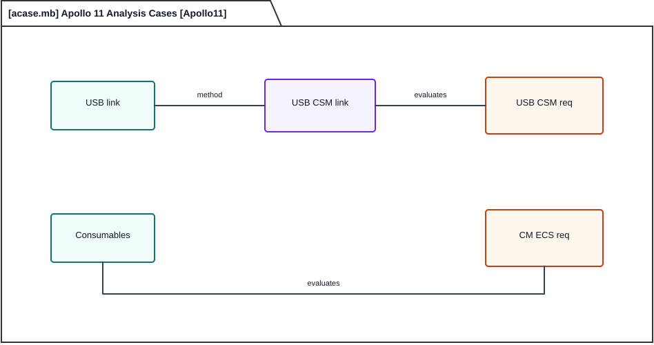

#### Verification cases — `apollo-vcase.svg`

**MagicGrid layer:** problem / verification (NPR 7123 product verification — names only).

**Question:** Which checks are named?

**How to read it:** `verifyUsbCsm`, `verifyA7l`, `verifyP27`, `verifyRso`. None binds a part, port, or effect.

**Symbols:** verification-case nodes.

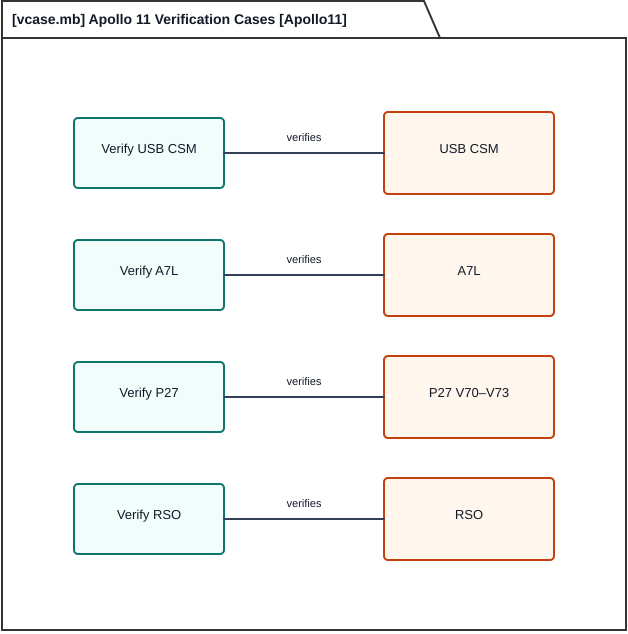

#### Operating context — `apollo-context.svg`

**MagicGrid layer:** problem / context.

**Question:** What sits outside the stack?

**How to read it:** Crew, KSC, MCC/RTCC, MSFN/NASCOM, RSO, recovery, Earth, and Moon surround the vehicles. RSO destruct does not pass through MCC.

**Symbols:** external parts and context flows.


#### Requirements — `apollo-req.svg`

**MagicGrid layer:** problem / requirements (NPR 7123 technical requirements).

**Question:** Which sourced shalls are modeled?

**How to read it:** Boxes follow model text. Planned GET, flown P66/EVA, SA-507 F-1, D-7720 2800/3200 plan baseline, and unmarked Δv / SPS / RCS load stay as the model states them. A view label is not a requirement.

**Symbols:** `«requirement»` rectangles.


### Solution domain — structure (logical / physical)

#### System definition tree (Block Definition Diagram) — `apollo-bdd.svg`

**MagicGrid layer:** solution / structure (NPR 7123 logical decomposition at system grain).

**Question:** What composes Apollo 11 at pad-stack grain?

**How to read it:** A Block Definition Diagram (BDD) is a composition tree: Saturn V, CSM, LM, Crew, Ground. IU children are LVDC, ST-124, and FCC. SLA is labeled 8-panel. Descent and ascent stay separate. Two AGCs stay separate.

**Symbols:** part boxes and composition lines.


#### CSM definition — `apollo-bdd-csm.svg`

**MagicGrid layer:** solution / structure.

**Question:** What is inside CM and SM?

**How to read it:** CM holds SCS, AGC_CM, two DSKYs, ECLSS, probe and latches. SM holds SPS, four RCS quads, three fuel cells.

**Symbols:** composition tree.

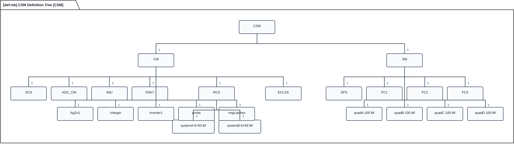

#### LM definition — `apollo-bdd-lm.svg`

**MagicGrid layer:** solution / structure.

**Question:** What is on descent versus ascent?

**How to read it:** Descent owns DPS, descent AgZn, ECA, and `landingRadar`. Ascent owns PNGS (IMU only), AGC_LM, AGS, APS, RCS, and one `rendezvousRadar`. PNGS does not nest either radar.

**Symbols:** composition tree.


#### AGC definition — `apollo-bdd-agc.svg`

**MagicGrid layer:** solution / structure.

**Question:** How are the two Block II AGCs built?

**How to read it:** Each AGC has erasable, fixed, oscillator, and a rope. CM rope is Comanche 055. LM rope is Luminary 1A. Do not merge the computers.

**Symbols:** composition tree.

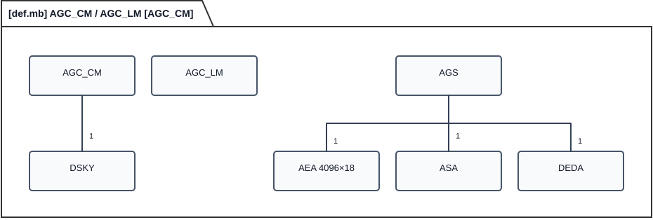

#### EPS definition — `apollo-bdd-eps.svg`

**MagicGrid layer:** solution / structure.

**Question:** How is electrical power partitioned?

**How to read it:** SM fuel cells, CM AgZn + charger + inverters, LM descent and ascent AgZn + ECA. No stage-to-stage electrical power.

**Symbols:** composition tree.

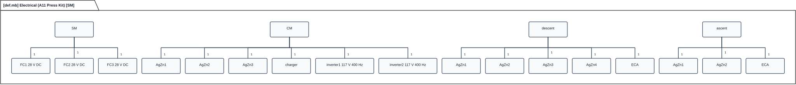

#### ECLSS definition — `apollo-bdd-eclss.svg`

**MagicGrid layer:** solution / structure.

**Question:** Which life-support loops exist?

**How to read it:** Oxygen, water, LiOH, and suit circuit on the CM.

**Symbols:** composition tree.

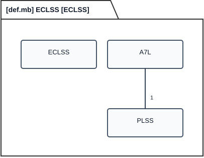

#### MSFN definition — `apollo-bdd-msfn.svg`

**MagicGrid layer:** solution / structure.

**Question:** Which ground stations are named?

**How to read it:** Goldstone, Madrid, Honeysuckle 85-ft USB plus NASCOM. Complete 30-ft inventory is unmarked; ships are collapsed.

**Symbols:** composition tree.

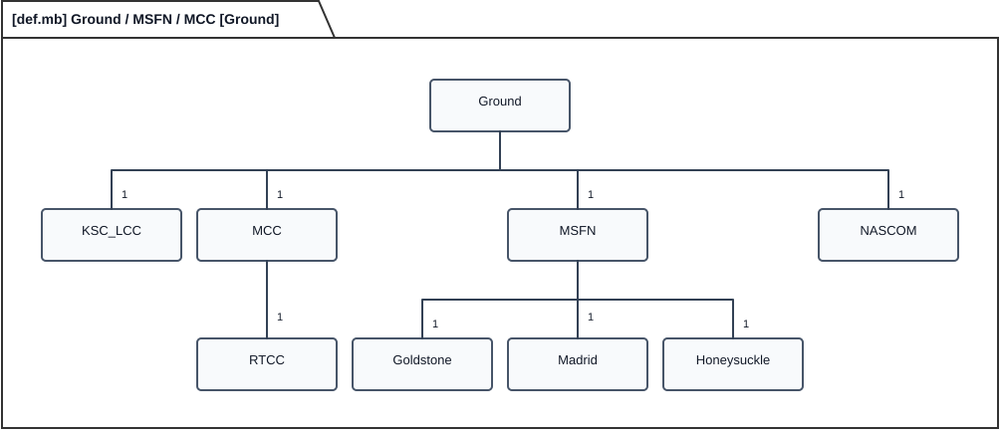

### Solution domain — interfaces

#### System interconnection (Internal Block Diagram) — `apollo-ibd.svg`

**MagicGrid layer:** solution / interfaces.

**Question:** How do the top-level parts connect?

**How to read it:** An Internal Block Diagram (IBD) shows parts as boxes and connections as lines between ports. Follow RSO destruct, KSC umbilicals, IU guidance, SLA, docking, USB, NASCOM, and recovery. Lines do not pass through boxes.

**Symbols:** part boxes, ports, connections.

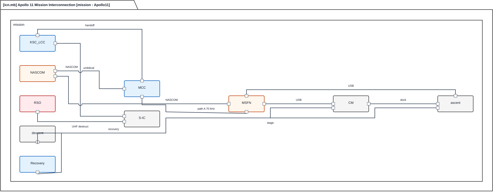

#### Vehicle interconnection — `apollo-ibd-vehicle.svg`

**MagicGrid layer:** solution / interfaces.

**Question:** What is the mechanical and guidance stack?

**How to read it:** SIC → SII → SIVB → IU → SLA → SM; LES → CM → SM; SLA → LM descent; CM probe ↔ LM drogue.

**Symbols:** stage boxes and mechanical/guidance connections.

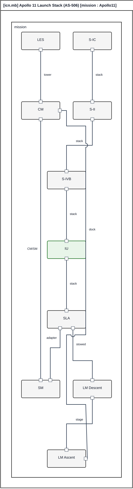

#### CSM interconnection — `apollo-ibd-csm.svg`

**MagicGrid layer:** solution / interfaces.

**Question:** How do CM and SM internals talk?

**How to read it:** AGC_CM to DSKYs and IMU; SCS to AGC_CM and RCS; charger to AgZn; fuel-cell string in the SM.

**Symbols:** part boxes and connections.

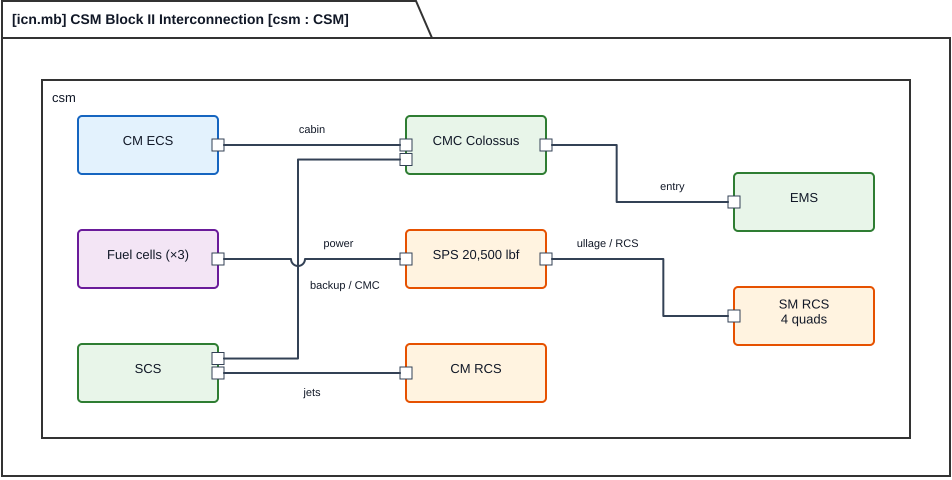

#### LM interconnection — `apollo-ibd-lm.svg`

**MagicGrid layer:** solution / interfaces.

**Question:** How does PNGS reach the computers, radars, and engines?

**How to read it:** PNGS on ascent connects to AGC_LM, to `descent.landingRadar`, and to `ascent.rendezvousRadar`. AGS is separate. DPS is descent; APS and RCS are ascent.

**Symbols:** part boxes and connections.


#### AGC interconnection — `apollo-ibd-agc.svg`

**MagicGrid layer:** solution / interfaces.

**Question:** How does each AGC clock its memories?

**How to read it:** Oscillator to erasable and fixed on each computer.

**Symbols:** part boxes and connections.

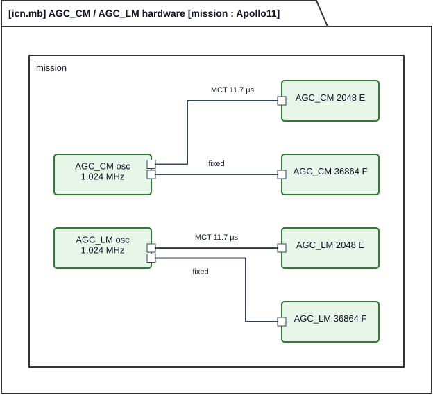

#### Guidance, Navigation, and Control (GNC) interconnection — `apollo-ibd-gnc.svg`

**MagicGrid layer:** solution / interfaces.

**Question:** How do the guidance computers stay separate?

**How to read it:** AGC_CM, AGC_LM, AGS, and IU LVDC are distinct boxes. There is no digital AGC↔LVDC path.

**Symbols:** GNC part boxes and connections.

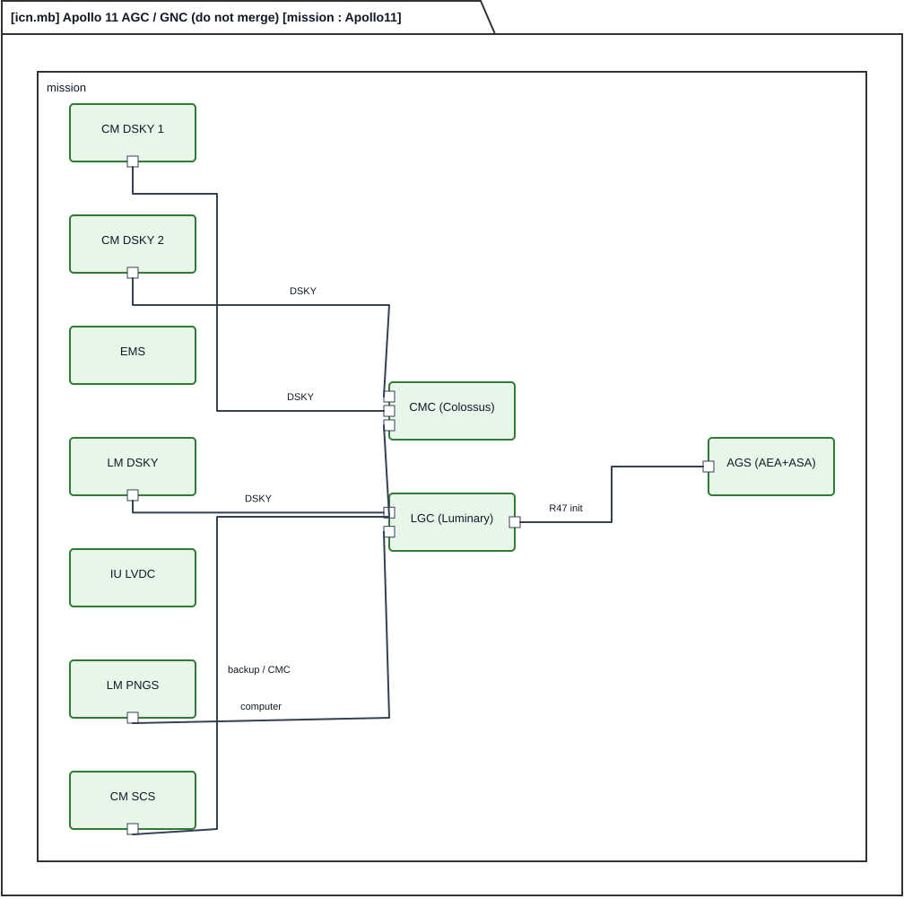

#### AGS interconnection — `apollo-ibd-ags.svg`

**MagicGrid layer:** solution / interfaces.

**Question:** What hardware is AGS?

**How to read it:** AEA + ASA + DEDA. AGS is not a landing computer.

**Symbols:** AGS boxes and connections.

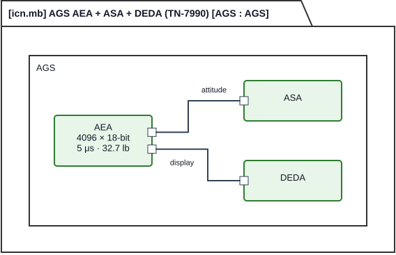

#### MCC / RTCC — `apollo-ibd-mcc.svg`

**MagicGrid layer:** solution / interfaces.

**Question:** How does Houston compute and uplink?

**How to read it:** RTCC, MOCR 2, CCATS, and named consoles. Path A leaves through CCATS. MOC vs DSC on A11 is unmarked.

**Symbols:** ground part boxes and connections.

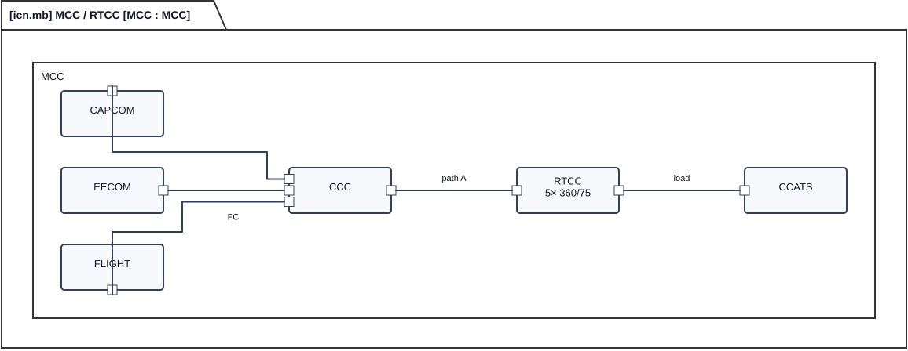

#### MSFN interconnection — `apollo-ibd-msfn.svg`

**MagicGrid layer:** solution / interfaces.

**Question:** How does the USB triad reach the vehicles?

**How to read it:** Goldstone / Madrid / Honeysuckle plus NASCOM. Ships are collapsed.

**Symbols:** site boxes and USB/NASCOM connections.

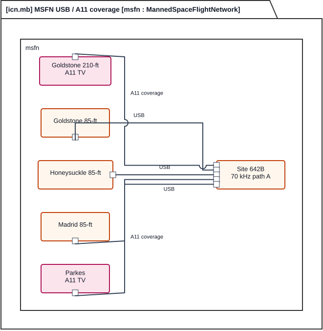

#### SM fuel cells — `apollo-ibd-eps-sm.svg`

**MagicGrid layer:** solution / interfaces.

**Question:** How are the three fuel cells strung?

**How to read it:** FC1–FC3 on a 2+2 cryo set. Not J-mission 3+3.

**Symbols:** EPS boxes and connections.

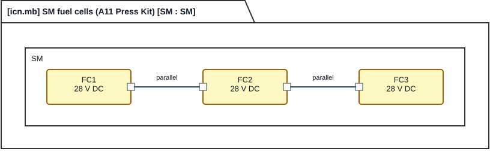

#### CM electrical power — `apollo-ibd-eps-cm.svg`

**MagicGrid layer:** solution / interfaces.

**Question:** How does the CM store and invert power?

**How to read it:** Three AgZn, a charger, and two 117 V 400 Hz inverters.

**Symbols:** EPS boxes and connections.

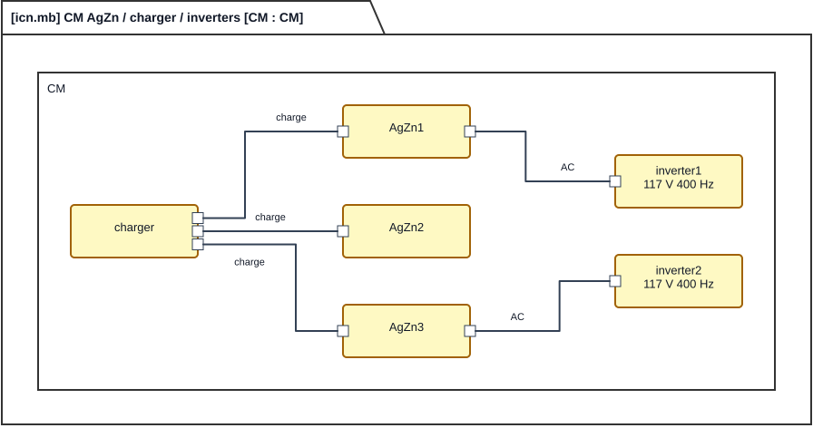

#### LM electrical power — `apollo-ibd-eps-lm.svg`

**MagicGrid layer:** solution / interfaces.

**Question:** How does descent electrical power sit?

**How to read it:** Four descent AgZn and an ECA. Landing radar is not on this EPS drawing; it is a descent part on the LM BDD.

**Symbols:** EPS boxes and connections.

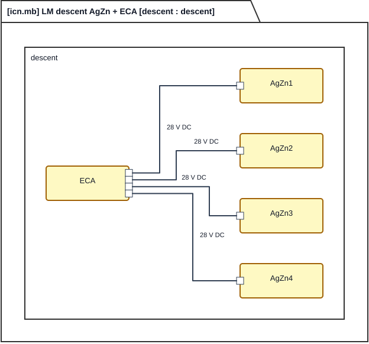

#### SM RCS quads — `apollo-ibd-rcs.svg`

**MagicGrid layer:** solution / interfaces.

**Question:** How are the SM jets grouped?

**How to read it:** Four quads, 100 lbf per engine (Press Kit p.93). Loaded propellant mass unmarked.

**Symbols:** RCS boxes and connections.

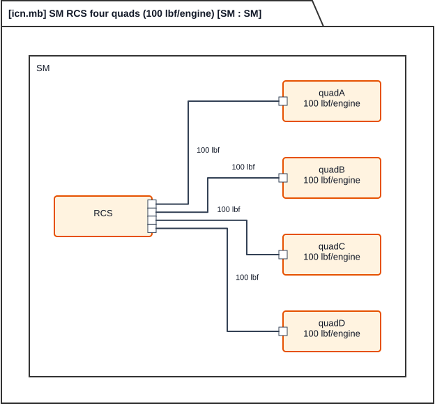

#### CM RCS systems — `apollo-ibd-rcs-cm.svg`

**MagicGrid layer:** solution / interfaces.

**Question:** How is CM RCS dual-stringed?

**How to read it:** Two systems of six 93 lbf engines. No automatic translation. Loaded mass unmarked.

**Symbols:** RCS boxes and connections.

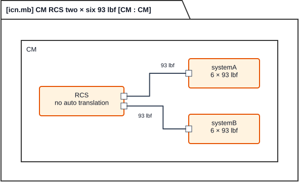

#### Docking interconnection — `apollo-ibd-dock.svg`

**MagicGrid layer:** solution / interfaces.

**Question:** What hardware performs TD&E?

**How to read it:** CM probe and twelve ring latches to the LM drogue.

**Symbols:** docking boxes and connections.

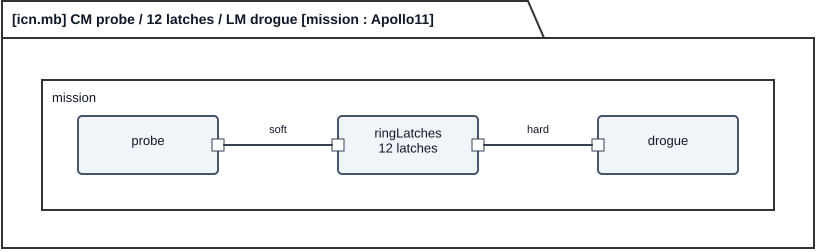

#### ECLSS interconnection — `apollo-ibd-eclss.svg`

**MagicGrid layer:** solution / interfaces.

**Question:** How do the cabin loops join?

**How to read it:** Oxygen and water to the suit circuit; suit circuit to LiOH.

**Symbols:** ECLSS boxes and connections.

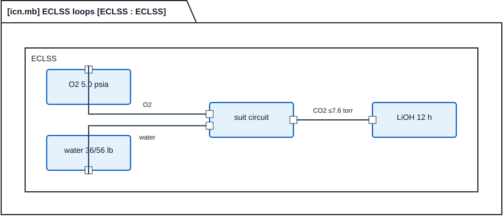

#### Interfaces — `apollo-intf.svg`

**MagicGrid layer:** solution / interfaces.

**Question:** Which port/interface types exist?

**How to read it:** UHF destruct, umbilical, voice, guidance, mechanical, docking, USB, NASCOM, command, recovery.

**Symbols:** interface nodes.

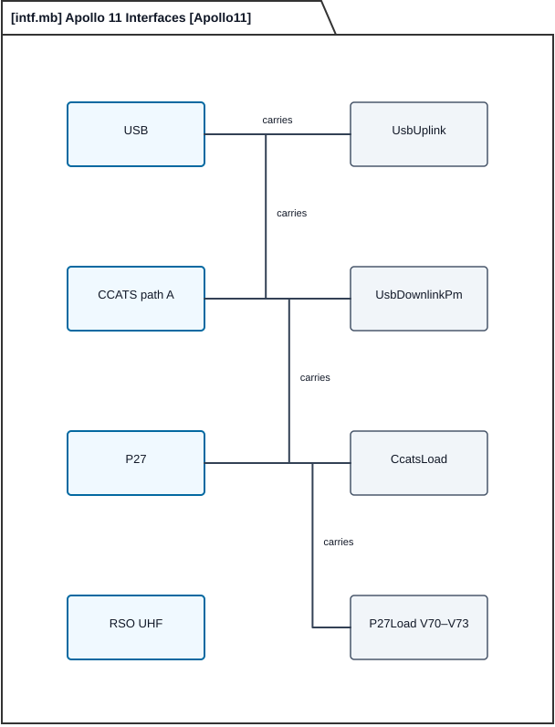

#### Flows — `apollo-flow.svg`

**MagicGrid layer:** solution / interfaces (items).

**Question:** Which items move among vehicles and ground?

**How to read it:** USB, NASCOM, command Path A, voice handoff, destruct UHF, and recovery. No stage-to-stage electrical power flow.

**Symbols:** item/flow nodes and arrows.

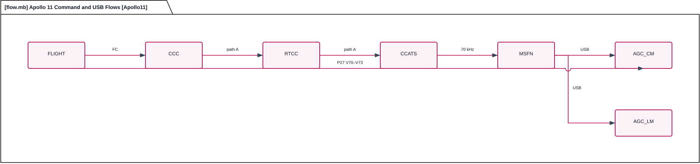

### Solution domain — behavior

#### Mission phases — `apollo-stm.svg`

**MagicGrid layer:** solution / behavior.

**Question:** What is the nominal mission sequence?

**How to read it:** The STM runs from countdown through recovery. The locked hop is TLI → dockEject → translunar → LOI. There is no TLI→translunar hop.

**Symbols:** rounded states and labeled transitions.


#### Abort modes — `apollo-stm-abort.svg`

**MagicGrid layer:** solution / behavior (fault/abort).

**Question:** Which abort modes exist besides LES?

**How to read it:** Parallel machine: pad, I–IV, contingency TLI, lunar, SPS. LES is pad / Mode I only.

**Symbols:** abort states and transitions.


#### CMC major modes — `apollo-stm-cmc.svg`

**MagicGrid layer:** solution / behavior.

**Question:** What is the CM entry P-number chain?

**How to read it:** P61–P67 is entry only. Do not reuse these numbers as the landing chain.

**Symbols:** CMC states.

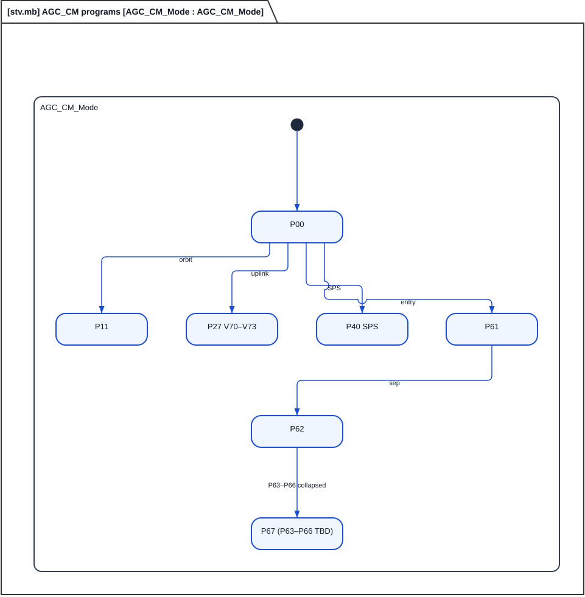

#### LGC major modes — `apollo-stm-lgc.svg`

**MagicGrid layer:** solution / behavior.

**Question:** What is the LM landing P-number chain?

**How to read it:** P63–P68 is landing only. Apollo 11 flew P66.

**Symbols:** LGC states.

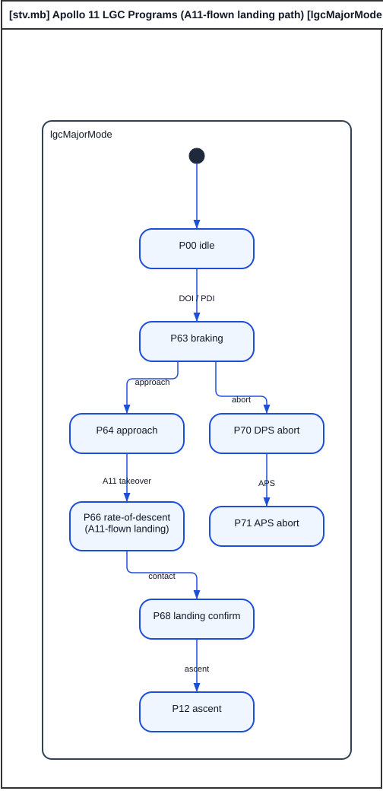

#### AGC CM states — `apollo-stm-agc-cm.svg`

**MagicGrid layer:** solution / behavior.

**Question:** Which CM major modes and verbs exist?

**How to read it:** P00, P11, P20, P27, P40, P51, P52 plus V37 / V36 / V69. 1201/1202 is overflow, not an abort.

**Symbols:** AGC_CM states.


#### AGC LM states — `apollo-stm-agc-lm.svg`

**MagicGrid layer:** solution / behavior.

**Question:** Which LM major modes and abort chain exist?

**How to read it:** P00, P12, P20, P27, P30, P70, P71. P70 → P71 is the abort chain.

**Symbols:** AGC_LM states.

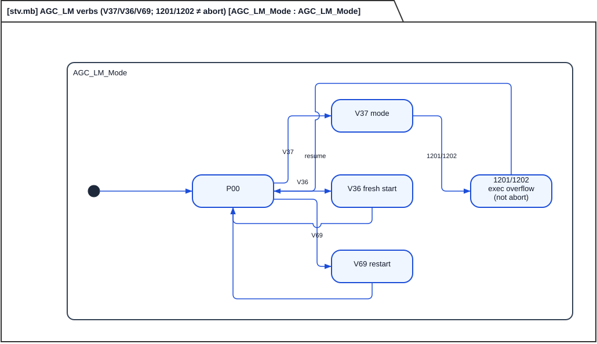

#### AGS states — `apollo-stm-ags.svg`

**MagicGrid layer:** solution / behavior.

**Question:** How does AGS follow PNGS?

**How to read it:** idle → operate (R47) → follow PNGS → idle. AGS does not land.

**Symbols:** AGS states.

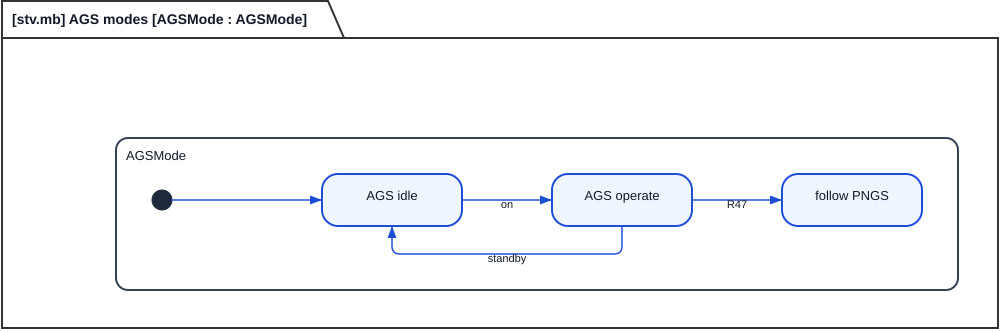

#### SCS modes — `apollo-stm-scs.svg`

**MagicGrid layer:** solution / behavior.

**Question:** How does the crew select analog backup?

**How to read it:** AGC_CM versus attitude hold / rate command / min impulse. Full switch deck is TBD.

**Symbols:** SCS states.

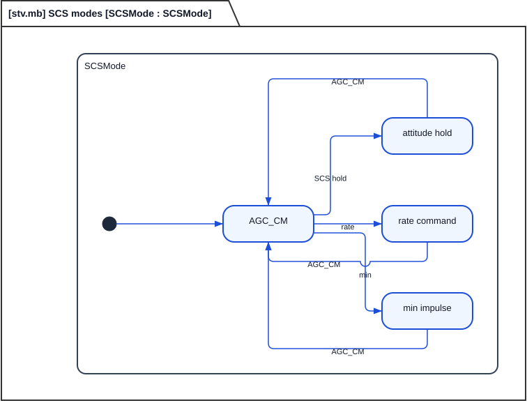

#### Docking mode — `apollo-stm-dock.svg`

**MagicGrid layer:** solution / behavior.

**Question:** What are the probe/drogue modes?

**How to read it:** undocked → soft → hard → hardware off. This is not the mission `dockEject` state.

**Symbols:** docking states.

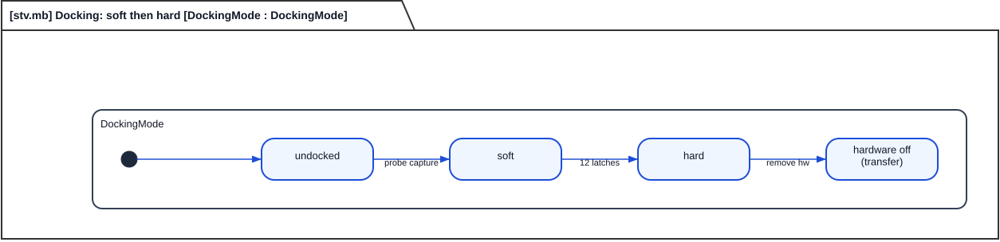

#### ECLSS states — `apollo-stm-eclss.svg`

**MagicGrid layer:** solution / behavior.

**Question:** How does the crew atmosphere move among cabin, suit, and EVA?

**How to read it:** cabin → suit → EVA (PLSS) → cabin.

**Symbols:** ECLSS states.

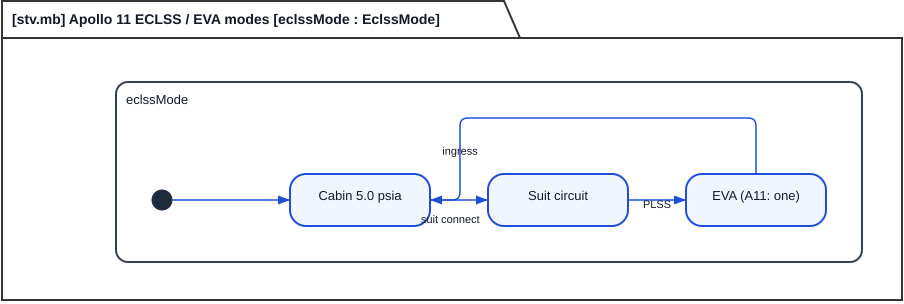

#### Actions — `apollo-act.svg`

**MagicGrid layer:** solution / behavior.

**Question:** Which procedures are named?

**How to read it:** AGC power-up, antenna selection, Path A and P27 loads, R47 AGS init, P63/P64/P66 landing, P70/P71 abort, and probe/drogue docking.

**Symbols:** action boxes and control flow.

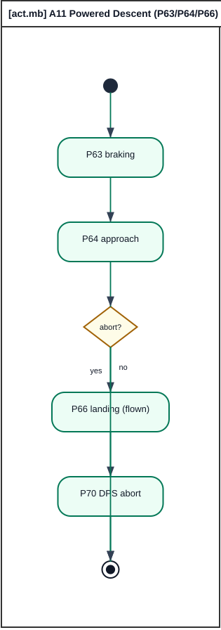

#### Interaction — `apollo-int.svg`

**MagicGrid layer:** solution / behavior.

**Question:** Who talks to whom on command and voice?

**How to read it:** MCC → CCATS → MSFN → CSM, with P27 as a separate uplink.

**Symbols:** lifelines and messages.

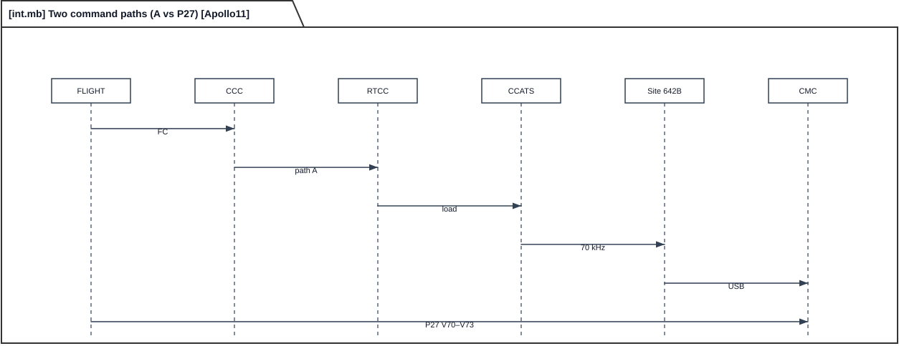

### Solution domain — parametrics and allocations

#### Constraints — `apollo-cst.svg`

**MagicGrid layer:** solution / parametrics.

**Question:** Which named constraints exist?

**How to read it:** USB links, lunar delay, F-1 (SA-507 citation), AGC cycle, ignition mass. No invented Δv equation.

**Symbols:** constraint nodes.

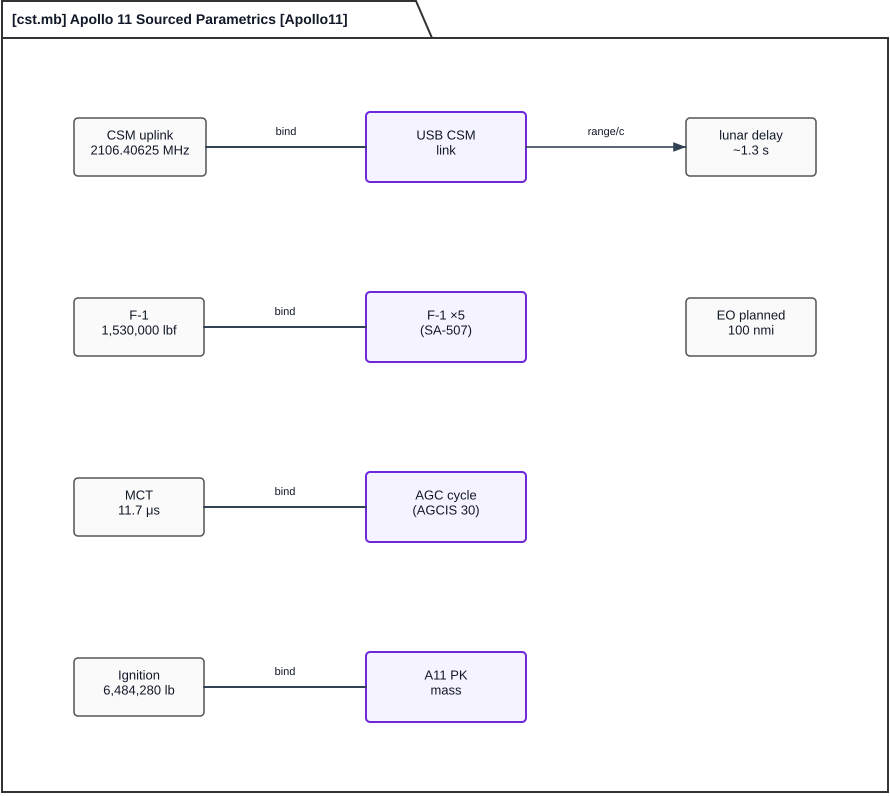

#### Allocations — `apollo-alloc.svg`

**MagicGrid layer:** solution / allocations (NPR 7123 design solution).

**Question:** Which technical requirements land on which existing parts?

**How to read it:** IU owns boost+TLI; RSO owns destruct; AGC_CM and AGC_LM stay split; AGS is separate; EPS maps to SM, CM, and descent; docking and RCS map to CM/SM.

**Symbols:** requirement boxes, part boxes, dashed allocate arrows.


#### Packages — `apollo-pkg.svg`

**MagicGrid layer:** model organization (supports every MagicGrid layer).

**Question:** How is the model packaged?

**How to read it:** Saturn V, CSM, LM, Crew, Ground, and the requirement/behavior packages.

**Symbols:** package nodes.

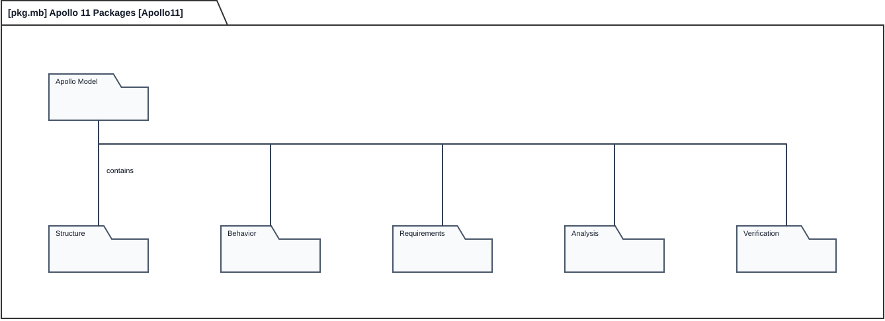

#### Cross-view trace — `apollo-general.svg`

**MagicGrid layer:** trace across MagicGrid layers.

**Question:** Can one path be followed from a use case through a requirement to a part and a verification name?

**How to read it:** A teaching thread. It is not extra requirements and not a DoDAF product.

**Symbols:** mixed-kind nodes and trace lines.

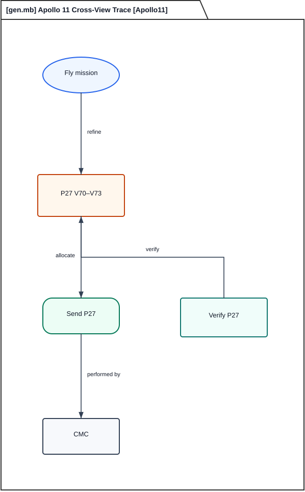

---

## 9. Open risks / unmarked / out of scope

- CSM lunar Δv, SPS loaded mass, and SM/CM RCS loaded propellant mass stay unmarked. There is no official CSM lunar Δv table in the sources used here.
- F-1 1,530,000 lbf is an SA-507 citation. It is not an AS-506 requirement.
- A11 AGS flight-program name, A11 flown food intake (kcal), entry blackout duration, RTCC MOC vs DSC on A11, and the complete 30-ft MSFN inventory stay unmarked. D-7720 2800 CM / 3200 LM is the 1967 plan baseline only.
- Verification cases are names only.

This remains an example model, not a certifiable product.
