# Blender Architecture Summary

This document summarizes the blender SysML model and its generated SysMLD views. The model covers user-facing cases, quantitative requirements, structure, behavior, interfaces, flows, analyses, verification, and traceability.

## Cases

The blender cases focus on making a smoothie, stopping a blend, and cleaning the container. Analysis cases evaluate motor load and smoothness detection. Verification cases check lid interlock, smoothness detection, and stop command behavior.

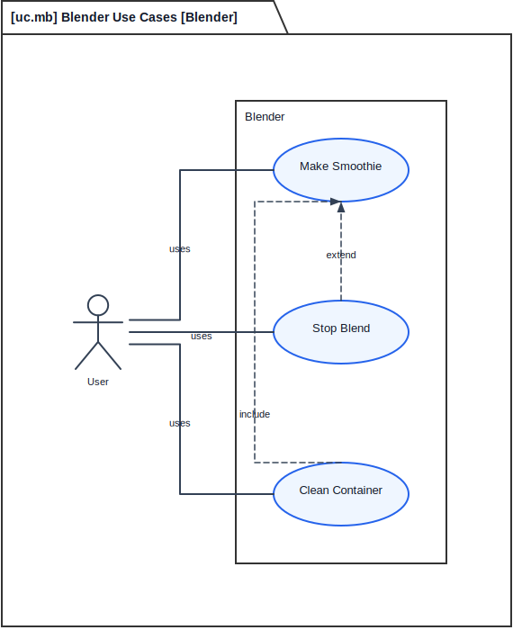

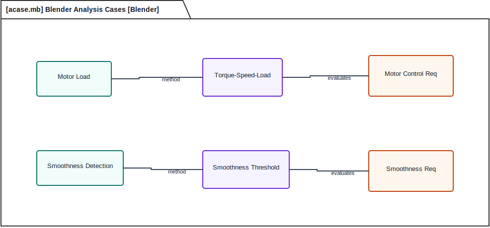

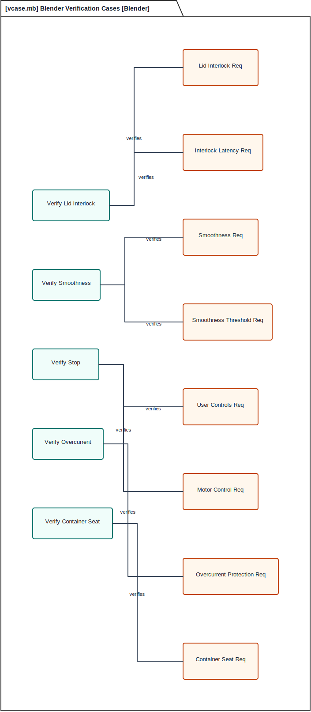

## Operating Context

The blender interacts with the user, ingredients, a 120 VAC outlet, the produced smoothie, smoothness feedback, and control/status exchanges. The context view makes the external exchanges explicit before decomposing the appliance internals.

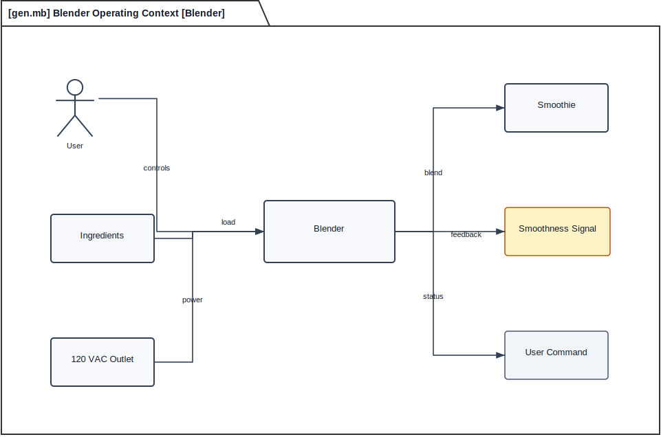

## Requirements

The requirement view embeds requirement intent and quantitative targets in each node. The lid interlock requirement derives motor control, smoothness detection, and power concerns. Detailed targets include motor disable within 100 ms of lid-open detection, 20,000 rpm no-load motor capability, overcurrent stop within 250 ms, smoothness threshold detection, operation below 85 dBA at 1 m, and container-seat detection before torque is enabled.

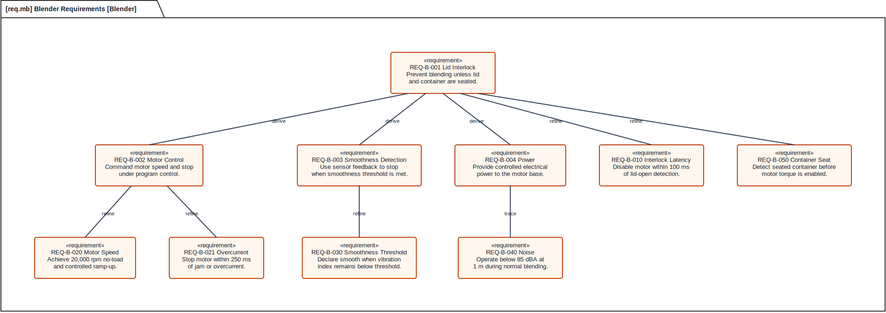

## Hierarchical Structure

The definition tree identifies the blender as a composition of tamper, lid, container, blade assembly, drive coupling, smoothness sensor, motor base, motor, and control panel.

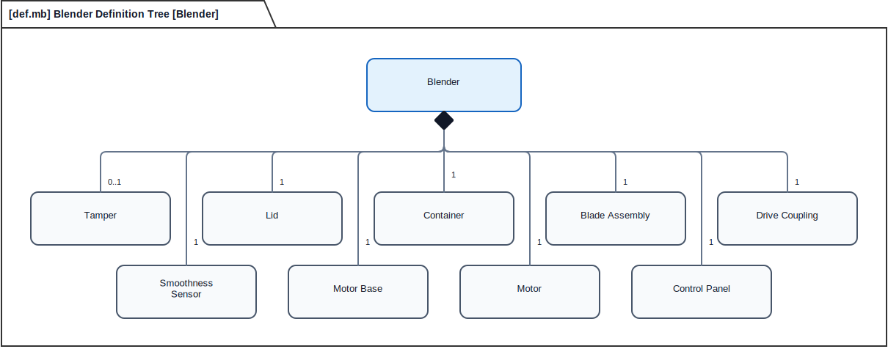

## Interaction

The interaction view shows the smoothie program sequence from user start command through control panel, motor, drive coupling, blade assembly, smoothness sensor feedback, and motor stop.

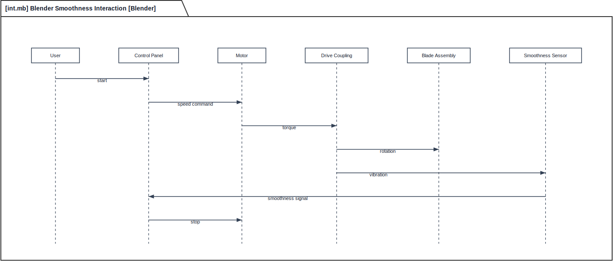

## State Behavior

The state machine uses Off and a composite Powered state. Ready, Blending, and Error are contained within Powered, with a single power-off transition leaving the composite state. The Error state now covers general fault, lid opened during blend, blade jam, overcurrent, and sensor fault conditions.

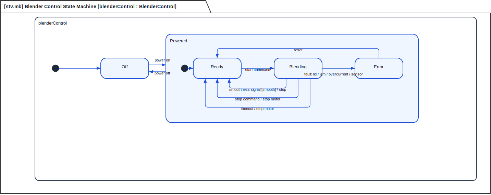

## Action Behavior

The action view describes loading ingredients, closing the lid, powering on, starting the program, spinning blades, sensing smoothness, looping until smooth, stopping the motor, and pouring.

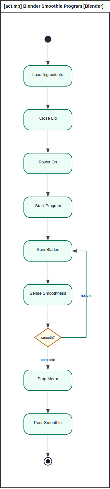

## Interconnection View

The interconnection view shows the physical and signal relationships among tamper, lid, container, blade assembly, drive coupling, smoothness sensor, motor base, motor, and control panel.

## Interfaces and Flows

The interface view captures user controls, power, drive, and sensing interfaces. The flow view shows ingredients, commands, power, torque, blade shear, and smoothness feedback.

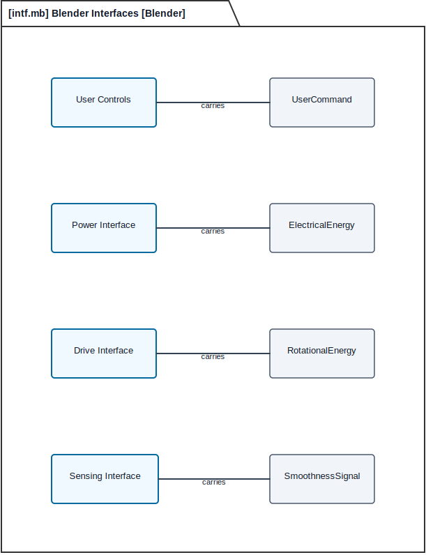

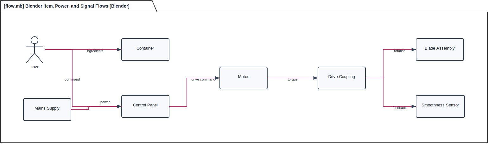

## Constraints and Allocations

The constraint view captures speed, torque, load, timing, interlock latency, smoothness threshold, motor power, and noise-power trade-offs. The allocation view maps requirements to the control panel, motor, smoothness sensor, and behavior.

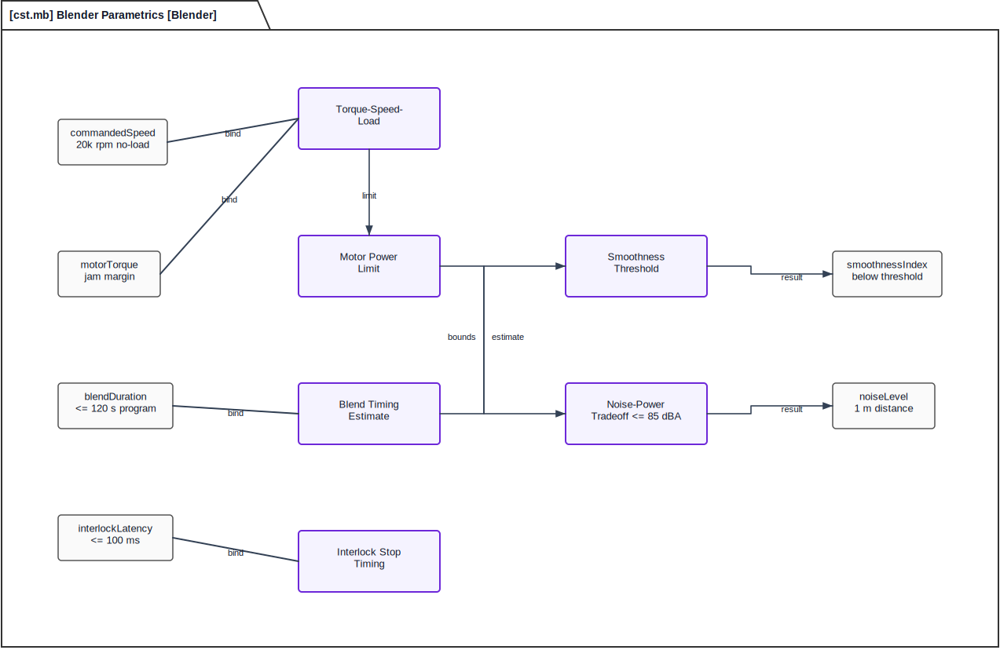

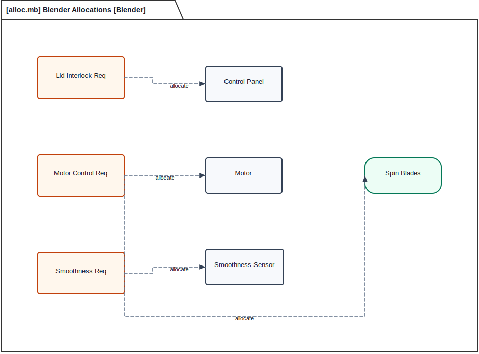

## Package and Trace Overview

The package view organizes the model into structure, behavior, requirements, analysis, and verification packages. The general trace view ties use case, requirement, action, part, and verification case together.

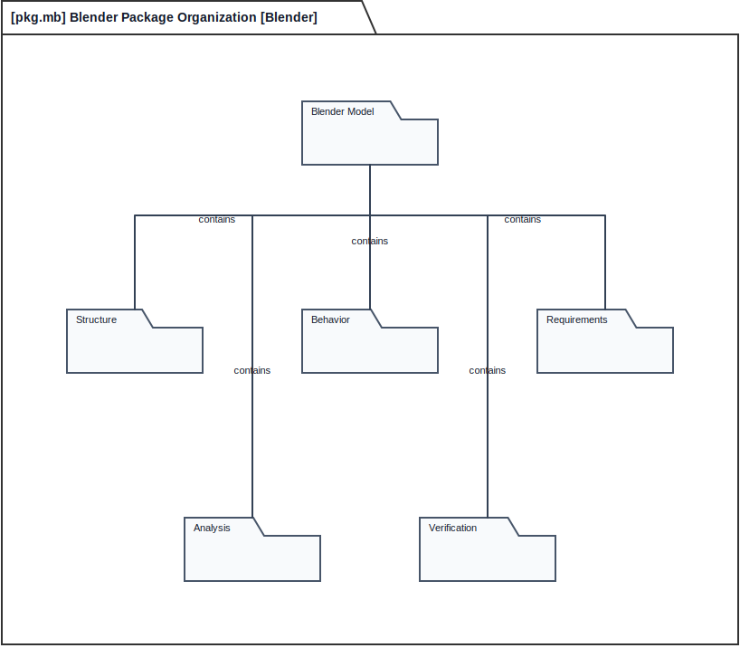

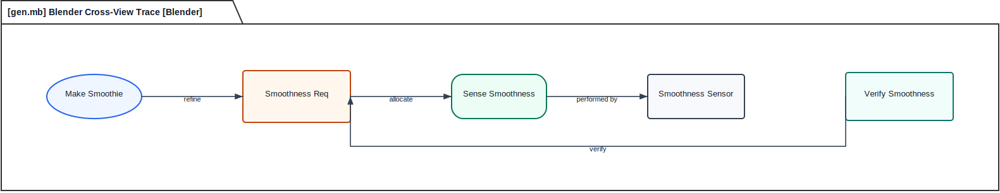

## Feedback Disposition

The Grok review recommended quantitative requirements, deeper error handling, stronger electrical/user/mechanical interface detail, context, and richer constraints. Those were implemented in the requirement view, constraint view, state machine, and context view. Product-line variants, dishwasher material certifications, and detailed digital sensor protocol are not modeled yet; they are deferred because this appliance example is scoped to a baseline smart blender architecture, not a production certification package.
