# Blender Architecture

This document is the architecture and system-design description of the countertop blender modeled in `blender.sysml`. A reviewer should be able to understand purpose, context, requirements, structure, interfaces, behavior, and allocations without opening the model. Generated views appear after the written architecture.

This is an example model, not a certifiable appliance. Requirement text and numbers come from the SysML model.

## 1. Purpose and Mission

The system is a baseline countertop blender. Its mission is to accept ingredients, blend them under program control until a smoothness threshold is reached, stop on user command or fault, and allow the container to be cleaned.

The model is a single baseline, not a product line.

## 2. Operating Context

The blender sits on a counter among the user, ingredients, and a mains supply. A smoothie is the produced output.

| External part | Role |
|---------------|------|
| User | Loads ingredients, closes the lid, starts / stops / powers the blender, pours |
| Ingredients | Material loaded into the container |
| Mains supply | Electrical energy |
| Smoothie | Blend output |

Items that cross the boundary: `ElectricalEnergy`, `RotationalEnergy`, `SmoothnessSignal`, `UserCommand`. `Fruit` and `Liquid` are declared and unused.

External interface defs: user controls, power, drive, sensing. `ContainerInterface` is declared and not wired. `MainsSupply` has no voltage in the model.

## 3. Stakeholders and Use Cases

The only named stakeholder is the user.

**Use cases**

- **Make Smoothie** — primary program.
- **Stop Blend** — extends Make Smoothie.
- **Clean Container** — included by Make Smoothie.

**Analysis cases**

- **Motor Load** — torque/speed/load constraint against motor control.
- **Smoothness Detection** — smoothness-threshold constraint against the smoothness-detection requirement.

**Verification cases** (names only — no part, port, or effect is bound)

`verifyLidInterlock`, `verifySmoothnessDetection`, `verifyStopCommand`, `verifyOvercurrentProtection`, `verifyContainerSeat`.

## 4. Requirements

The model states thirteen requirements. IDs such as REQ-B-xxx appear only on views.

| ID (view) | Requirement | Quantitative target in the model |
|-----------|-------------|----------------------------------|
| REQ-B-001 | Motor shall not run unless the lid is fully seated and locked | none |
| REQ-B-002 | Control panel starts, pauses, and stops the motor in response to user commands | **within 200 ms** |
| REQ-B-003 | Smoothness sensor detects blend completion and signals the control panel | none |
| REQ-B-004 | Operate within the rated power envelope under normal blending loads | rated magnitude **not in model** |
| — | User can start, pause, and stop without tools | none |
| — | Container, lid, and blade assembly dishwasher-safe or washable under running water | none |
| — | Serviceable by a qualified technician without specialized equipment | none |
| REQ-B-020 | Motor maintains set speed across normal blending loads | **±10%** |
| REQ-B-010 | Lid interlock disables the motor after lid-removal detection | **within 50 ms** |
| REQ-B-021 | Motor circuit overcurrent protection cuts power before motor damage | trip time **not in model** |
| REQ-B-030 | Smoothness threshold configurable for blend program profiles | **at least three** profiles |
| REQ-B-040 | Noise during normal use | **below 85 dB(A) at the operator position** (model wording; not a blender certification) |
| REQ-B-050 | Container locks to the motor base with positive mechanical engagement and deliberate release | none |

The model requires pause. The state machine has no pause state or transition. There is no interlock part; lid-to-container is a mechanical connection, and `interlockLatencyRequirement` is a requirement on that behavior. Power claims in this note refer to the modeled mains → control panel → motor path.

## 5. Structure

The blender is a single-level composition. Child part definitions are empty.

```
Blender
├── tamper              (0..1 on the definition view)
├── lid
├── container
├── bladeAssembly
├── driveCoupling
├── smoothnessSensor
├── motorBase
├── motor
└── controlPanel
```

The definition view marks tamper `0..1`; the SysML source does not state multiplicity. System-level attributes are declared without values: `commandedSpeed`, `motorTorque`, `blendDuration`, `smoothnessIndex`, `motorSpeed`, `interlockLatency`, `motorPower`, `noiseLevel`.

## 6. Interfaces and Interconnections

**Why the connections exist:** the lid and container must be seated before torque is legal; the motor base locates motor, panel, and coupling; the coupling transmits rotation to the blades and vibration to the smoothness sensor; the panel commands the motor and receives blend-complete.

| Connection | From → to | Why |
|------------|-----------|-----|
| Tamper ↔ lid | Mechanical | Optional tamper fit |
| Lid ↔ container | Mechanical | Lid seat / interlock geometry |
| Container ↔ blade | Mechanical | Blade mounted in the jar |
| Container ↔ motor base | Mechanical | Seat and lock |
| Base → motor, control panel, drive coupling | Mechanical | Mount |
| Motor → coupling → blade | Drive | Torque to shear |
| Coupling → smoothness sensor | Sensor | Vibration / load for completion |
| Sensor → control panel | Control | Blend-complete |
| Control panel → motor | Control | Speed / stop |

Flows: ingredients into the container; user command and mains energy to the control panel; torque motor → coupling; rotation coupling → blades; smoothness feedback coupling → sensor.

## 7. Behavior

### States (`BlenderControl`)

Top-level states are Off and a composite Powered. Entering Powered goes to Ready. A single power-off transition leaves the composite.

| From | Trigger | To |
|------|---------|-----|
| Off | power switch on | Powered (Ready) |
| Powered | power switch off | Off |
| Ready | start command | Blending |
| Blending | smoothness signal | Ready |
| Blending | stop command | Ready |
| Blending | timeout | Ready |
| Blending | fault | Error |
| Blending | lid opened | Error |
| Blending | blade jam | Error |
| Blending | overcurrent | Error |
| Blending | sensor fault | Error |
| Error | reset | Ready |

Timeout duration is not in the model. The state view collapses the five blending-to-error transitions into one fault edge.

### Smoothie program (actions)

Load ingredients → close lid → power on → start program → spin blades ⇄ sense smoothness (loop until smooth) → stop motor → pour smoothie.

### Interaction

User start → control panel speed command → motor torque → coupling rotation to blades and vibration to the sensor → smoothness signal back to the panel → stop.

## 8. Allocations

Six allocation names exist in the model. The allocation view binds three of them.

| Allocation | Source | Target (view or name) |
|------------|--------|------------------------|
| Interlock to control panel | Lid interlock | Control panel |
| Torque to motor | Motor control | Motor and spin-blades action |
| Smoothness to sensor | Smoothness detection | Smoothness sensor |
| Cleaning to container | name only | endpoints **not in model** |
| Protection to motor base | name only | endpoints **not in model** |
| Interface to control panel | name only | endpoints **not in model** |

## 9. Parameters, Constraints, and Scope

Constraint names: `torqueSpeedLoadEstimate`, `motorPowerLimit`, `blendTimingEstimate`, `interlockStopTiming`, `smoothnessThresholdEstimate`, `noisePowerTradeoff`. The model has no equations.

**Out of scope:** product-line variants; dishwasher material certifications; a detailed digital sensor protocol; pause as a state (required in text, not modeled).

## 10. Open Risks

- Rated power magnitude, blend timeout duration, and overcurrent trip time are unmarked.
- Pause is required in `motorControlRequirement` and `userControlsRequirement` but has no state or transition.
- There is no interlock part; only the lid–container mechanical connection and the 50 ms requirement.
- `allocateCleaningToContainer`, `allocateProtectionToMotorBase`, and `allocateInterfaceToControlPanel` are names without model endpoints.
- Constraint definitions have no equations.
- Verification cases are names only.

---

## Generated Views

The figures below are the generated SysMLD views for this model. They illustrate the architecture above; they do not replace it.

### Cases

Make a smoothie, stop a blend, and clean the container. Analysis cases are `motorLoadAnalysis` and `smoothnessDetectionAnalysis`. Verification cases are names only.

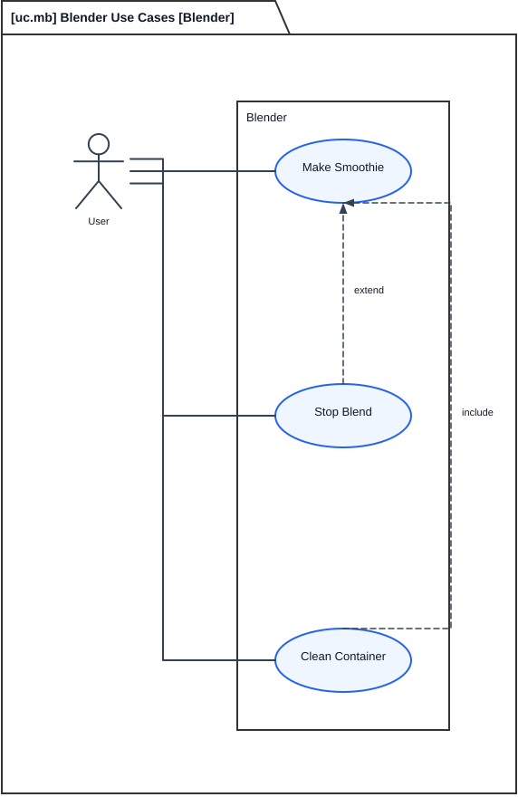

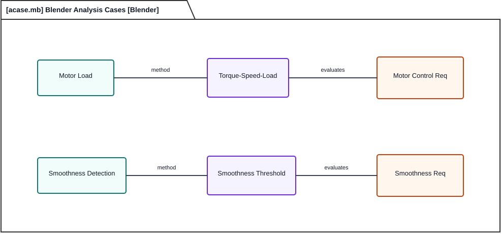

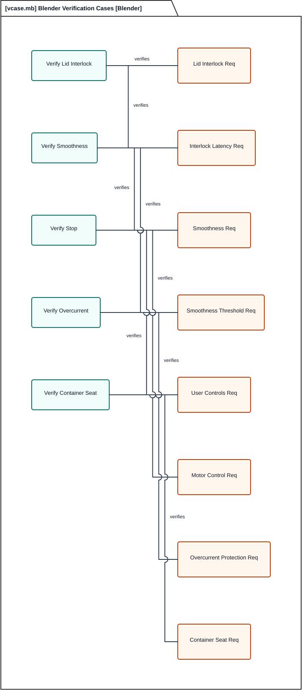

### Operating Context

The blender interacts with the user, ingredients, the mains outlet, the produced smoothie, smoothness feedback, and control or status exchanges.

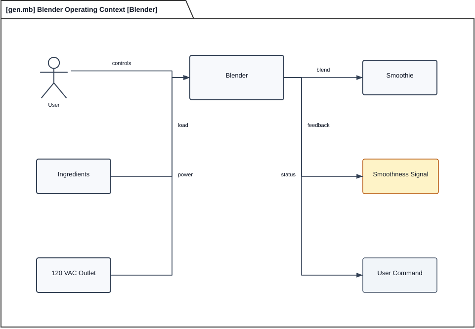

### Requirements

Requirement nodes follow the SysML model text.

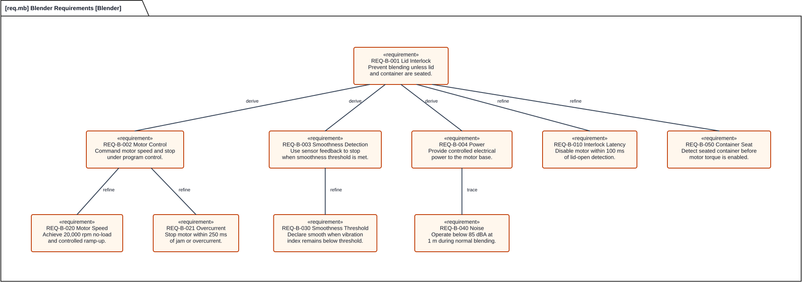

### Hierarchical Structure

The definition tree composes tamper, lid, container, blade assembly, drive coupling, smoothness sensor, motor base, motor, and control panel.

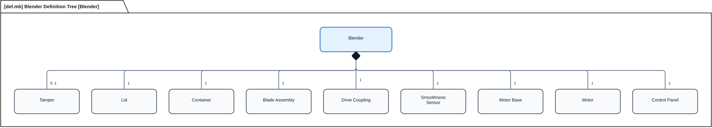

### Interaction

The smoothie program from user start through control panel, motor, drive coupling, blade assembly, smoothness feedback, and motor stop.

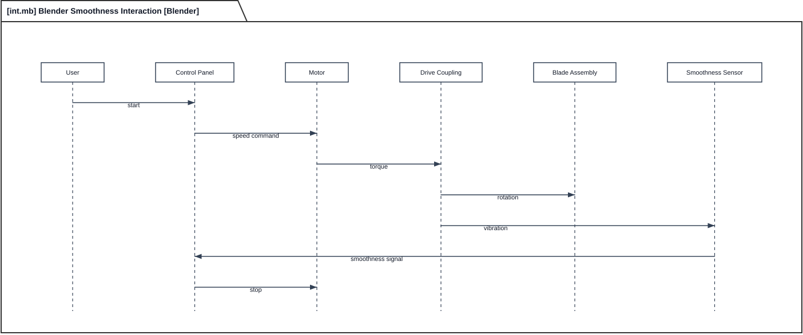

### State Behavior

Off and a composite Powered state. Ready, Blending, and Error sit inside Powered. Error covers general fault, lid opened during blend, blade jam, overcurrent, and sensor fault.

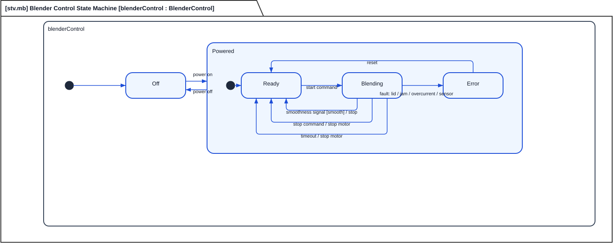

### Action Behavior

Load ingredients, close the lid, power on, start the program, spin, sense, loop until smooth, stop, and pour.

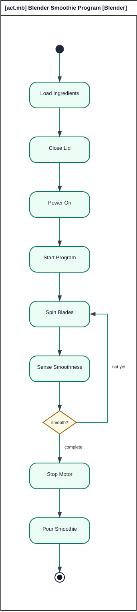

### Interconnection View

Physical and signal relationships among tamper, lid, container, blade assembly, drive coupling, smoothness sensor, motor base, motor, and control panel.

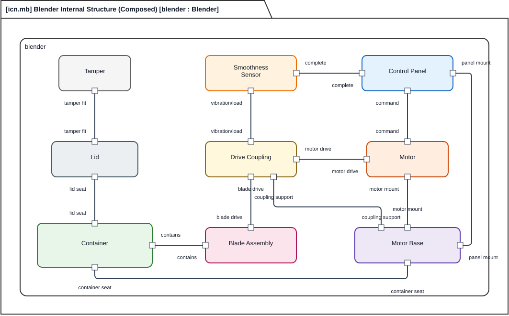

### Interfaces and Flows

User controls, power, drive, and sensing. Flows are ingredients, commands, power, torque, blade shear, and smoothness feedback.

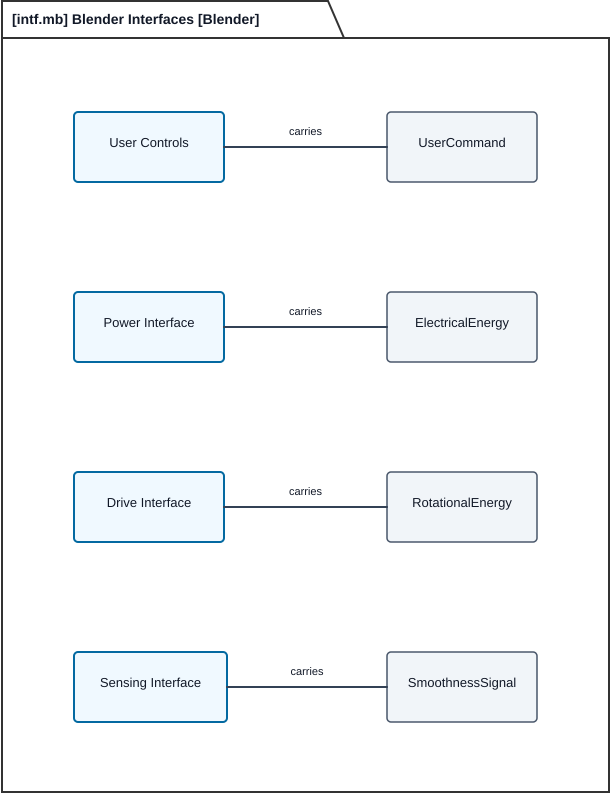

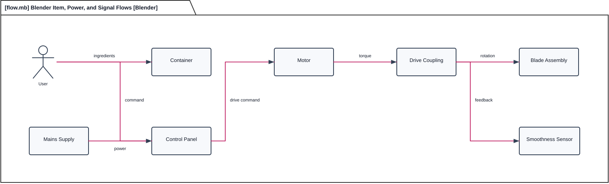

### Constraints and Allocations

Named speed, torque, load, timing, interlock, smoothness, power, and noise constraints. Allocations map the requirements that the view binds onto the control panel, motor, smoothness sensor, and behavior.

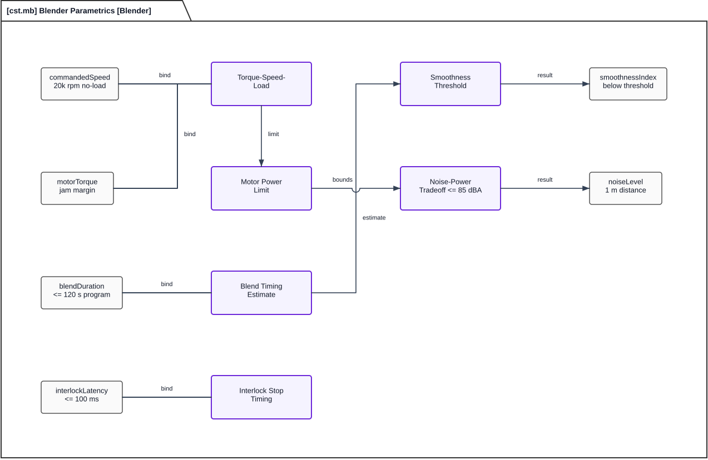

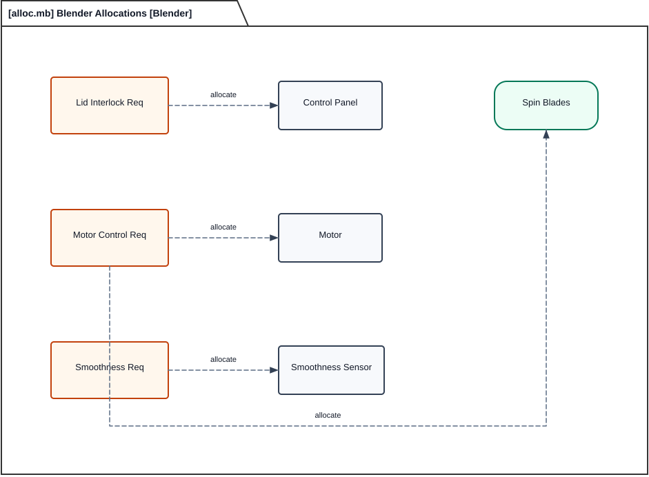

### Package and Trace Overview

Packages are structure, behavior, requirements, analysis, and verification. The general view traces a use case, requirement, action, part, and verification case.

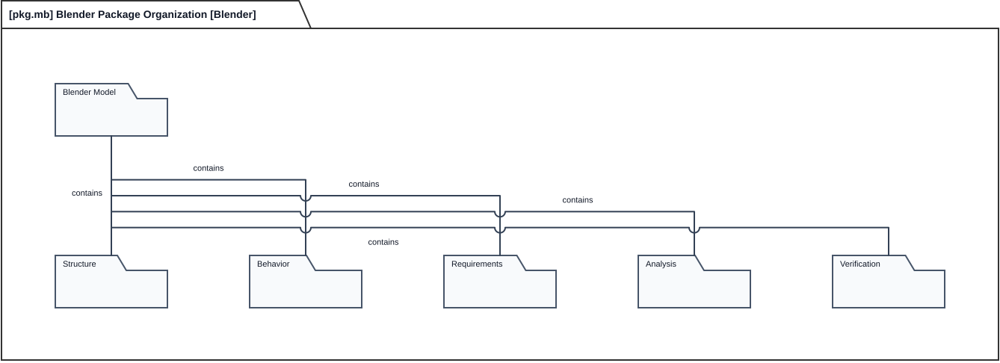

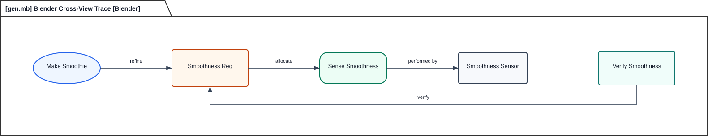
