# Electric Bike Architecture

This note is an educational architecture walkthrough of the electrically assisted bicycle modeled in `e-bike.sysml`. It uses a **simplified MagicGrid** spine: problem domain first, then solution domain. It is not a Department of Defense Architecture Framework (DoDAF) product. There are no Operational / Systems / Technical View (OV / SV / TV) products and no capability taxonomies.

A new systems engineer should be able to learn the *system* and the *method* from this note without opening the Systems Modeling Language (SysML) source. The `.sysml` model is authoritative when a generated view label disagrees.

This is an example model, not a certifiable appliance. The bicycle is cadence Pedal Assist System (PAS) only: no certified throttle, assist cutoff at 25 km/h, walk assist at or below 6 km/h. The hub is rear geared with no regeneration. **250 W is the European Union (EU) continuous rating (European Standard (EN) 15194), not peak power.** **40 N·m is hub peak torque, not continuous** — that torque does not sit with 250 W at 25 km/h as a continuous operating point. Charge energy enters the Battery Management System (BMS), then the pack.

## How to read this note (simplified MagicGrid)

MagicGrid separates **what the system must do for someone** from **how the design does it**.

**Problem domain**

1. Purpose / mission — why the system exists, in plain language.
2. Stakeholders and use cases — every actor, include/extend, and the analysis and verification *names*.
3. Requirements — model text wins. Quantitative targets appear only when they are bound in the `.sysml`. Sources appear only when the model already cites them.

**Solution domain**

4. Structure and interfaces — parts, ports that exist, what connects to what and why, and the operating boundary.
5. Behavior — states, actions, interactions, and fault paths.
6. Parametrics / constraints — equations if present; names only if not.
7. Allocations — requirements or behavior mapped onto parts that actually exist.

Sections 8 and 9 walk every generated figure — Block Definition Diagram (BDD), Internal Block Diagram (IBD), and State Machine (STM) among them — and then list unmarked items and out-of-scope work.

---

## 1. Purpose / mission

The system is one Electrically Power Assisted Cycle (EPAC) class under EN 15194. Its mission is to assist a rider’s pedaling on the road within the legal continuous-power and speed limits, cut torque on brake input, and accept charge from an off-board charger through the pack BMS.

It is not a throttle bike, not a mid-drive kit, and not a regenerative hub. Tour-mode range is the only bound range scenario.

## 2. Stakeholders and use cases

| Stakeholder | Associated use cases |
|-------------|----------------------|
| Rider | Ride Bike, Adjust Assist |
| Charger | Charge Bike only |

Ride Bike **includes** Adjust Assist. The charger is not associated with ride or assist. There is no extend relationship in the model.

**Analysis cases** (named studies; they bind named constraints, not measured results)

- Range analysis (`rangeAnalysis`) — `energyBalance` and the Tour binding against the range requirement.
- Tour-range analysis (`tourRangeAnalysis`) — `tourRangeBind` against the range requirement.
- Brake-latency analysis (`brakeLatencyAnalysis`) — `brakeLatencyLimit` against brake override.

**Verification cases** (names only — no part, port, or effect is bound)

`verifyRange`, `verifyBrakeCutoff`, `verifyChargeSafety`, `verifyAssistLimit`.

## 3. Requirements

Identifiers such as REQ-E-xxx appear only on generated views. Text and numbers are from the model. View labels are not treated as requirements.

| ID (view only) | Model requirement | Quantitative target | Source in the model |
|----------------|-------------------|---------------------|---------------------|
| REQ-E-001 | Ride safety — fail-silent torque cut. Brake, controller, cadence sensor, wheel-speed sensor, and BMS shall cut motor torque. Cadence-only cannot enforce 25 km/h | qualitative | EN 15194 EPAC safety (stated in the assist-limit family) |
| REQ-E-002 | Tour-mode range | Tour-scenario `usableWh` binding: **500 Wh** / `energyPerKm` **~8.3 Wh/km** ≥ **60 km**. Not pack nameplate. Not Eco / PAS-1 | `rangeRequirement` / `tourRangeBind` |
| REQ-E-003 | Assist limit — cadence PAS only, no certified throttle | Assist cut **25 km/h**; walk assist **≤ 6 km/h** | **EN 15194** |
| REQ-E-004 | Charge safety — stop on over-temperature, over-voltage, or charger disconnect. **Model shall:** BMS opens the pack contactor | qualitative | UL 2849 cited; not a certification shall |
| REQ-E-010 | Electronic brake inhibit | **≤ 50 ms** from either lever. Separate design target — not a comparison to the EN 15194 distance test | `brakeOverrideRequirement` |
| REQ-E-011 | BMS opens the pack contactor before any cell exceeds voltage or temperature limits | qualitative | UL 2849 cited; not a certification shall |
| REQ-E-012 | EN 15194:2017 clause 4.2.13 Power management — motor-assist cut-off after pedaling stops, **not** vehicle brake distance. Brake lever switches only relax the cut-off from 2 m to 5 m | **2 m**; **5 m** when lever switches relax the clause | **EN 15194:2017 4.2.13** |
| REQ-E-013 | Walk assist is not a throttle | **≤ 6 km/h** | **EN 15194** |
| REQ-E-014 | Continuous assist power | **250 W EU continuous** — distinct from hub peak torque **40 N·m** | **EN 15194** |
| REQ-E-020 | Display speed, assist level, and remaining range without removing hands from the bars | qualitative | not cited |
| REQ-E-030 | Frame carries rider, cargo, and battery loads without yielding | qualitative | not cited |
| REQ-E-040 | Lighting | **Straßenverkehrs-Zulassungs-Ordnung (StVZO) / International Organization for Standardization (ISO) 6742**, not United Nations Economic Commission for Europe (UN ECE) R113 | **StVZO**, **ISO 6742** |

Clause 4.2.13 is power management on the motor controller, cadence sensor, and wheel-speed sensor — not `BrakeSystem`. The 50 ms electronic inhibit is a separate design target. Do not treat 50 ms as tighter than the distance test.

UL 2849 is a citation on charge safety. It is not modeled as a certification requirement. The model shall is that the BMS opens the pack contactor.

## 4. Structure and interfaces

### Operating context / boundary

Rider, charger, and road are first-class external parts. They stay on the operating-context view. They are not decomposed inside the IBD.

| External part | Role | Context exchange |
|---------------|------|------------------|
| Rider | Commands the bike | `riderCommandFlow` |
| Charger | Off-board charge source | `chargeEnergyFlow` |
| Road | Tractive load | `roadLoadFlow` |

Boundary entries on the internal interconnection view (ports on children, not parent-owned externals):

- Rider → `humanInterface.riderIn`
- Charger → `batteryPack.bms.chargerIn`
- Road load → `hubMotor.roadLoadIn`

Port types that exist: `RiderPort`, `ChargePort`, `MechanicalPort`, `PowerPort`, `DrivePort`, `ControlPort`.

### Parts

Six `ElectricBike` part usages are `frame`, `batteryPack`, `motorController`, `hubMotor`, `humanInterface`, and `brakeSystem`. The model also has `cadenceSensor`, `wheelSpeedSensor`, and a nested `batteryPack::bms`.

```
ElectricBike
├── frame
├── batteryPack
│   └── bms
├── motorController
├── hubMotor          continuousPower, wheelTorque
├── humanInterface    cadence PAS, walk assist, display; no throttle
├── brakeSystem
├── cadenceSensor
└── wheelSpeedSensor
```

`HubMotor` documentation: rear geared hub; regen none; EU continuous rating 250 W (EN 15194); hub peak torque 40 N·m — not continuous; 40 N·m does not sit with 250 W at 25 km/h as a continuous operating point.

`continuousPower` and `wheelTorque` are declared on the hub. Literal 250 W / 40 N·m values are in the documentation and view labels, not as SysML attribute bindings.

Lighting and a separate display part are not in the structure. Display is a function of `humanInterface`. `packEnergy` and `packVoltage` are declared without values.

### What connects to what, and why

Interfaces: rider (`PedalCadence`, `WalkAssistCommand`), charge (`ChargeEnergy`, `ElectricalEnergy`), drive (`WheelTorque`), brake (`BrakeInhibit`). `ThrottleCommand` is defined and unused — it is not on RideControl or HumanInterface.

**Charge path (only this path):** charger → `bms.chargerIn` (`chargerToBms`) → `bms.contactorOut` → `batteryPack.powerOut` (`bmsToPackPower`) → `motorController.powerIn`. The charger does not feed the pack and the BMS in parallel.

| Connection | From → to | Why |
|------------|-----------|-----|
| Frame mounts | frame → battery, hub, human interface, brakes | Mechanical location |
| Pack power | battery pack → controller | Traction energy after the BMS contactor |
| Phase drive | controller → hub | Assist torque |
| Assist command | human interface → controller | PAS / walk / display commands |
| Inhibit | brake system → controller | Fail-silent cut |
| Cadence | cadence sensor → controller `sensorIn` | Pedal presence |
| Wheel speed | wheel-speed sensor → controller `sensorIn` | 25 km/h cut — cadence cannot do this alone |
| Charge | charger → BMS → pack | BMS opens the contactor (UL 2849 cited, not a certification shall) |
| Road load | road → hub | Tractive load (context, not an internal actor) |

`frameToMotor` exists in the model. The interconnection view leaves the frame-to-hub mount off the drawing so frame mounts do not hop each other.

## 5. Behavior

### RideControl states

Initial state is Off.

| State | Notes |
|-------|-------|
| Off | Only state that may enter Charging |
| Standby | Powered, not assisting |
| Assist | Cadence PAS |
| walk | `do / speed <= 6 km/h` — EPAC walk assist, not a throttle |
| charging | Entered only from Off |
| fault | Reset returns to Off, not Standby |

| From | Trigger | To |
|------|---------|-----|
| Off | power button | Standby |
| Standby | cadence pedal | Assist |
| Assist | no pedal | Standby |
| Standby | walk button | walk |
| walk | walk release or brake | Standby |
| Assist | brake lever | Standby |
| Off | charger connected | charging |
| charging | charge full or charger removed | Off |
| Standby | power button | Off |
| Assist | overcurrent or cutout | fault |
| fault | reset | Off |

There is no charging transition from Standby. There is no overcurrent transition from Standby. There is no fault-to-Standby reset.

### Ride actions and interaction

Power on → select assist → pedal → apply brake → inhibit motor → deliver (or drop) torque. Plug-in and charge-stop are the charge path. The interaction lifeline for the hub is the rear geared hub.

## 6. Parametrics / constraints

| Parameter | Value in the model |
|-----------|--------------------|
| Tour-scenario `usableWh` | 500 Wh (binding on `rangeRequirement`, not pack nameplate) |
| Tour-scenario `energyPerKm` | ~8.3 Wh/km |
| Tour-scenario range | ≥ 60 km |
| Assist cutoff | 25 km/h |
| Walk assist | ≤ 6 km/h |
| EU continuous power | 250 W |
| Hub peak torque | 40 N·m (not a continuous pair with 250 W at 25 km/h) |
| Electronic brake inhibit | ≤ 50 ms (brake levers; not the 2 m / 5 m pedal-cutoff) |
| EN 15194:2017 4.2.13 assist cut-off after pedaling stops | 2 m; lever switches relax to 5 m (not vehicle brake distance) |

`energyBalance` is pack electrical energy only. Rider pedal watts use `riderInputBalance`. Do not add rider watts to pack `usableWh`. `tourRangeBind` is `usableWh / energyPerKm` for the Tour 60 km scenario — not Eco / PAS-1. `packEnergy` and `packVoltage` are unmarked.

Constraint names `rangeEstimate`, `assistPowerLimit`, `brakeLatencyLimit`, and `thermalDerate` have **no formulas** in the model.

## 7. Allocations

| Requirement | Allocated to parts that exist |
|-------------|-------------------------------|
| Ride safety | `brakeSystem`, `motorController`, `cadenceSensor`, **`wheelSpeedSensor`**, `bms` |
| Range | `batteryPack` |
| Assist limit | `motorController`, **`wheelSpeedSensor`** |
| EN 15194:2017 4.2.13 (2 m; levers relax to 5 m) | `motorController`, `cadenceSensor`, `wheelSpeedSensor` — **not** `brakeSystem` |
| Charge safety | `bms` |

Ride safety and assist limit both allocate to the wheel-speed sensor. Cadence-only cannot enforce 25 km/h. Clause 4.2.13 is power management: motor-assist cut-off after pedaling stops. Brake lever switches only relax 2 m to 5 m; they do not move the cite onto `BrakeSystem`.

---

## 8. Diagram walkthrough

The figures are generated SysMLD views. They illustrate the architecture above; they do not replace it. When a view label disagrees with the `.sysml`, the model wins.

**Shared symbol key**

- Stick figure — actor (rider or charger).
- Ellipse — use case.
- Dashed arrow labeled `include` — use-case inclusion.
- Rectangle with `«requirement»` — a requirement node (view identifier only).
- Rectangle — part usage.
- Small square on a box edge — port.
- Solid line between ports — connection. Lines must not pass through boxes. Hop-overs are line-on-line only.
- Rounded rectangle — state.
- Arrow between states — transition, labeled with the trigger.
- Rounded action box — an action on a control-flow diagram.
- Lifeline / message — interaction (sequence).

### Problem domain

#### Use cases — `e-bike-uc.svg`

**MagicGrid layer:** problem / stakeholders.

**Question:** Who uses the bike, and which jobs can they ask of it?

**How to read it:** Rider associates with Ride Bike and Adjust Assist. Charger associates with Charge Bike only. Ride Bike **includes** Adjust Assist.

**Symbols:** two actors, three use-case ellipses, include dashed arrow, system boundary.

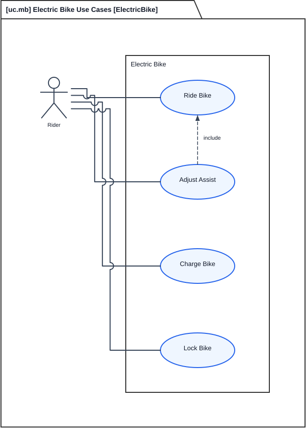

#### Analysis cases — `e-bike-acase.svg`

**MagicGrid layer:** problem / analysis.

**Question:** Which named studies exist?

**How to read it:** Range, Tour-range, and brake-latency analysis sit against named constraints. They do not invent Eco / PAS-1 range.

**Symbols:** analysis-case nodes and constraint names.

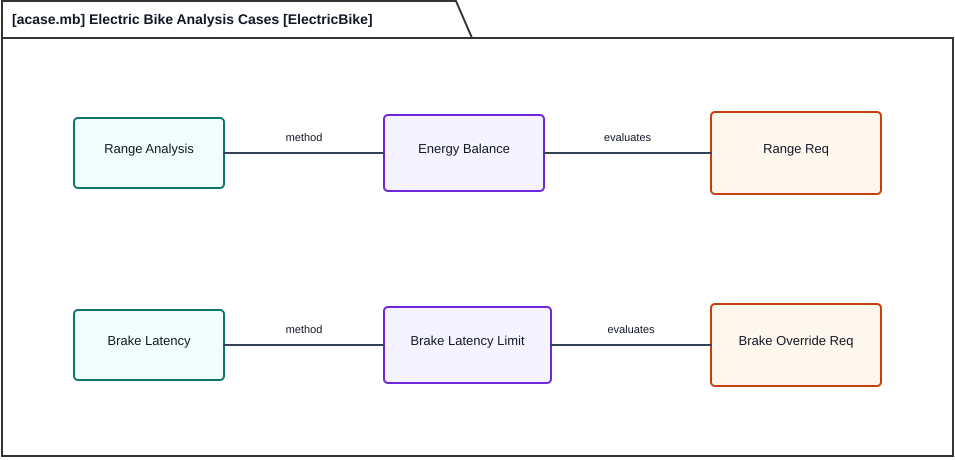

#### Verification cases — `e-bike-vcase.svg`

**MagicGrid layer:** problem / verification (names only).

**Question:** Which checks are named?

**How to read it:** `verifyRange`, `verifyBrakeCutoff`, `verifyChargeSafety`, `verifyAssistLimit`. None binds a part, port, or effect.

**Symbols:** verification-case nodes.

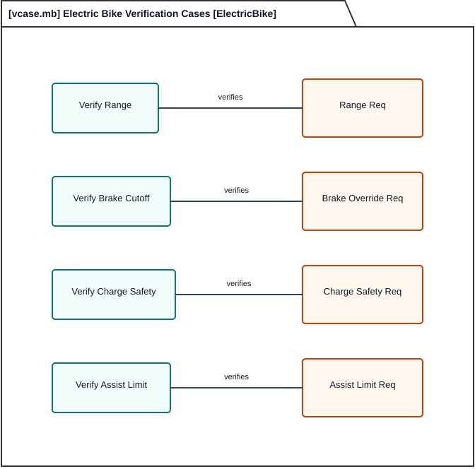

#### Operating context — `e-bike-context.svg`

**MagicGrid layer:** problem / context (boundary of the solution).

**Question:** What sits outside the bike?

**How to read it:** Rider, off-board charger, and road surround the bike. Those externals stay on context. They are not internal IBD actors.

**Symbols:** external parts and item flows.

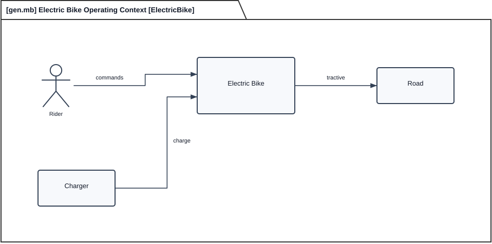

#### Requirements — `e-bike-req.svg`

**MagicGrid layer:** problem / requirements.

**Question:** What shalls does the model state?

**How to read it:** Tour-scenario `usableWh` 500 Wh / `energyPerKm` ~8.3 Wh/km for 60 km, 50 ms electronic brake inhibit (separate design target), EN 15194:2017 4.2.13 assist cut-off after pedaling stops (2 m; levers relax to 5 m), 25 km/h assist cut, walk assist ≤ 6 km/h, EU continuous 250 W, StVZO / ISO 6742 lighting. If a box says something the model does not, ignore the box.

**Symbols:** `«requirement»` rectangles.

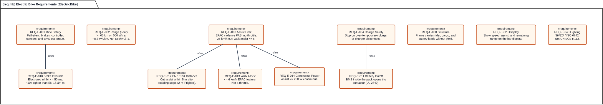

### Solution domain

#### Definition tree (Block Definition Diagram) — `e-bike-bdd.svg`

**MagicGrid layer:** solution / structure.

**Question:** What parts compose the bike?

**How to read it:** A BDD is a composition tree: frame, battery pack with nested BMS, motor controller, rear geared hub, human interface, brake system, cadence sensor, and wheel-speed sensor. The hub box states EU continuous 250 W and 40 N·m peak torque separately.

**Symbols:** part boxes and composition lines.

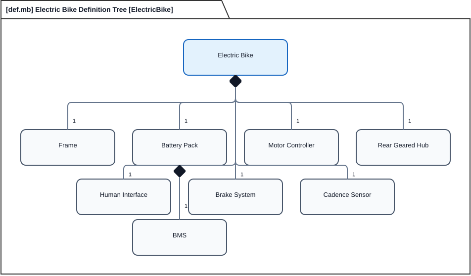

#### Internal interconnection (Internal Block Diagram) — `e-bike-ibd.svg`

**MagicGrid layer:** solution / interfaces.

**Question:** How do the parts exchange power, commands, and inhibits?

**How to read it:** An IBD shows child-part ports only. Charge arrives at the BMS, then the pack contactor, then the controller, then the hub. Cadence and wheel-speed sensors feed the controller. Rider, charger, and road do not appear as internal boxes. Connections do not pass over boxes.

**Symbols:** part boxes, ports, power / drive / control connections.

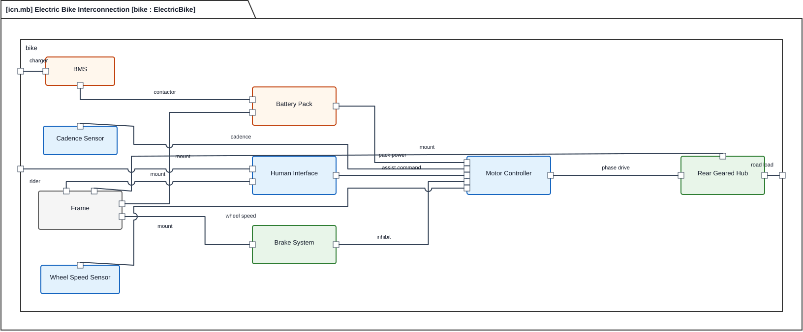

#### Interfaces — `e-bike-intf.svg`

**MagicGrid layer:** solution / interfaces.

**Question:** Which interface definitions exist?

**How to read it:** Rider, charge, drive, and brake. `ThrottleCommand` is unused.

**Symbols:** interface nodes.

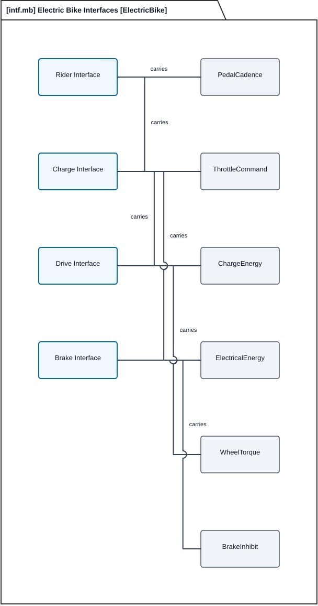

#### Flows — `e-bike-flow.svg`

**MagicGrid layer:** solution / interfaces (items).

**Question:** Which items move?

**How to read it:** Charge energy charger → BMS → pack → controller → hub → road, with rider command and brake inhibit on the side.

**Symbols:** item/flow nodes and arrows.

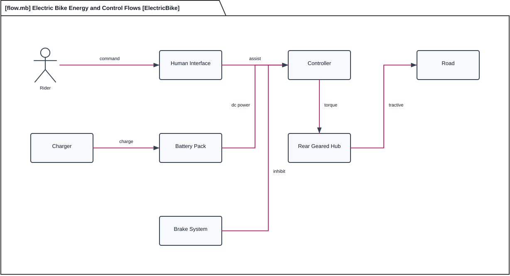

#### State machine — `e-bike-stm.svg`

**MagicGrid layer:** solution / behavior.

**Question:** Which ride modes exist, and which transitions are legal?

**How to read it:** The STM starts in Off. Power goes to Standby; cadence starts Assist; the walk button starts walk (`do / ≤ 6 km/h`). Charging is entered only from Off. Fault is reached from Assist on overcurrent; reset returns to Off.

**Symbols:** rounded states, transition arrows, triggers.

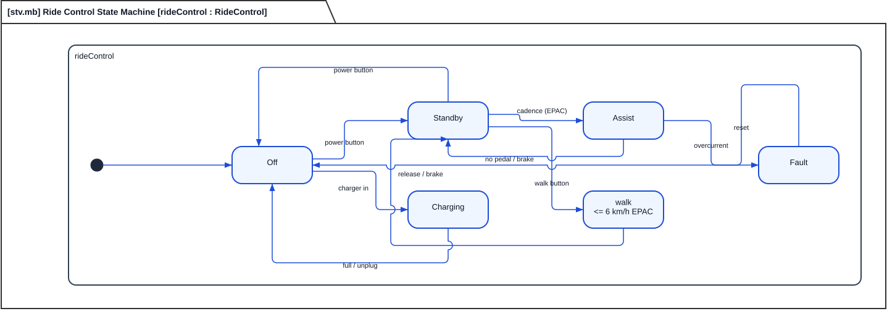

#### Ride actions — `e-bike-act.svg`

**MagicGrid layer:** solution / behavior.

**Question:** What is the ordered ride and charge procedure?

**How to read it:** Power-on, assist selection, pedaling, brake inhibit, torque delivery, plug-in, and charge stop.

**Symbols:** action boxes and control-flow arrows.

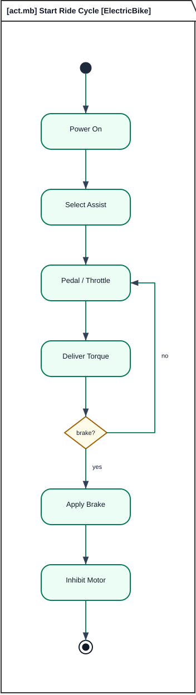

#### Interaction — `e-bike-int.svg`

**MagicGrid layer:** solution / behavior.

**Question:** Who talks to whom from power-on through a brake cut?

**How to read it:** Lifelines for human interface, controller, and the rear geared hub. Messages follow assist command, phase current, brake lever, inhibit, and torque-off.

**Symbols:** lifelines and messages.

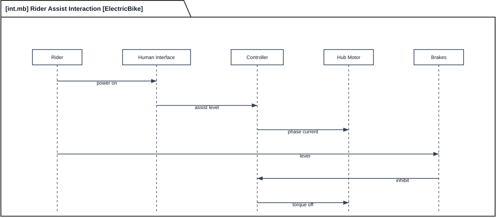

#### Constraints — `e-bike-cst.svg`

**MagicGrid layer:** solution / parametrics.

**Question:** Which energy and timing relations are named?

**How to read it:** Pack energy (`energyBalance`) is separate from rider watts (`riderInputBalance`). `tourRangeBind` is Tour `usableWh / energyPerKm` only. Several constraint names have no formulas.

**Symbols:** constraint nodes and attributes.

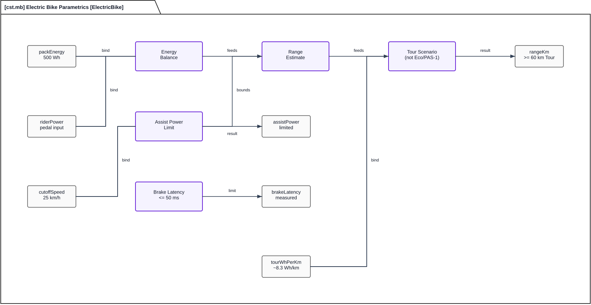

#### Allocations — `e-bike-alloc.svg`

**MagicGrid layer:** solution / allocations.

**Question:** Which shalls land on which existing parts?

**How to read it:** Ride safety and assist limit map onto brakes, controller, both sensors, and the BMS. Clause 4.2.13 maps onto controller, cadence, and wheel speed — not the brake system. Charge safety maps to the BMS.

**Symbols:** requirement boxes, part boxes, dashed allocate arrows.

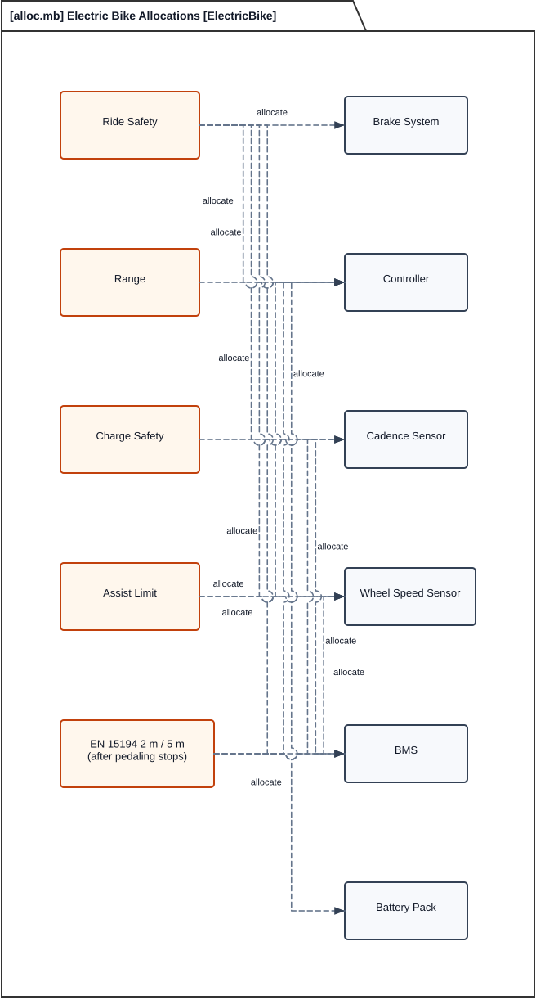

#### Packages — `e-bike-pkg.svg`

**MagicGrid layer:** model organization (supports every MagicGrid layer).

**Question:** How is the model packaged?

**How to read it:** Structure, behavior, requirements, analysis, and verification packages.

**Symbols:** package nodes.

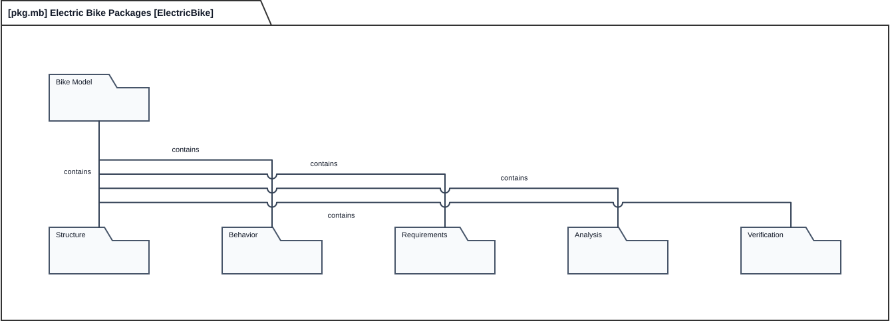

#### Cross-view trace — `e-bike-general.svg`

**MagicGrid layer:** trace across MagicGrid layers.

**Question:** Can one path be followed from a use case through a requirement to a verification name?

**How to read it:** A single teaching thread. It is not extra requirements.

**Symbols:** mixed-kind nodes and trace lines.

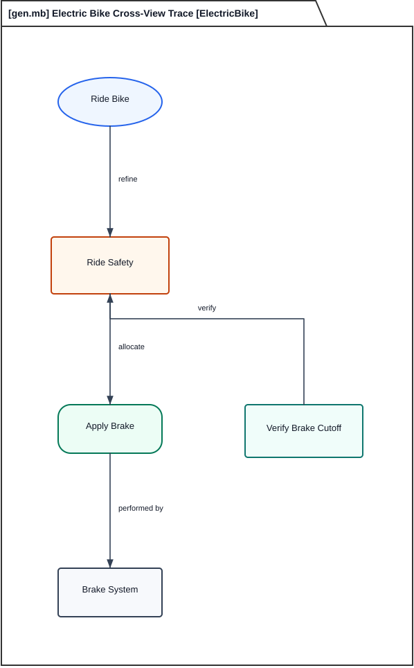

---

## 9. Open risks / unmarked / out of scope

**Unmarked:** `packEnergy` and `packVoltage`. 500 Wh is only the Tour `usableWh` binding, not a pack nameplate.

**Model gaps:** Lighting is a requirement (`lightingRequirement`) with no lighting part. Display is required on `humanInterface` with no separate display part. `ThrottleCommand` is unused. Verification cases are names only.

**Out of scope:** throttle variants, mid-drive kits, regenerative hubs, UN ECE R113 lighting, Eco / PAS-1 range, charging from Standby, treating 40 N·m as continuous with 250 W at 25 km/h.

This remains an example model, not a certifiable product.
