# Toaster Architecture Summary

This document summarizes the toaster SysML model and its generated SysMLD views. The model covers user-facing cases, quantitative requirements, structure, behavior, interfaces, flows, analyses, verification, and traceability.

## Cases

The toaster cases focus on the primary user workflows: toasting bread, cancelling a toast cycle, and removing crumbs through the tray. Analysis cases evaluate thermal performance and electrical load. Verification cases check browning quality, electrical safety, and crumb-tray removal.

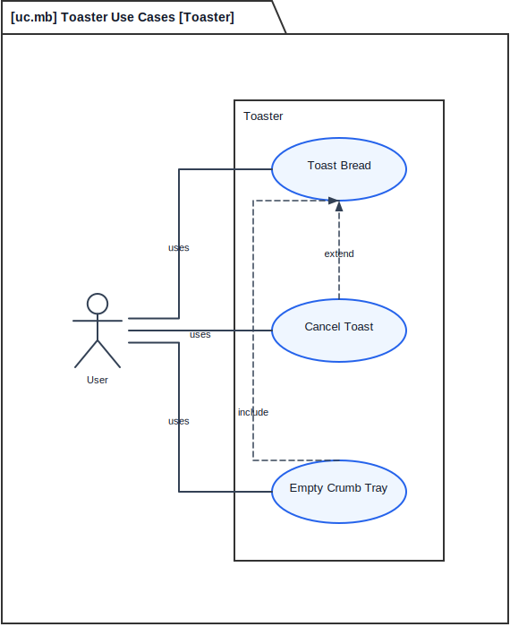

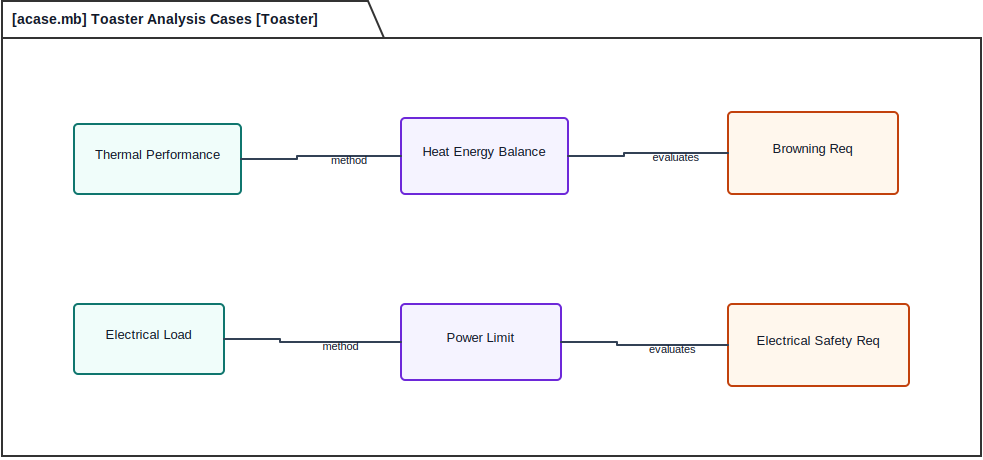

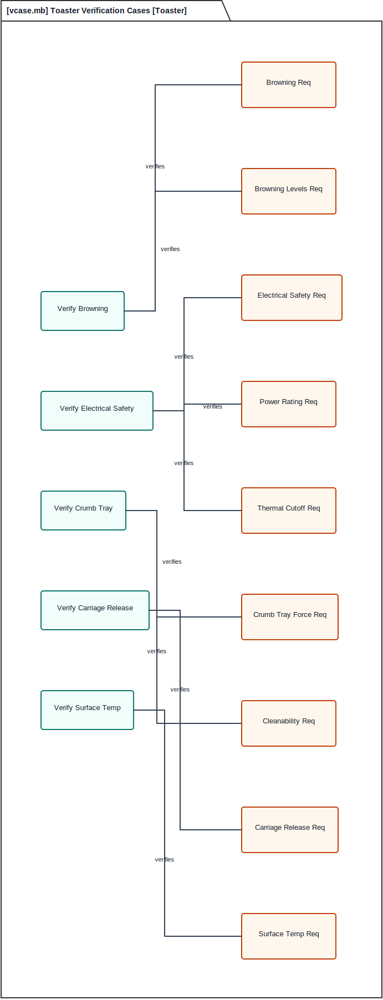

## Operating Context

The toaster interacts with the user, bread, a 120 VAC outlet, the kitchen environment, finished toast, and crumb debris. The context view makes the external interfaces explicit before decomposing the toaster internals.

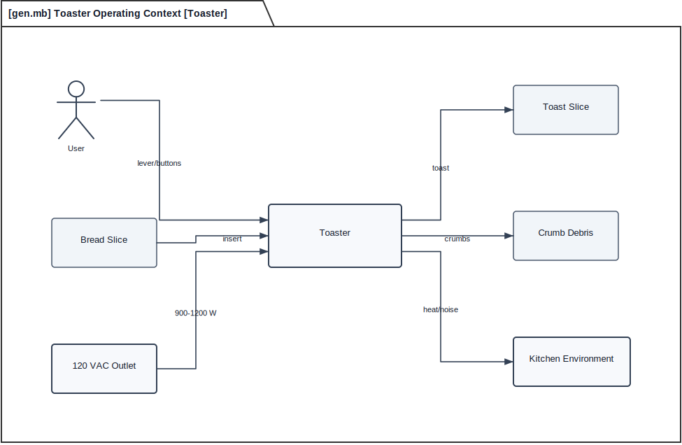

## Requirements

The requirement view now embeds requirement intent and quantitative targets in each requirement node. The root safety requirement derives electrical, browning, and timing requirements. Detailed targets include 900-1200 W operation, touchable surface temperature at or below 60 C, thermal cutoff before external surfaces exceed 90 C, seven browning levels, carriage release within 2 s, crumb tray removal force of 5-15 N, and 10,000 mechanism cycles.

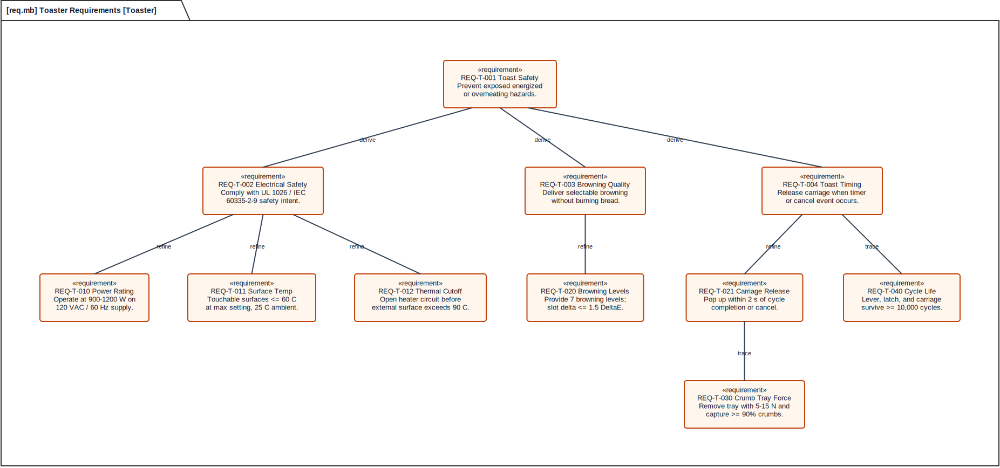

## Hierarchical Structure

The definition tree identifies the toaster as a composition of chassis, lever, buttons, power and control subsystem, heating element, carriage, crumb tray, and power cord. Multiplicity and composition diamonds show part ownership.

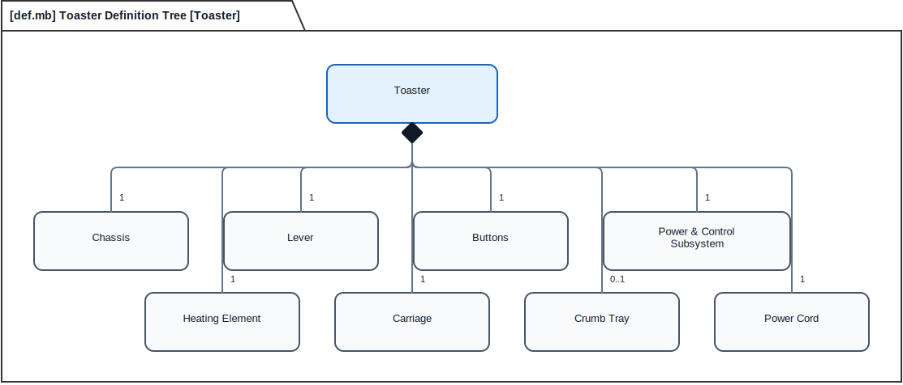

## Interaction

The interaction view shows the user lowering the lever, the control subsystem commanding heat, the carriage being released, and toast becoming available to the user.

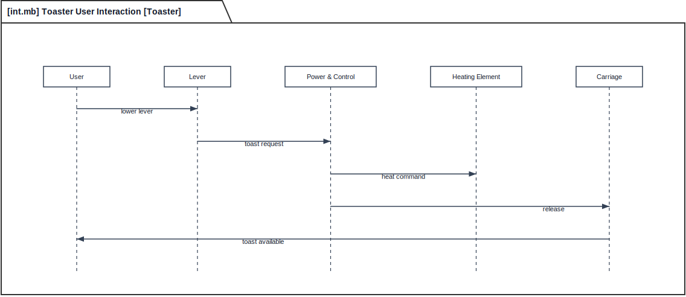

## State Behavior

The state machine captures Idle, Heating, Done, and Error as distinct operating states. Done is a normal state, not a final node, so the model distinguishes toast completion from bread removal. The Error state now covers overheating, carriage jam, and power fault conditions, with reset returning to Idle.

## Action Behavior

The action view describes the toast cycle from bread insertion through lever actuation, carriage latching, heater energizing, timer monitoring, decision looping, carriage release, and toast presentation.

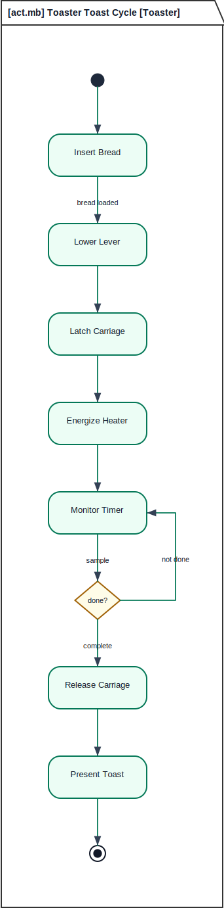

## Interconnection Views

The electrical interconnection view separates user controls, cord power, power/control logic, and the heater command. The mechanical interconnection view separates chassis mounting, lever lift, button mounting, carriage guidance, and crumb tray guidance.

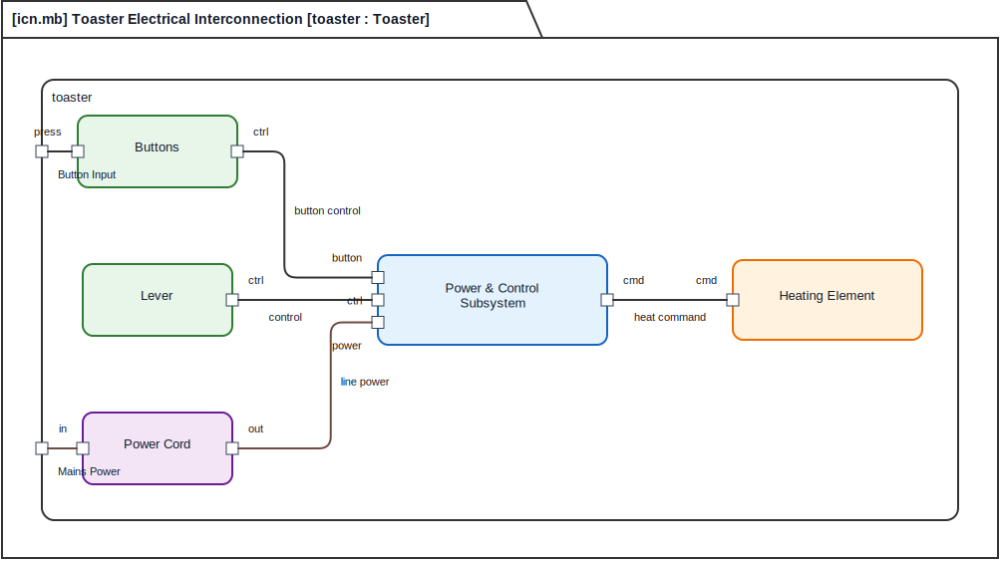

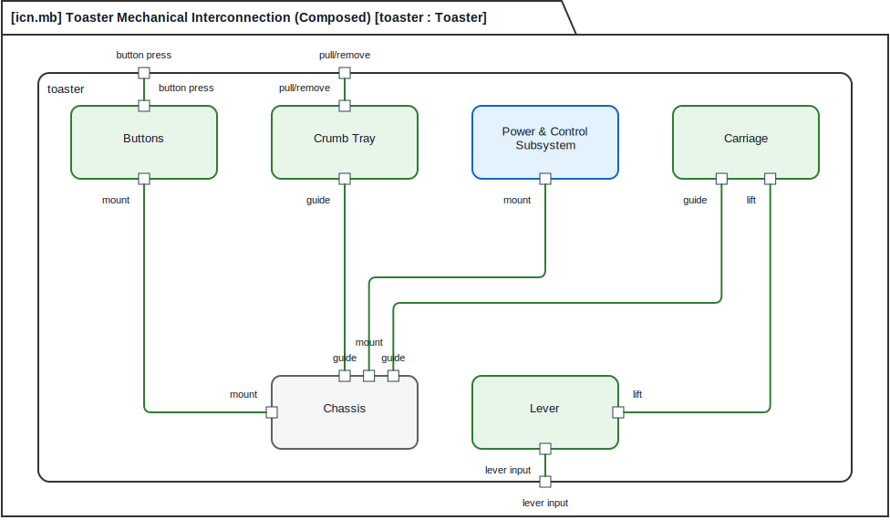

## Interfaces and Flows

The interface view captures user, power, mechanical, and thermal interfaces. The flow view shows bread, toast, mains power, heat, user commands, and crumbs moving through the system.

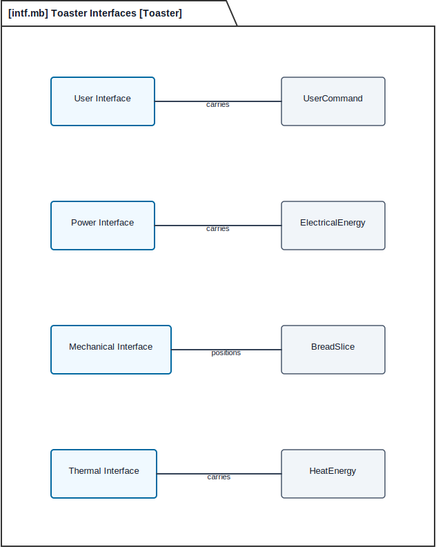

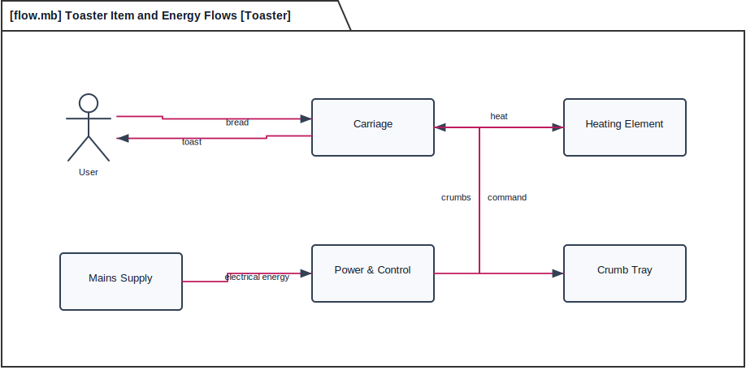

## Constraints and Allocations

The constraint view captures heat energy, timing, electrical power, browning, external surface temperature, and carriage-release timing estimates. The allocation view maps requirements onto parts and behavior responsible for satisfying them.

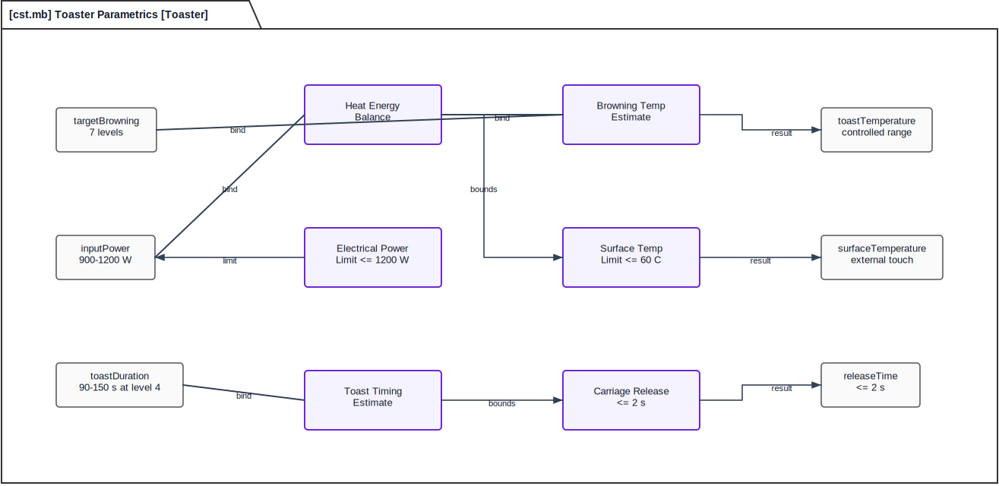

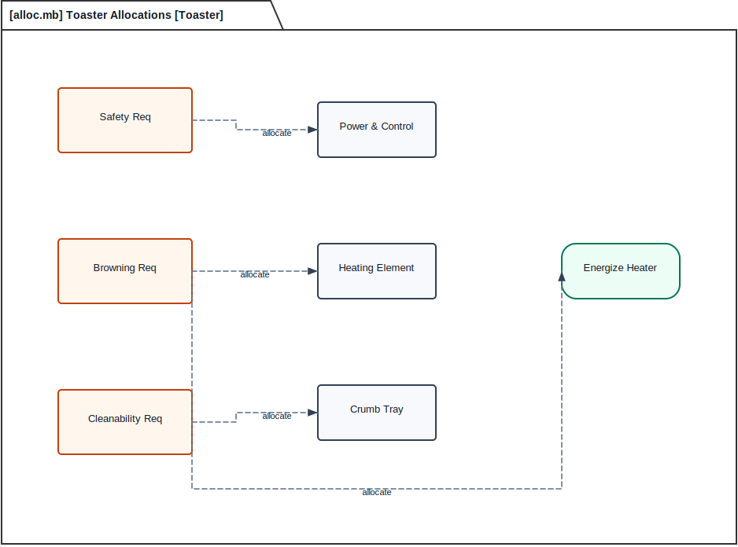

## Package and Trace Overview

The package view organizes the model into structure, behavior, requirements, analysis, and verification packages. The general trace view ties use case, requirement, action, part, and verification case together.

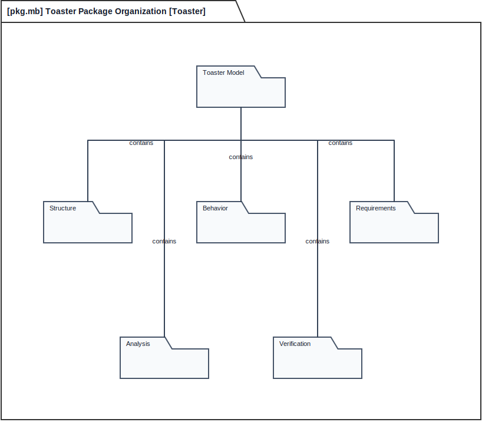

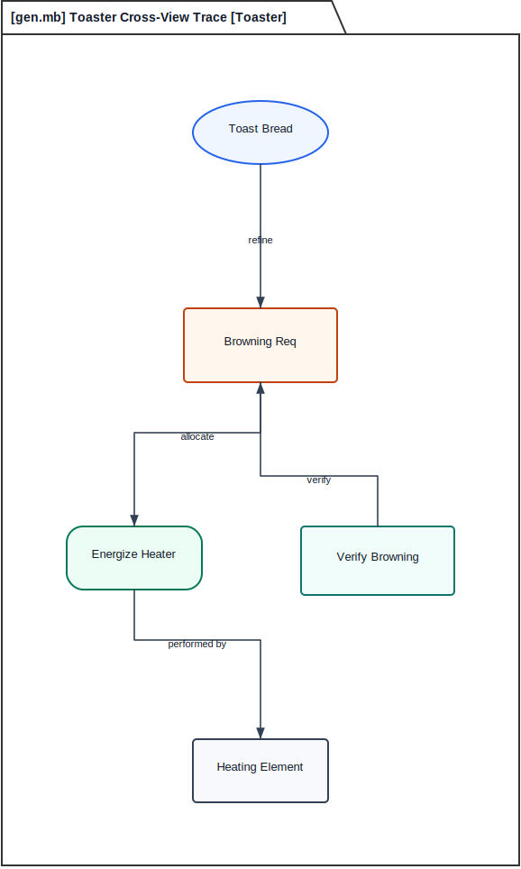

## Feedback Disposition

The Grok review recommended quantitative requirements, richer fault handling, context, and stronger thermal/safety emphasis. Those were implemented in the requirement view, constraint view, state machine, and context view. Product-line variants such as 4-slice, bagel, defrost, and wide-slot versions are not modeled yet; they are intentionally deferred because this example is a reference architecture for one 2-slice baseline, not a product-line model.
