# Toaster Architecture

This note is an educational architecture walkthrough of the two-slice household toaster modeled in `toaster.sysml`. It uses a **simplified MagicGrid** spine: problem domain first, then solution domain. It is not a Department of Defense Architecture Framework (DoDAF) product. There are no Operational / Systems / Technical View (OV / SV / TV) products and no capability taxonomies.

A new systems engineer should be able to learn the *system* and the *method* from this note without opening the Systems Modeling Language (SysML) source. The `.sysml` model is authoritative when a generated view label disagrees.

This is an example model, not a certifiable appliance. Requirement text and numbers come from the SysML model. The model does not name an external standard.

## How to read this note (simplified MagicGrid)

MagicGrid separates **what the system must do for someone** from **how the design does it**.

**Problem domain**

1. Purpose / mission — why the system exists, in plain language.
2. Stakeholders and use cases — every actor and named use case (include/extend only when the `.sysml` has it), and the analysis and verification *names*.
3. Requirements — model text wins. Quantitative targets appear only when they are bound in the `.sysml`.

**Solution domain**

4. Structure and interfaces — parts, ports that exist, what connects to what and why, and the operating boundary.
5. Behavior — states, actions, interactions, and fault paths.
6. Parametrics / constraints — equations if present; names only if not.
7. Allocations — requirements or behavior mapped onto parts that actually exist.

Sections 8 and 9 walk every generated figure — Block Definition Diagram (BDD), Internal Block Diagram (IBD), and State Machine (STM) among them — and then list unmarked items and out-of-scope work.

---

## 1. Purpose / mission

The system is a countertop two-slice toaster. Its mission is to accept bread, apply controlled heat for a selected browning level, present toast, and allow the user to cancel a cycle or empty crumbs without tools.

The model is a single baseline product, not a product line. Four-slice, bagel, defrost, and wide-slot variants are not modeled.

## 2. Stakeholders and use cases

The only named stakeholder is the user. A service technician is implied by a serviceability requirement but is not modeled as an actor.

**Use cases**

- **Toast Bread** — primary named use case. The user inserts bread, selects browning, and receives toast.
- **Cancel Toast** — named use case. The user can abort a heating cycle. The `.sysml` has no extend relationship.
- **Empty Crumb Tray** — named use case. The tray is removable without tools. The `.sysml` has no include relationship.

**Analysis cases** (named studies; they bind named constraints, not measured results)

- **Thermal Performance** (`thermalPerformanceAnalysis`) — uses `heatEnergyBalance` against browning.
- **Electrical Load** (`electricalLoadAnalysis`) — uses `electricalPowerLimit` against electrical safety.

**Verification cases** (names only — no part, port, or effect is bound)

`verifyToastBrowning`, `verifyElectricalSafety`, `verifyCrumbTrayRemoval`, `verifyCarriageRelease`, `verifySurfaceTemperature`.

## 3. Requirements

The model states fourteen requirements. Identifiers such as REQ-T-xxx appear only on generated views and are listed here for cross-reference. View labels are not treated as requirements.

| ID (view only) | Model requirement | Quantitative target in the model |
|----------------|-------------------|----------------------------------|
| REQ-T-001 | The toaster shall not cause burns, electrical shock, or fire under normal operating conditions | none |
| REQ-T-002 | The toaster shall comply with applicable electrical safety standards for household appliances | none (no standard named in the model) |
| REQ-T-003 | Uniform browning across the full bread surface for each browning level | none |
| REQ-T-004 | The timer shall control heating duration within ±5% of the selected setting across all browning levels | **±5%** |
| — | The user shall be able to insert bread, select browning level, and cancel toasting without tools | none |
| — | The crumb tray shall be removable and washable without tools | none |
| — | The toaster shall be serviceable by a qualified technician without specialized equipment | none |
| REQ-T-010 | The toaster shall operate within its rated power consumption under all normal use conditions | rated watts unmarked |
| REQ-T-011 | Exterior surfaces accessible during operation shall not exceed safe touch temperature limits | touch temperature unmarked |
| REQ-T-012 | A thermal cutoff shall disable heating if internal temperature exceeds a safe threshold | cutoff threshold unmarked |
| REQ-T-020 | At least three distinct and repeatable browning level settings | **at least three** |
| REQ-T-021 | The carriage shall release automatically when the timer expires or when the user presses cancel | carriage-release time unmarked |
| REQ-T-030 | The crumb tray shall require no more than 10 N removal force | **no more than 10 N** |
| REQ-T-040 | At least 10,000 toast cycles before maintenance | **at least 10,000** |

There is no thermal-cutoff part in the structure. The cutoff statement is a requirement only. Power in this note refers to the modeled `mainsPower` → cord → `powerAndControlSubsystem` → `heatingElement` path. The model does not bind a wattage envelope, a pop time, or a numeric surface-temperature limit.

## 4. Structure and interfaces

### Operating context / boundary

The toaster sits in a kitchen among three external parts: the user, a mains supply (`MainsSupply`), and the kitchen environment. Bread enters the slots; toast and crumbs leave; heat and noise go to the surroundings.

| External part | Role |
|---------------|------|
| User | Inserts bread, lowers the lever, sets browning, cancels, pulls the crumb tray |
| Mains supply | Electrical energy into the power cord |
| Kitchen environment | Receives waste heat and noise |

Items that cross the boundary: `BreadSlice`, `ToastSlice`, `ElectricalEnergy`, `HeatEnergy`, `UserCommand`, `CrumbDebris`.

External-facing ports on the toaster are user inputs (lever, buttons, tray pull) and mains power (`PowerPort`). `MainsSupply` has no voltage or frequency in the model.

### Parts

The toaster is a single-level composition. Child part definitions have no nested internals.

```
Toaster
├── chassis
├── lever
├── buttons
├── powerAndControlSubsystem
├── heatingElement
├── carriage
├── crumbTray
└── powerCord
```

The definition view marks the crumb tray `0..1` and the others `1`. Multiplicity is not written in the SysML source.

Port types used on the toaster: user-interface, power, control, heat, and mechanical. Ports are declared on the toaster, not on the empty child part definitions.

### What connects to what, and why

The user starts and stops the cycle through the lever and buttons. Mains energy reaches the control subsystem through the cord. The subsystem commands the heater. `heaterToCarriage` connects `heaterHeatOut` to `carriageHeatIn` — heat to the carriage. The model has no bread thermal port. The chassis locates the moving and mounted parts.

| Connection | From → to | Why |
|------------|-----------|-----|
| Lever / button / tray inputs | Boundary → lever, buttons, crumb tray | User actuation |
| Mains → cord → power and control | Power | Energize control and heater switching |
| Lever → power and control | Control | Toast request / latch |
| Buttons → power and control | Control | Browning and cancel |
| Power and control → heater | Control | Heat command |
| Heater → carriage | Thermal | `heaterToCarriage`: heat to the carriage |
| Lever → carriage | Mechanical | Lift / release |
| Chassis → carriage, buttons, power and control, crumb tray | Mechanical | Guide and mount |

Interface definitions (`UserInterface`, `PowerInterface`, `ThermalInterface`, `MechanicalInterface`) are stubs. They do not declare carried features in the model.

## 5. Behavior

### States (`ToasterControl`)

Initial state is Idle.

| From | Trigger | To |
|------|---------|-----|
| Idle | lever down | Heating |
| Heating | timer expired | Done |
| Done | carriage up | Idle |
| Heating | carriage up | Idle (cancel / early release) |
| Heating | overheat | Error |
| Heating | carriage jam | Error |
| Heating | power fault | Error |
| Error | reset | Idle |

Done is a normal state, not a final node: cycle complete is distinct from bread removal. Error is event names only: overheat, carriage jam, power fault. The model does not bind unmodeled effects on Error. The three heating-to-error transitions are separate in the model; the state view collapses them to one fault edge.

### Toast cycle (actions)

Insert bread → lower lever → latch carriage → energize heater → monitor timer (loop until done) → release carriage → present toast.

Emptying the crumb tray is a use case. It is not an action on the toast-cycle diagram.

### Interaction

The user lowers the lever. The lever requests toast from power and control. Power and control commands the heater and later releases the carriage. Toast is available to the user.

## 6. Parametrics / constraints

Constraint definitions exist as **names only** — `heatEnergyBalance`, `toastTimingEstimate`, `electricalPowerLimit`, `browningTemperatureEstimate`, `surfaceTemperatureLimit`, `carriageReleaseTiming`. The model has no equations.

Attributes declared without values: `targetBrowning`, `inputPower`, `toastDuration`, `toastTemperature`, `surfaceTemperature`, `releaseTime`, `trayRemovalForce`.

## 7. Allocations

Allocation elements exist in the model. Most endpoints are only on the allocation view. The table below lists parts that actually exist.

| Allocation | Source | Target that exists |
|------------|--------|--------------------|
| `allocateSafetyToPowerControl` | Toast safety | `powerAndControlSubsystem` |
| `allocateHeatToHeater` | Browning | `heatingElement` |
| `allocateBrowningToToastCycle` | Browning | `energizeHeater` action |
| `allocateCleanabilityToCrumbTray` | Cleanability | `crumbTray` |
| `allocateCarriageReleaseToMechanism` | name only | endpoints **not in model** |
| `allocateSurfaceTemperatureToChassis` | name only | endpoints **not in model** |

Timing, user interface, serviceability, power rating, thermal cutoff, browning-level count, tray force, and cycle life have no allocation in the model or views.

---

## 8. Diagram walkthrough

The figures are generated SysMLD views. They illustrate the architecture above; they do not replace it. When a view label disagrees with the `.sysml`, the model wins.

**Shared symbol key**

- Stick figure — actor (a stakeholder outside the system).
- Ellipse — use case.
- Dashed arrow labeled `include` / `extend` — use-case dependency on a view. Teach it only when the `.sysml` has the relationship.
- Rectangle with `«requirement»` — a requirement node (view identifier only).
- Rectangle — part usage (a piece of the toaster).
- Small square on a box edge — port.
- Solid line between ports — connection. Lines must not pass through boxes.
- Rounded rectangle — state.
- Arrow between states — transition, labeled with the trigger.
- Rounded action box — an action on a control-flow diagram.
- Lifeline / message — interaction (sequence).

### Problem domain

#### Use cases — `toaster-uc.svg`

**MagicGrid layer:** problem / stakeholders.

**Question:** Who uses the toaster, and which jobs can they ask of it?

**How to read it:** The User actor associates with three named ellipses inside the Toaster boundary: Toast Bread, Cancel Toast, Empty Crumb Tray. The `.sysml` has no include or extend. A generated view may still draw those arrows; that is a view, not the model.

**Symbols:** actor, use-case ellipses, system boundary.

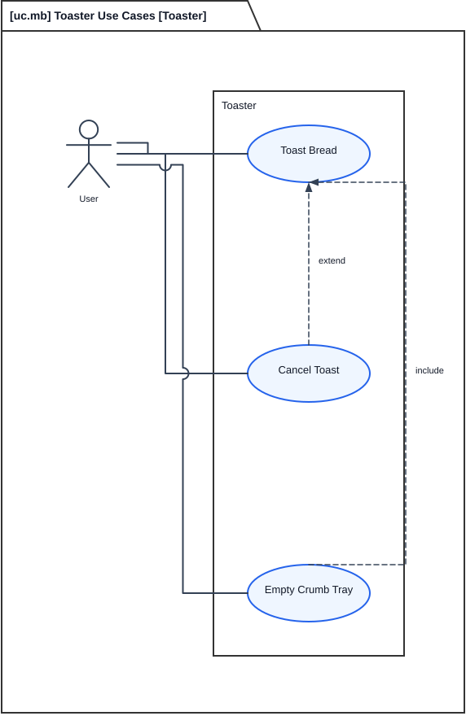

#### Analysis cases — `toaster-acase.svg`

**MagicGrid layer:** problem / analysis (supports later verification).

**Question:** Which named studies exist, and which constraints do they use?

**How to read it:** Two analysis-case names sit against thermal and electrical constraints. They do not publish measured results.

**Symbols:** analysis-case nodes and constraint names.

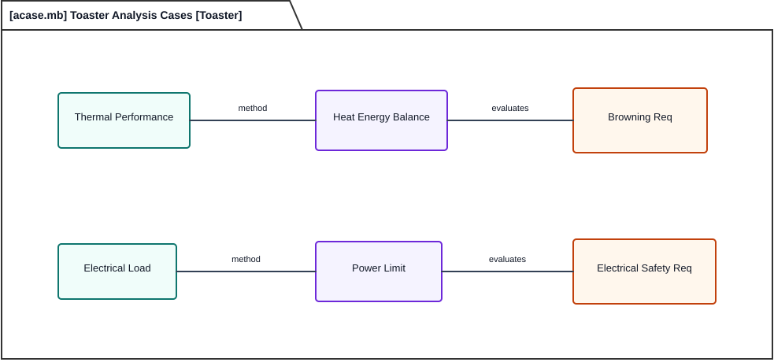

#### Verification cases — `toaster-vcase.svg`

**MagicGrid layer:** problem / verification (names only).

**Question:** Which checks are named, even if they are not bound to a part or port?

**How to read it:** Five verification-case names. None binds a part, port, or effect in the model.

**Symbols:** verification-case nodes.

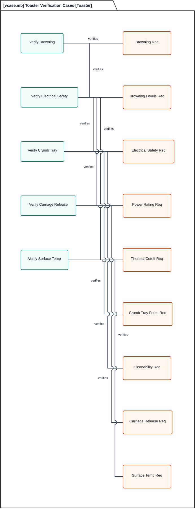

#### Operating context — `toaster-context.svg`

**MagicGrid layer:** problem / context (boundary of the solution).

**Question:** What sits outside the toaster, and what crosses the boundary?

**How to read it:** User, mains supply, kitchen environment, bread, toast, and crumbs surround the toaster. Context is not an internal interconnection.

**Symbols:** external parts and item flows across the boundary.

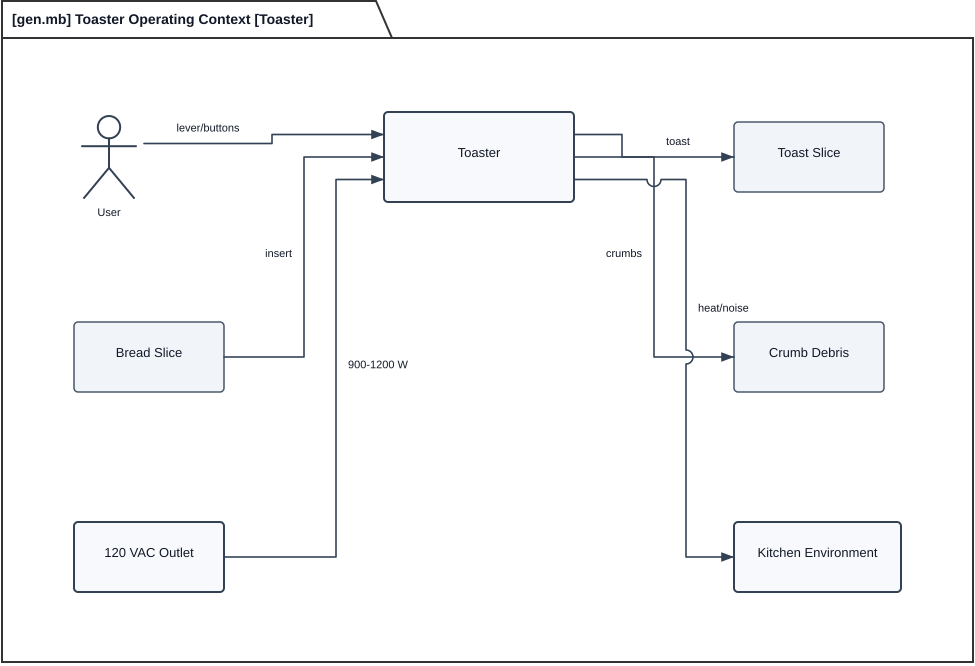

#### Requirements — `toaster-req.svg`

**MagicGrid layer:** problem / requirements.

**Question:** What shalls does the model state, and which numbers are actually bound?

**How to read it:** Requirement boxes follow model text. Quantitative shalls that exist are ±5% timer, at least three browning levels, no more than 10 N tray force, and at least 10,000 cycles. View-only identifiers (REQ-T-xxx) are not model elements.

**Symbols:** `«requirement»` rectangles.

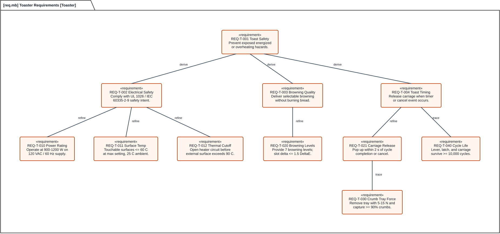

### Solution domain

#### Definition tree (Block Definition Diagram) — `toaster-bdd.svg`

**MagicGrid layer:** solution / structure.

**Question:** What parts compose the toaster?

**How to read it:** A BDD is a composition tree. Chassis, lever, buttons, power and control, heating element, carriage, crumb tray, and power cord hang from `Toaster`. Child definitions are empty.

**Symbols:** part boxes and composition lines.

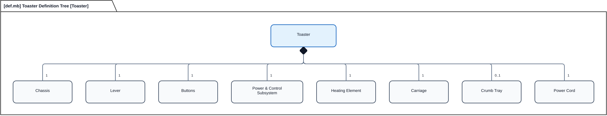

#### Electrical interconnection (Internal Block Diagram) — `toaster-electrical-icn.svg`

**MagicGrid layer:** solution / interfaces.

**Question:** How does electrical energy and control reach the heater?

**How to read it:** An IBD shows parts as boxes and connections as lines between ports. This view keeps buttons, lever, cord, power and control, and heater. It is the same model connections as the mechanical IBD, split by domain.

**Symbols:** part boxes, ports, power and control connections.

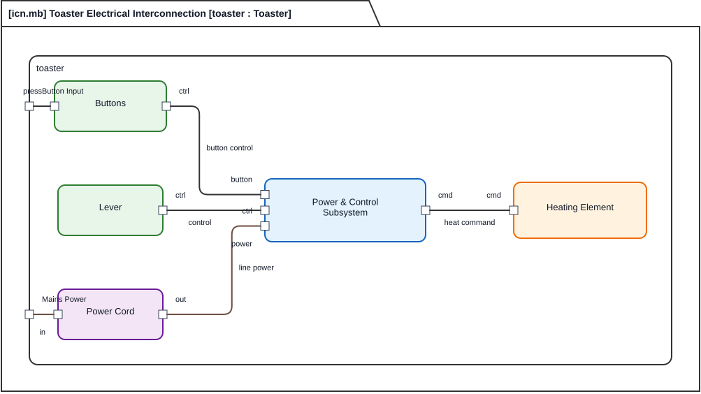

#### Mechanical interconnection — `toaster-mech-composed.svg`

**MagicGrid layer:** solution / interfaces.

**Question:** How does the chassis locate the moving and mounted parts?

**How to read it:** Chassis, lever, buttons, carriage, crumb tray, and the control-subsystem mount. Lines stay on the outside of boxes.

**Symbols:** part boxes, mechanical ports, mount/guide connections.

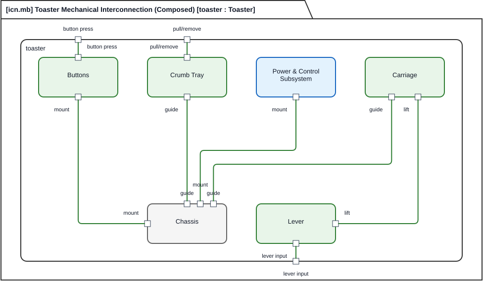

#### Interfaces — `toaster-intf.svg`

**MagicGrid layer:** solution / interfaces.

**Question:** Which interface definitions exist?

**How to read it:** User, power, mechanical, and thermal interface stubs. They do not declare carried features.

**Symbols:** interface nodes.

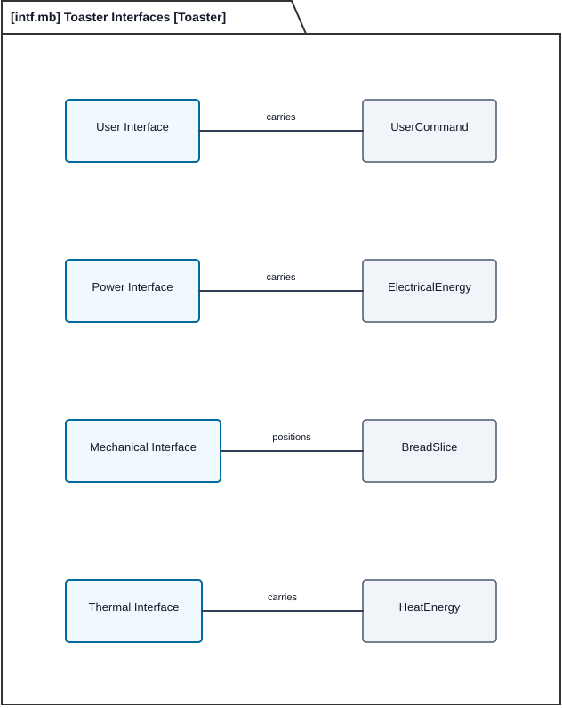

#### Flows — `toaster-flow.svg`

**MagicGrid layer:** solution / interfaces (items).

**Question:** Which items move across the boundary and inside the toaster?

**How to read it:** Bread in, toast out, mains energy, heat, user commands, and crumbs.

**Symbols:** item/flow nodes and arrows.

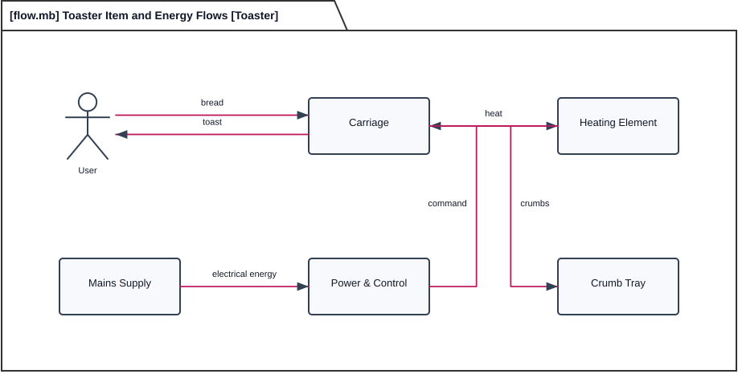

#### State machine — `toaster-stm.svg`

**MagicGrid layer:** solution / behavior.

**Question:** Which modes does the toaster occupy, and what events move it?

**How to read it:** The STM starts in Idle. Heating is the only state that can go to Done or Error. Done returns to Idle on carriage up. Error is event names only (overheat, carriage jam, power fault) and returns to Idle on reset. The view may collapse the three heating-to-error transitions; the model keeps them separate.

**Symbols:** rounded states, transition arrows, triggers.

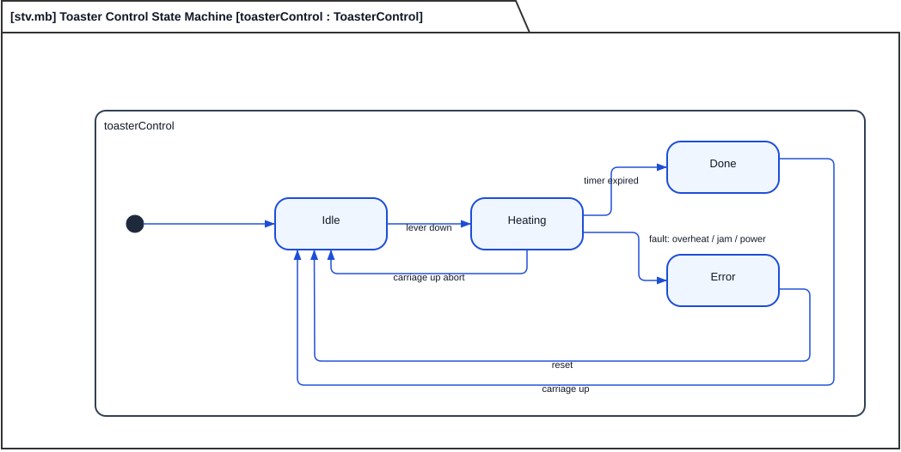

#### Toast-cycle actions — `toaster-act.svg`

**MagicGrid layer:** solution / behavior.

**Question:** What is the ordered toast procedure?

**How to read it:** Insert bread → lower lever → latch → energize → monitor timer → release → present toast. Crumb-tray emptying is not on this diagram.

**Symbols:** action boxes and control-flow arrows.

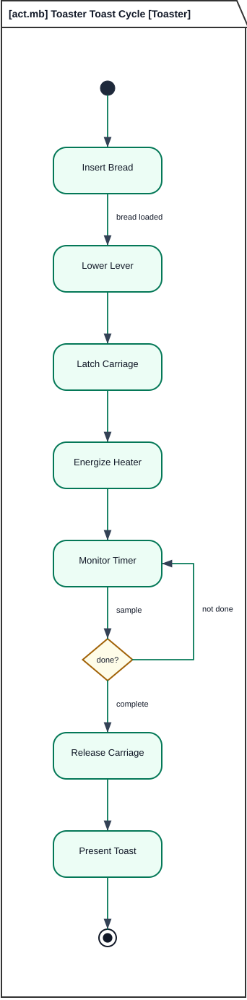

#### Interaction — `toaster-int.svg`

**MagicGrid layer:** solution / behavior.

**Question:** Who talks to whom during one toast cycle?

**How to read it:** Lifelines for user, lever, power and control, heater, and carriage. Messages follow the lever-down request, heat command, release, and toast available.

**Symbols:** lifelines and messages.

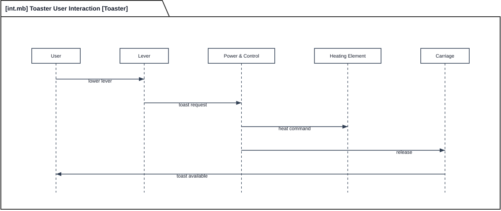

#### Constraints — `toaster-cst.svg`

**MagicGrid layer:** solution / parametrics.

**Question:** Which named constraints exist?

**How to read it:** Energy, timing, power, browning, surface-temperature, and release names. There are no equations in the model.

**Symbols:** constraint nodes and unbound attributes.

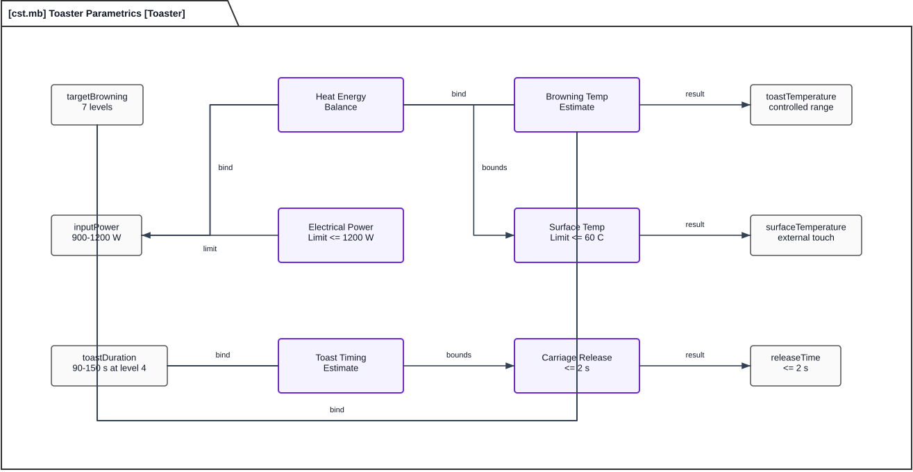

#### Allocations — `toaster-alloc.svg`

**MagicGrid layer:** solution / allocations.

**Question:** Which shalls are mapped onto parts or actions that exist?

**How to read it:** Safety → power and control; browning → heater and energize-heater; cleanability → crumb tray. Carriage-release and surface-temperature allocations are names without model endpoints.

**Symbols:** requirement boxes, part boxes, dashed allocate arrows.

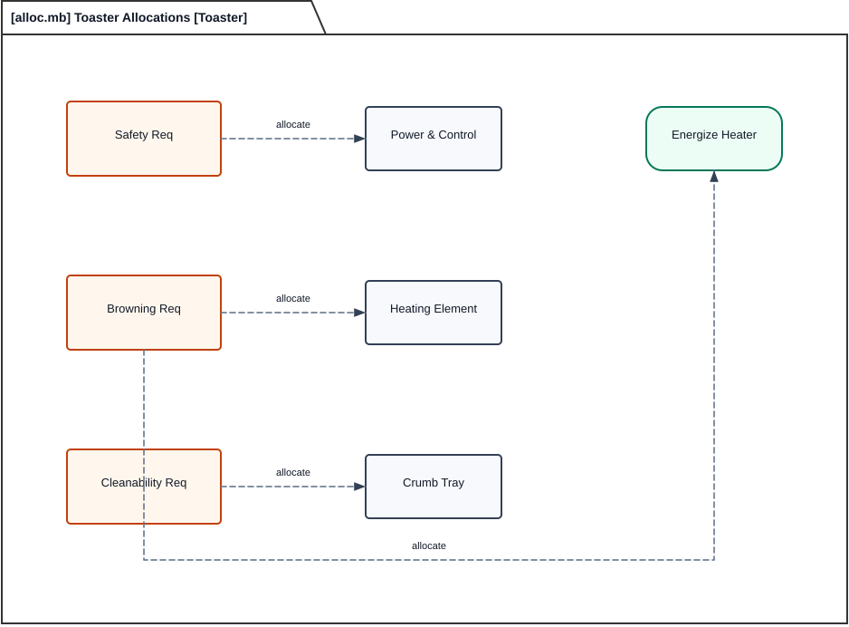

#### Packages — `toaster-pkg.svg`

**MagicGrid layer:** model organization (supports every MagicGrid layer).

**Question:** How is the model packaged?

**How to read it:** Structure, behavior, requirements, analysis, and verification packages.

**Symbols:** package nodes.

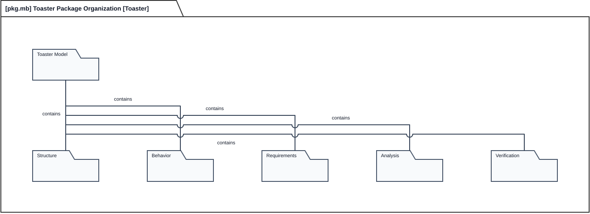

#### Cross-view trace — `toaster-general.svg`

**MagicGrid layer:** trace across MagicGrid layers.

**Question:** Can one path be followed from a use case through a requirement and an action to a part and a verification name?

**How to read it:** A single thread among those element kinds. It is a teaching trace, not extra requirements.

**Symbols:** mixed-kind nodes and trace lines.

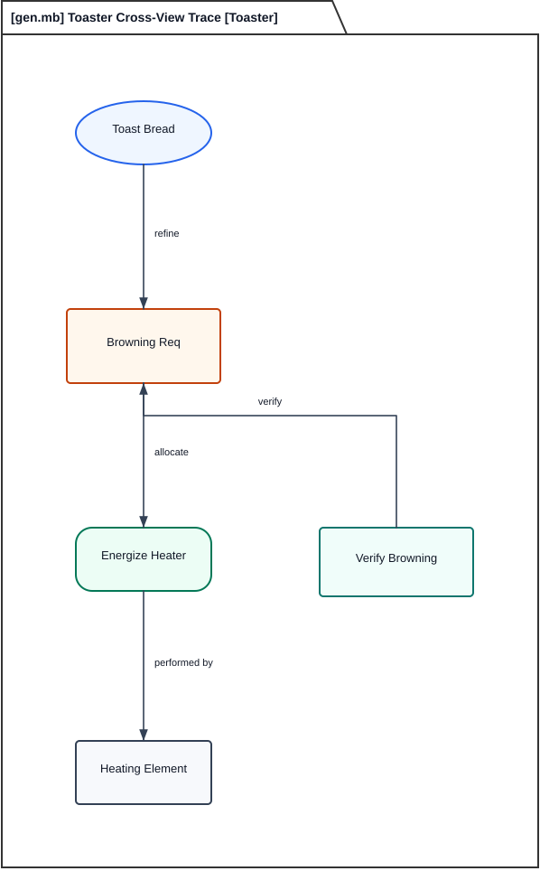

---

## 9. Open risks / unmarked / out of scope

**Unmarked:** rated watts, mains voltage and frequency, touch-temperature limit, thermal-cutoff threshold, and carriage-release time.

**Model gaps:** `thermalCutoffRequirement` has no matching part. `allocateCarriageReleaseToMechanism` and `allocateSurfaceTemperatureToChassis` are names without model endpoints. Constraint definitions have no equations. Verification cases are names only.

**Out of scope:** 4-slice, bagel, defrost, and wide-slot variants; coil, thermostat, and latch geometry; constraint equations.

This remains an example model, not a certifiable product.
